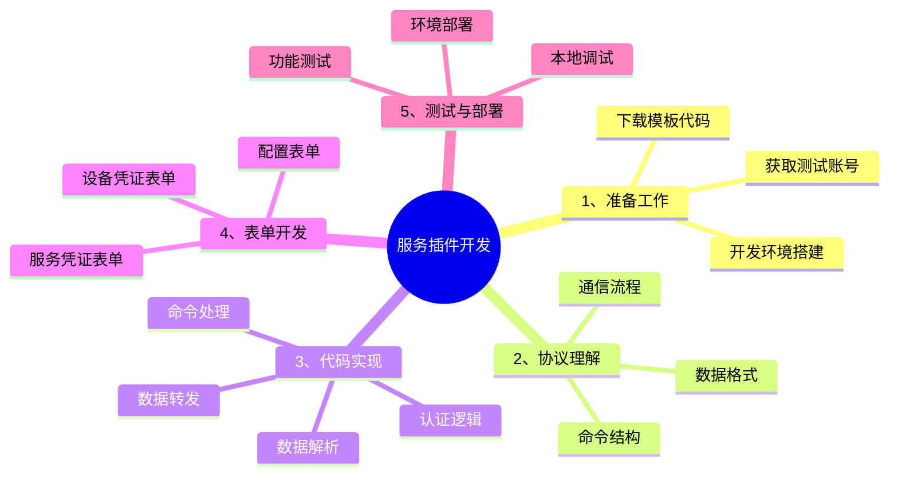

# 常见问题

```mermaid
mindmap
  root((服务插件开发))
    1、准备工作
      开发环境搭建
      获取测试账号
      下载模板代码
    2、协议理解
      数据格式
      通信流程
      命令结构
    3、代码实现
      认证逻辑
      数据解析
      数据转发
      命令处理
    4、表单开发
      设备凭证表单
      服务凭证表单
      配置表单
    5、测试与部署
      本地调试
      环境部署
      功能测试


```

```mermaid
graph TD;
    A-->B;
    A-->C;
    B-->D;
    C-->D;
```

