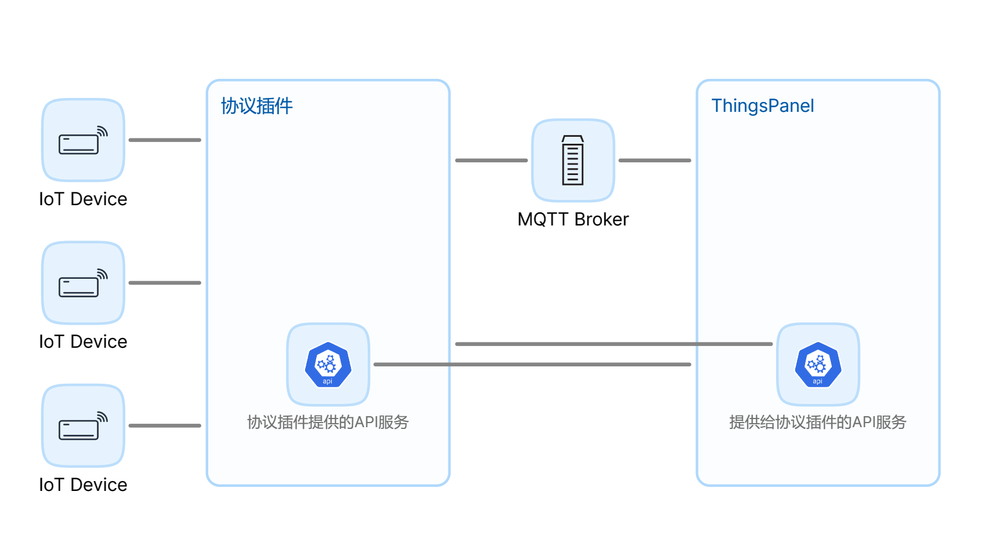
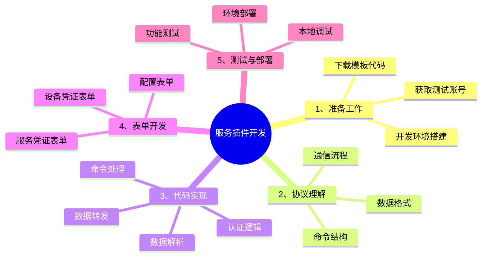
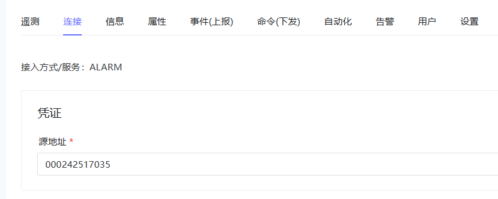

# 设备接入插件开发
## 插件介绍
### 针对问题

在物联网领域，设备接入方式纷繁复杂，整体来说，包括两类。
* **协议接入：** 通过MQTT、TCP、HTTP、SOAP、Modbus、OPC-UA、Bacnet、KNX、LwM2M和SNMP等协议接入
* **整合性接入：** 通过各种各样的网关服务或三方服务。
  
- **现状：** 这些协议和服务在通信模式和报文规范上各不相同，导致在系统集成时面临巨大的复杂性。
- **后果：** 这种复杂性不仅使系统变得臃肿、效率低下，而且还难以扩展和维护，进而导致维护成本居高不下。

### 用途

设备与系统之间的桥梁，将设备接入ThingsPanel平台，实现设备与平台的交互。
### 交互结构图 


### 插件类别


1.**协议接入**：支持各种物联网协议（如MODBUS、MQTT等），使ThingsPanel平台能够**直接**与使用这些协议的设备通信。
2.**服务接入**：连接ThingsPanel平台与各种第三方物联网平台，**间接**与设备通信。

### 功能
- 提供统一的接口规范，简化设备和第三方平台的接入流程。
- 支持多种协议和服务，增强ThingsPanel平台的兼容性和扩展性。
- 实现灵活的配置和凭证管理，方便用户快速接入不同的协议和第三方平台。

###  主要特点
  - 模块化设计，易于扩展支持新的协议和第三方平台
  - 提供标准化的数据交换格式和接口
  - 支持设备配置模板和凭证管理
  - 实时数据同步和设备状态监控
  - 支持多种通信协议，包括但不限于MQTT、MODBUS等


## 插件开发
### 开发工作内容

### 开发准备
* 阅读和了解ThingsPanel的插件开发设计和规范
  * ThingsPanel-服务插件-设计-阅读了解插件原理，理解平台的四种数据模型：遥测、属性、事件、命令
https://docs.qq.com/doc/DZWNvcWFJa25VSVlS
* 阅读和了解协议或者第三方服务的文档
* 可查看现有的插件是如何开发的，例如：
  * Modbus插件：https://github.com/ThingsPanel/modbus-protocol-plugin
  * GB26875.3-2011 报警传输网络通信协议插件 https://gitee.com/ThingsPanel/protocol-plugin-pressure-transmitter
### 开发步骤
#### 1.下载插件模板
```
git clone https://gitee.com/ThingsPanel/protocol-plugin-template.git 
```
#### 2.根据需求修改模板代码
* 阅读模板源码的README-DEV.md
* 使用最新的SDK
```
go get -u github.com/ThingsPanel/tp-protocol-sdk-go@latest  
```
* 根据该设备的协议文档，修改模板的凭证表单from_voucher.json
  * 该表单会显示在**设备接入-设备详情**的连接栏中，用来认证设备，一般是设备协议中能唯一标识设备的信息。该表单经用户填写会保存到平台，设备连接到插件后，插件调平台的获取设备配置接口/api/v1/plugin/device/config来认证设备（voucher字段是一个json字符串）。
  
* 判断该协议设备的对接是否需要配置表单（一般固定字段规范的TCP协议不需要）
	* 配置表单在设备接入-设备配置，主要用来获取需要用户提供的信息，开发过程中需要使用的一些配置信息
* 根据该插件需求，修改http_service/service.go中插件提供给平台的接口
	* https://apifox.com/apidoc/shared-87a62ec6-68e5-4590-ac53-8cfe8a8e814b 在这里有接口说明：服务插件-插件提供目录下的接口
	* 获取JSON表单接口
    	* 凡是有表单的服务插件都需要修改这个接口
	* 断开设备连接接口
    	* 当用户修改配置表单后，如果需要设备断开重连，就需要实现这个接口
	* 通知事件接口
    	* 当平台对服务插件相关的设备做了某些改动如删除设备、新增设备等需要通知到服务插件的，可以实现改接口，如果有些事件平台没有开发，需要联系相关开发人员讨论
* 修改配置文件，运行测试
#### 3.注册插件到ThingsPanel
* 确定好端口、插件名称、主题前缀后就可以注册插件了
* 注册服务插件需要使用超管账户
* 具体参考服务插件-设计文档中注册插件

#### 4.编写核心流程
* 插件的核心流程就是处理每个接入到插件的设备消息的上下行报文
* 这里可以使用AI工具辅助生成代码帮助开发繁琐的协议解析和组装内容
  * 比如模板里提供了tcp协议的模板：service/service_tcp.go
* 解析后的数据可以通过mqtt/mqtt_client.go中的方法发到平台
* 平台发给设备的数据通过mqtt/sub/sub.go中的得到，处理后转发给设备

#### 5.集成测试
* 注册插件后，在平台首先需要创建配置模板
* 在配置模板详情的协议配置栏可以选择该协议
* 创建设备然后绑定该模板，填写设备的凭证信息，然后将设备连接到插件就完成了对接

更多参考：协议插件开发流程
【腾讯文档】ThingsPanel-服务插件-协议开发流程
https://docs.qq.com/doc/DZXZCSk5McVBPSlRL


## 其他技术参数与技术规范

### 参数说明
	- device_type:
    	- 1-直连设备 
    	- 2-网关设备 
    	- 3-子设备
	- form_type:
    	- CFG-配置表单 
    	- VCR-凭证表单 
    	- SVCRT-服务凭证表单


### 平台提供的接口 
#### 获取设备配置（通过设备id或设备凭证）
- config分别是设备表单数据和子设备表单数据，是根据协议插件提供的表单，用户填写后保存的json数据。
- API：/api/v1/plugin/device/config GET
- 示例：
```
{
	"voucher": "{\"username\":\"aaaaaa\",\"password\":\"\"}",
	"device_id": "2611f2a8-fdab-9247-efc7-683e9de4f137"
}
```
- 响应示例：
```
{
	"code": 200,
	"message": "success",
	"data": {
		"id": "f073477f-6e11-9f0b-06ae",
		"voucher": "123456",
		"device_type": "2",
		"protocol_type": "MODBUS_TCP",
		"config": {},
		"sub_devices": [
			{
				"device_id": "0036d6bf-ffea-922e-f12e",
				"voucher": "202e0361-2cf8-f78b-0b8b",
				"sub_device_addr": "c7bb49f70",
				"config": {}
			}
		]
	}
}
```
#### 上报心跳
- API：/api/v1/plugin/heartbeat POST
- 请求示例
```json
{
    "service_identifier": "MODBUS-RTU"
}
```


### 协议插件提供的接口
#### 获取JSON表单
- /api/v1/form/config GET
- form_type：CFG-配置表单 VCR-凭证表单 SVCRT-服务凭证表单
	- 配置表单：平台配置模板详情-协议配置的数据解析表单，用户可以在此干预解析规则等
	- 凭证表单：平台设备管理-连接的凭证表单，用户在这里可以设置设备的凭证信息，对设备的接入做鉴权。
	- 服务凭证表单：平台服务接入点管理详情中接入点的修改配置表单，用于连接三方服务的信息。
- VCR 响应示例：
```
{
    "code": 200,
    "data": [
        {
            "dataKey": "reg_pkg",
            "label": "Registration Package",
            "placeholder": "please input the registration package",
            "type": "input",
            "validate": {
                "message": "The Registration Package cannot be empty",
                "required": true,
                "type": "string"
            }
        }
    ],
    "message": "success"
}
```
- CFG响应结构与VCR响应结构一致，参考表单规范文档ThingsPanel-JSON表单设计(https://docs.qq.com/doc/DZXBIZnpISmhxdmh2)

#### 断开设备连接
- 断开设备连接，主要用在更新配置后断开设备让设备重连达到更新配置的目的
- /api/v1/device/disconnect POST
- 请求：device_id

#### 通知
- 当平台设备或服务配置修改，用来通知到服务
- /api/v1/plugin/notification POST
- 请求：message_type,message

### 获取服务设备列表
- 如果是服务接入，这个接口用来获取对应服务的设备列表以添加设备到系统
- /api/v1/plugin/device/list GET
- 请求
```  
{
    "voucher":"",
    "service_identifier":""
}
```
### 交换数据相关
#### 插件推送数据到平台
- 协议插件发送遥测规范如下，属性类似（事件参考平台MQTT主题设计规范）：
##### 直连设备或子设备消息
- mqtt用户：root  （使用thingspanel-go配置文件中的用户名和密码）
- 发布主题：device/telemetry
- 报文规范：```{"device_id":device_id,"values":{key:value...}}```
或自定义报文：```{"token":device_id,"values":自定义报文}```
- 自定义报文可以根据设备配置里的脚本进一步解析，考虑到性能，推荐在协议插件内解析

##### 网关设备消息
- mqtt用户：root  （使用thingspanel-go配置文件中的用户名和密码）
- 发布主题：gateway/telemetry
- 报文规范：```{"device_id":device_id,"values":{sub_device_addr1:{key:value...},sub_device_add2r:{key:value...}}}```
- 或自定义报文：```{"device_id":device_id,"values":自定义报文}```

##### 在线离线通知
- mqtt用户：root  （使用thingspanel-go配置文件中的用户名和密码）
- 发布主题：device/status
- 报文规范：```{"device_id":device_id,"values":1}```
- 0-离线 1-上线

#### 平台推送数据给插件
- 协议插件订阅主题如下：
##### 直连设备消息
```
    mqtt用户：root (使用thingspanel-go配置文件中的用户名和密码)
    订阅主题：plugin/modbus/# （说明：plugin/modbus/为注册插件时填写的订阅主题前缀,主题#部分是MQTT主题规范（凡是device_number的要改为device_id），实际上就是协议插件比平台下行规范多了主题前缀）
    报文规范：{key:value...}（示例是telemetry或attributes，commands请参考平台主题规范）
```


##### 网关设备消息
```
    mqtt用户：root  （使用thingspanel-go配置文件中的用户名和密码）
    订阅主题：plugin/modbus/# (说明：plugin/modbus/为注册插件时填写的订阅主题前缀,主题#部分是MQTT主题规范（凡是device_number的要改为device_id），实际上就是协议插件比平台下行规范多了主题前缀)
    报文规范：{sub_device_addr:{key:value...},sub_device_addr:{key:value...}}
（示例是telemetry或attributes，commands请参考平台主题规范）

```
### 插件注册

- 服务名称：创建配置模板时，会显示在选择协议下拉框中  
- 服务标识符：系统中唯一标识这个插件，由字母和数字组成
- 类别：选择接入协议
- HTTP服务地址：填写平台后端能够直接访问插件API的地址，格式如127.0.0.1:8151
- 服务订阅主题前缀 ：格式如（name一般为服务标识符）：
  ```
  service/name/
  ```
- 设备接入地址：这里填写的内容会显示在设备凭证管理的下发，以提示用户应该将设备连接到哪里

#### 方式一：使用SQL注册(参考SQL)：
```
INSERT INTO public.service_plugins (id, "name", service_identifier, service_type, last_active_time, "version", create_at, update_at, description, service_config, remark) VALUES('41d04726-8490-119f-7689-7f8d0193ad45', 'ALARM协议', 'ALARM', 1, NULL, 'v0.0.1', '2024-06-23 16:44:26.607', '2024-06-30 14:05:25.790', '', '{"http_address":"127.0.0.1:8151","device_type":1,"sub_topic_prefix":"service/alarm/","access_address":":8150"}'::json, '');
```
#### 方式二：平台注册
- 超管账号登录
- 应用管理-插件管理，点击添加新服务按钮


