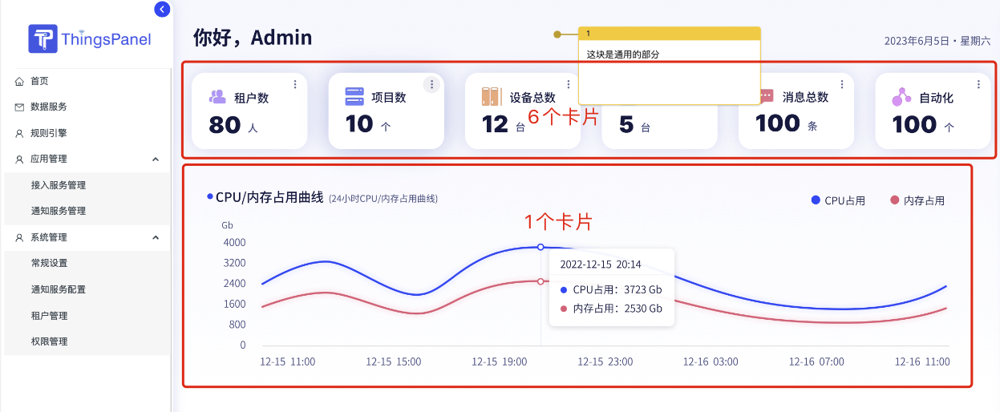
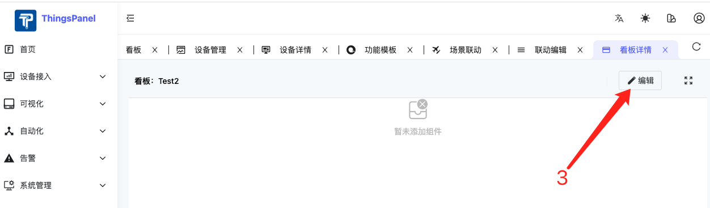
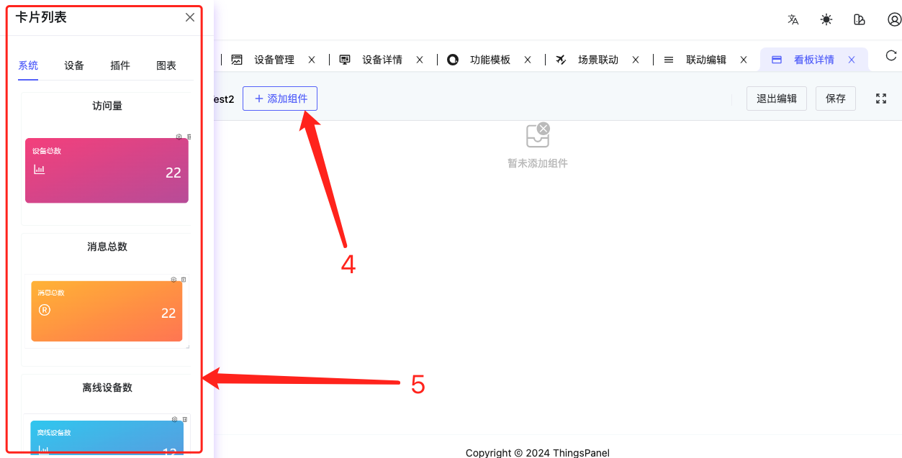
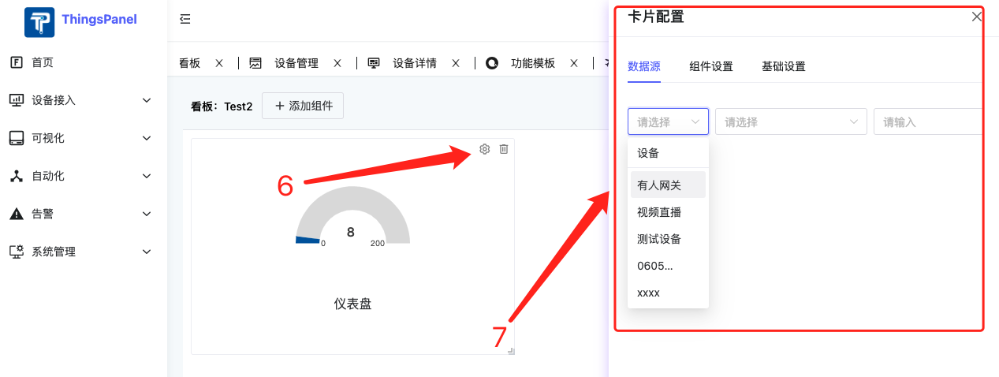
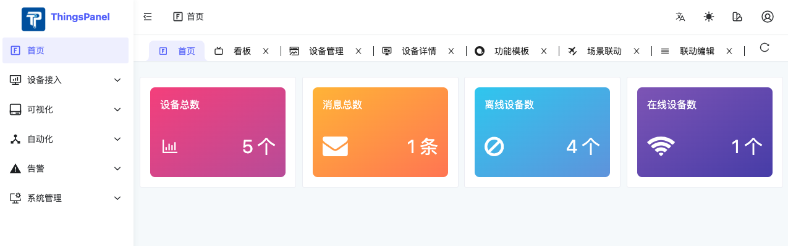
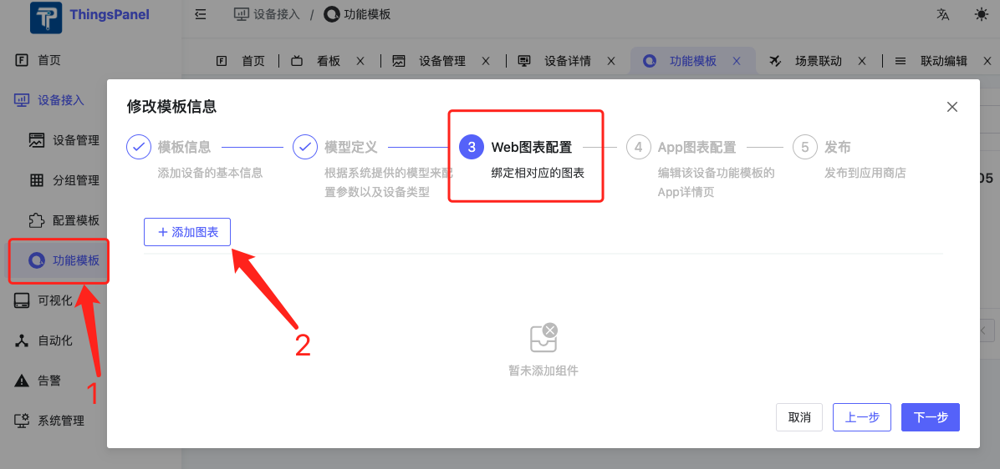
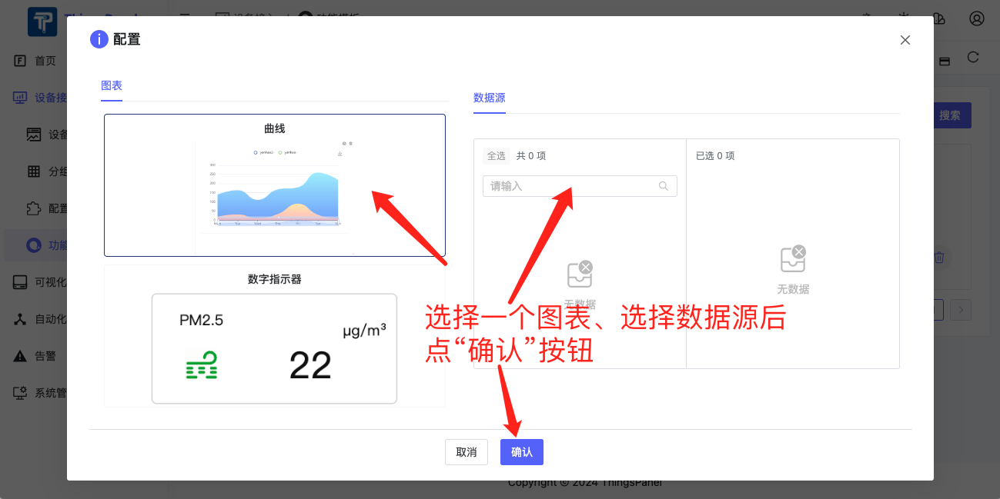
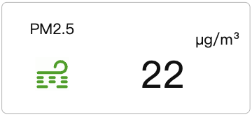

# 看板卡片开发
看板卡片快速开发指南。
## 一、首先介绍下看板卡片
### 1、什么是看板卡片？
看板卡片是用来搭建ThingsPanel的页面的组件，可以是一个数字指示器，一个曲线，或者一个表格。


### 2、怎么使用看板卡片？
#### 1）看板卡片创建、编辑




#### 2）看板卡片使用
我们可以在3个地方使用看板卡片：
1. 首页
   
2. 设备功能模板的Web图表配置（仅图表卡片）
   
   
3. 设备功能模板的App图表配置（仅图表卡片）
   
   

## 二、如何开发看板卡片
### 1. 明确将要开发的卡片类型
看板卡片目前分为2个类型：**系统卡片** 和 **图表卡片**。其中只有图表卡片可以在设备功能模板的Web图表配置和App图表配置中使用。

### 2. 在相应目录下创建文件夹和文件进行开发
一般包括4个文件（参考demo：/src/card/chart-card/demo）：
```
demo
  - index.ts // 导出目录：定义卡片的名称，id，类型（builtin：系统卡片，chart: 图表卡片），预设的参数，图标等
  - component.vue // 卡片组件
  - card-config.vue // 卡片配置表单，无配置可不添加，主要用于收集卡片特有的一些属性和值的配置信息
  - poster.png // 卡片示意图，缩略图尺寸236*148
```
*注：卡片全部自动加载，无需做额外引入。*

### 3. 数据获取和保存
#### 1）卡片配置表单（card-config.vue）中的数据如何保存
卡片配置表单用于收集用户对于卡片的配置信息，上层会通过传入一个ctx对象来收集数据：
`const ctx = inject<IConfigCtx>('config-ctx')!;`
表单中需要保存的信息都保存在 **ctx.config** 这个对象中即可。例如如果需要用户选一个颜色，可以把选定的颜色信息保存在 ctx.config.color 中：
`<NColorPicker v-model:value="ctx.config.color" :show-alpha="false" />`。
#### 2）如何在卡片组件（component.vue）中获取配置信息
在卡片组件中，可以通过组件的props属性获取配置信息：`props.card.config`。
比如上面例子里保存的颜色信息，可以通过以下方式获取到：
`<NIcon class="iconclass" :color="props?.card?.config?.color || 'black'">`。
#### 3）设备数据的获取
在开发**图表卡片**的时候需要获取设备数据。有2种获取设备数据的方式：
1. http方式：通过http请求接口 `/telemetry/datas/current/keys` 来获取设备的历史数据；
2. WebSocket方式：通过WebSocket的API来获取设备的实时数据。
我们已经在上层封装了通过WebSocket请求设备数据的方法，在卡片中**只需要实现一个updateData方法**，上层会调用这个方法，把最新的数据传递进来：
    ```typescript
    defineExpose({
      updateData: (_deviceId: string | undefined, metricsId: string | undefined, data: any) => {
         detail.value = metricsId ? data[metricsId] : '';
      }
   });
    ```

### 4. 注意事项
#### 1）响应式
卡片的大小是用户可以编辑的，卡片UI设计时**必须要遵循Responsive UI的设计原则**，UI必须能适应不同卡片大小。
如果卡片过小时不能正常显示，请设置**minW**和**minH**来保证卡片编辑时的最小行列高度和宽度。
具体的规范如下：
1. 避免使用绝对单位：避免使用像素（px）等绝对单位定义宽度、高度或间距。转而使用相对单位，如百分比（%）、视窗单位（vw, vh, vmin, vmax）或em/rem，这些单位能够根据父元素或视口大小动态调整。
2. 采用流式布局：流体布局（Fluid Layout）允许内容根据容器的宽度自动调整大小，使用百分比宽度代替固定宽度，确保内容能够顺畅地重新排列。
3. 使用Flexbox或Grid布局：Flexbox（弹性盒子模型）和CSS Grid布局是响应式设计中的两大利器。Flexbox适合单维度布局，如一行或一列的对齐和分配空间；而Grid布局适用于二维布局，能够轻松创建复杂的网格结构。两者都能自动适应容器大小，使元素在不同屏幕尺寸下都能保持良好的布局。
4. 媒体查询：利用CSS媒体查询来为不同的屏幕尺寸或设备特性定义不同的样式规则。这允许你基于视口宽度、设备类型或分辨率等条件，调整布局、字体大小、图片大小等。
5. 响应式图片：使用max-width: 100%; height: auto; 确保图片不会超过其容器的宽度，并自动调整高度以保持比例。还可以利用picture标签和srcset属性来提供不同分辨率的图片资源，以优化加载时间和视觉质量。
6. 字体大小的灵活性：使用相对单位（如em, rem）设置字体大小，允许字体随着用户设置或父元素大小变化而缩放，提高可访问性。
#### 2）卡片示意图（poster.png）
开发完成后，截图保到当前卡片目录下。

### 5. 举个例子
以“数字指示器”卡片为例，它的4个文件代码分别为：
#### 1）导出目录 index.tx
```typescript
import { defineAsyncComponent } from 'vue';
import poster from '@/components/panel/chart-card/demo/poster.png';
import type { ICardDefine } from '@/components/panel/card';

export default {
  id: 'chart-demo',
  type: 'chart',
  component: defineAsyncComponent(() => import('./component.vue')),
  poster,
  title: '数字指示器',
  configForm: defineAsyncComponent(() => import('./card-config.vue')),
  preset: {
    dataSource: {
      origin: 'device',
      sourceNum: 1,
      systemSource: [{}],
      deviceSource: [{}]
    },
    config: {
      name: '123'
    },
    iCardViewDefault: {
      w: 5,
      h: 3,
      minH: 1,
      minW: 2
    }
  }
} as ICardDefine;
```
#### 2）卡片组件 component.vue
```typescript
<script setup lang="ts">
import { onBeforeUnmount, onMounted, ref, watch } from 'vue';
import type { ICardData } from '@/components/panel/card';
import { deviceDetail } from '../curve/modules/api';
import { icons as iconOptions } from './icons';

// 正式环境可根据api获取
const detail = ref<string>('');
const unit = ref<string>('');
const props = defineProps<{
  card: ICardData;
}>();
const fontSize = ref('14px');

const myCard = ref<any | null>(null); // 创建一个ref来引用NCard
let resizeObserver: ResizeObserver | null = null;

defineExpose({
  updateData: (_deviceId: string | undefined, metricsId: string | undefined, data: any) => {
    detail.value = metricsId ? data[metricsId] : '';
  }
});

const setSeries: (dataSource) => void = async dataSource => {
  const arr: any = dataSource;
  const querDetail = {
    device_id: dataSource?.deviceSource ? dataSource?.deviceSource[0]?.deviceId ?? '' : '',
    keys: arr.deviceSource ? arr.deviceSource[0]?.metricsId : ''
  };
  if (querDetail.device_id && querDetail.keys) {
    const detailValue = await deviceDetail(querDetail);
    if (detailValue?.data[0]?.unit) {
      unit.value = detailValue?.data[0]?.unit;
    }
    if (detailValue?.data[0]?.value) {
      detail.value = detailValue.data[0].value;
    }
  } else {
    // window.$message?.error("查询不到设备");
  }
};

const handleResize = entries => {
  for (const entry of entries) {
    // 根据卡片宽度动态调整字体大小，这里仅为示例逻辑，实际应用中需按需调整
    let dFontSize = `${entry.contentRect.width / 20}px`; // 假设字体大小与宽度成反比，20为比例系数
    if (entry.contentRect.width / entry.contentRect.height > 3) {
      dFontSize = `${(entry.contentRect.width + (entry.contentRect.height * entry.contentRect.width) / entry.contentRect.height / 2) / 20 / (1 + entry.contentRect.width / entry.contentRect.height / 2)}px`;
    }
    console.log('font size:', dFontSize);
    fontSize.value = dFontSize;
  }
};

watch(
  () => props.card?.dataSource?.deviceSource,
  () => {
    detail.value = '';
    unit.value = '';
    setSeries(props.card?.dataSource);
  },
  { deep: true }
);

onMounted(() => {
  setSeries(props?.card?.dataSource);
  // 确保DOM已经挂载后再初始化ResizeObserver
  if (myCard.value) {
    resizeObserver = new ResizeObserver(handleResize);
    resizeObserver.observe(myCard.value.$el);
  }
});

onBeforeUnmount(() => {
  // 组件卸载前清除观察器
  if (resizeObserver) {
    resizeObserver.disconnect();
    resizeObserver = null;
  }
});
</script>

<template>
  <div class="h-full">
    <div class="h-full flex-col items-center">
      <NCard ref="myCard" :bordered="false" class="box">
        <div class="bt-data" :style="'font-size:' + fontSize">
          <span class="name" :title="card?.dataSource?.deviceSource?.[0]?.metricsName || ''">
            {{ card?.dataSource?.deviceSource?.[0]?.metricsName }}
          </span>
          <NIcon class="iconclass" :color="props?.card?.config?.color || 'black'">
            <component :is="iconOptions[props?.card?.config?.iconName || 'ClipboardCode20Regular']" />
          </NIcon>
          <div class="value-wrap">
            <span class="value" :title="detail != null && detail != '' ? detail : '8'">
              {{ detail != null && detail !== '' ? detail : '8' }}
            </span>
            <span class="unit" :title="props?.card?.config?.unit || unit">
              {{ props?.card?.config?.unit || unit }}
            </span>
          </div>
        </div>
      </NCard>
    </div>
  </div>
</template>

<style scoped>
.items-center {
  padding: 0;
}
:deep(.n-card__content:first-child) {
  padding-top: 0;
}
.box {
  display: flex;
  position: relative;
  flex-direction: column;
  width: 100%;
  height: 100%;
}
.iconclass.n-icon svg {
  width: 100%;
  height: 100%;
}
.bt-data {
  width: 100%;
  height: 100%;
}

.iconclass {
  position: absolute;
  bottom: 20%;
  left: 7%;
  width: 25%;
  height: 25%;
}

.value-wrap {
  position: absolute;
  display: flex;
  bottom: 20%;
  left: 55%;
  width: 45%;
  line-height: 1;
}

.unit {
  margin-left: 10px;
  font-size: 1em;
  overflow: hidden;
  display: block;
  white-space: nowrap;
  text-overflow: ellipsis;
  transform: translateY(-50%);
}

.name {
  position: absolute;
  top: 15%;
  left: 15%;
  width: 45%;
  font-size: 1.2em;
  display: block;
  white-space: nowrap;
  text-overflow: ellipsis;
  overflow: hidden;
}

.value {
  flex-shrink: 0;
  max-width: 75%;
  font-size: 2.5em;
  white-space: nowrap;
  text-overflow: ellipsis;
  overflow: hidden;
  vertical-align: text-bottom;
}
</style>
```
#### 3）卡片配置表单 card-config.vue
```typescript
<script lang="ts" setup>
import { inject } from 'vue';
import type { IConfigCtx } from '@/components/panel/card';
import { $t } from '@/locales';
import IconSelector from './icon-selector.vue';

const ctx = inject<IConfigCtx>('config-ctx')!;

const setIcon = icon => {
  ctx.config.iconName = icon; // 更新配置
};
</script>

<template>
  <NForm :model="ctx.config">
    <NFormItem :label="$t('device_template.table_header.unit')">
      <NInput v-model:value="ctx.config.unit" :placeholder="$t('device_template.table_header.pleaseEnterTheUnit')" />
    </NFormItem>
    <NFormItem :label="$t('generate.color')">
      <NColorPicker v-model:value="ctx.config.color" :show-alpha="false" />
    </NFormItem>
    <IconSelector @icon-selected="setIcon" />
  </NForm>
</template>
```
#### 4）卡片示意图 poster.png
