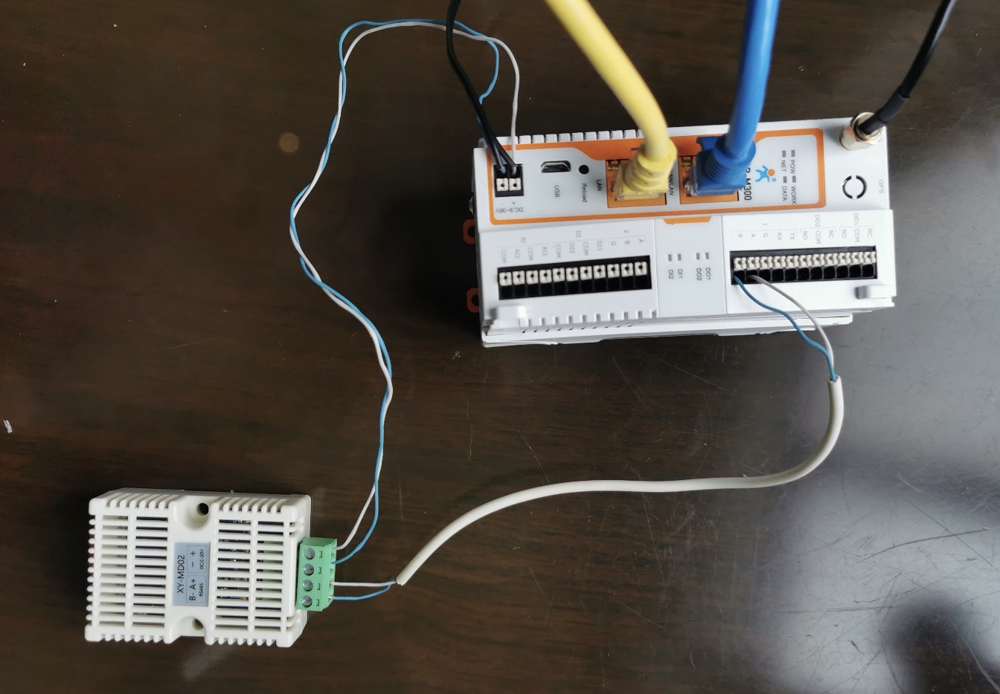
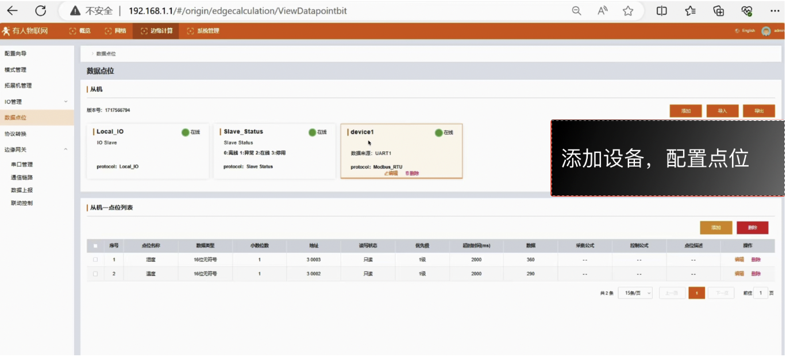
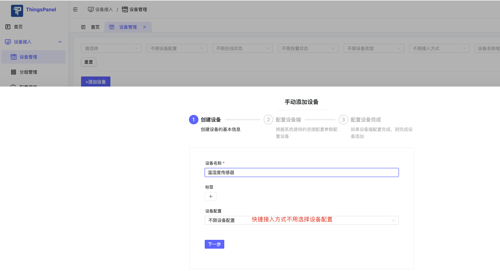
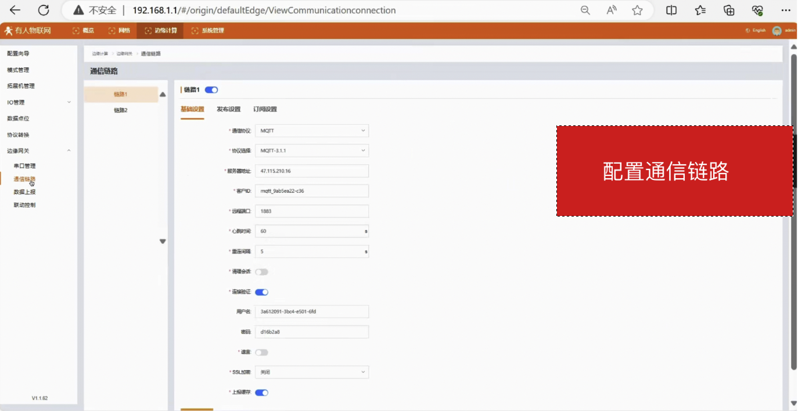
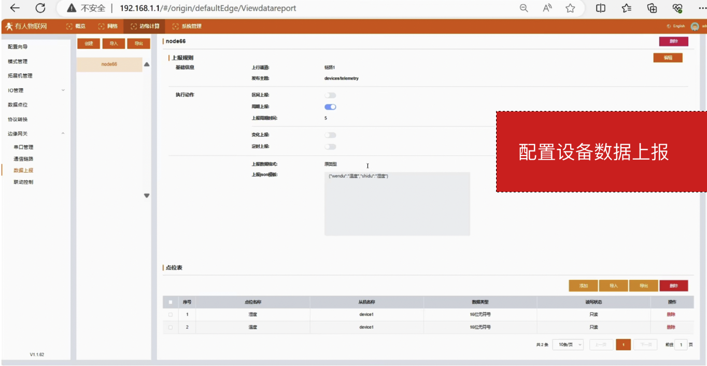
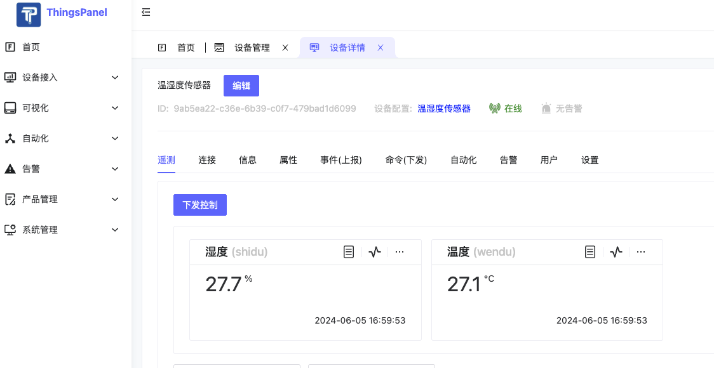

# M300网关接温湿度传感器使用MQTT接入

## 1、M300网关介绍
- M300网关是一款高性能可拓展的综合性物联网控制器。产品集成了数据的边缘采集、计算、主动上报和数据读写，联动控制，IO
采集和 控制等功能，采集协议包含标准 Modbus 协议和多种常见的 PLC
协议，以及行业专用协议;主动上报采用分组上报方式，自定义 Json 上报
模版，快速实现服务器数据格式的对接。同时产品还具备路由和 VPN
以及图形化编程功能，图形化模块设计边缘计算功能，满足客户自有
设计需求。产品支持 TCP(S)/MQTT(S)/HTTP 协议通信，支持多路连接;支持
Modbus RTU/TCP 和 OPC UA 协议转换等功能，产品更是支持有 人云，阿里云和
AWS，华为云等常用平台的快速接入。

## 2、接入步骤
1.  物理连接，先把线接好。
2.  在网关上配置Modbus
3.  在ThingsPanel中创建温湿度传感器设备【快捷接入】
4.  在网关上配置链路，开启MQTT
5.  在网关上配置JSON，重启设备，完成接入。

## 3、物理连接

## 4、在网关上配置Modbus

## 5、在ThingsPanel中创建温湿度传感器设备【快捷接入】

## 6、在网关上配置链路，开启MQTT

- 在设备详情的【连接】Tab中，获得连接信息配置到网关上：

### 7、在网关上配置上报，重启设备，完成接入。

- 在协议转换-JSON配置中配置上报的报文

### 8、ThingsPanel采集到网关数据
