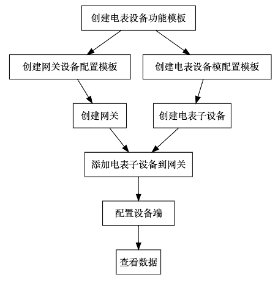

# ModBus接入

## 接入步骤
1.	创建电表设备功能模板
    * 创建设备物模型、Web和App图表
2.	创建网关设备配置模板
    * 需要选择使用Modbus_RTU或者Modbus_TCP
3.	创建电表设备配置模板
    * 引用电表设备功能模板
4.	创建网关设备
    * 创建后获得网关设备端可配置的IP地址、端口、注册包
5.	创建电表子设备
    * 要配置数据解析
6.	添加电表子设备到网关
    * 建立网关和子设备的关联
7.	配置设备端
    * 创建设备物模型、Web和App图表
8.	查看数据
    * 在电表设备详情中查看设备数据

## 接入流程图

## 接入结果

## 参考实例

[有人口红网关USR-DR154接智能电表接入ThingsPanel
](http://thingspanel.cn/posts/54)