# ModBus接入

## 前置条件

安装Modbus协议插件，并在系统管理员注册插件

[ThingsPanel1.0.0安装Modbus协议插件教程](https://github.com/ThingsPanel/modbus-protocol-plugin)

## 接入步骤

### 在平台创建Modbus网关设备

1. 创建网关设备配置模板
   1. 创建配置模板  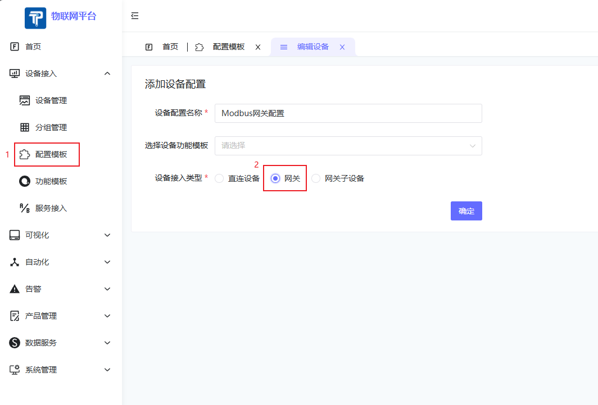
   2. 在协议配置中，需要选择使用Modbus_RTU或者Modbus_TCP  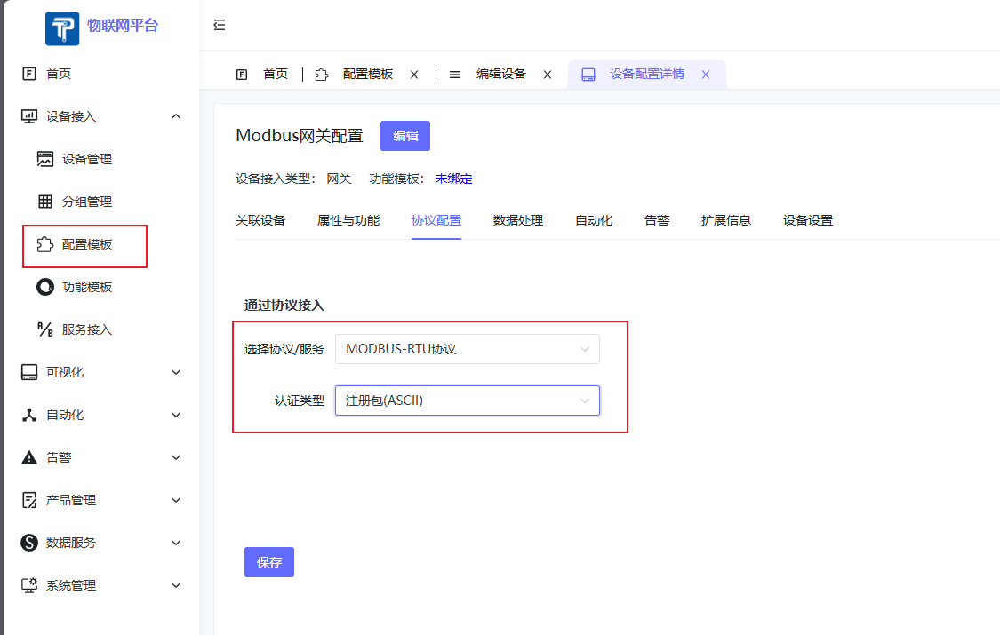
2. 创建设备，绑定刚创建的网关类型的配置模板
   1. 进入`设备接入`->`设备管理`，点`添加设备`按钮创建网关设备  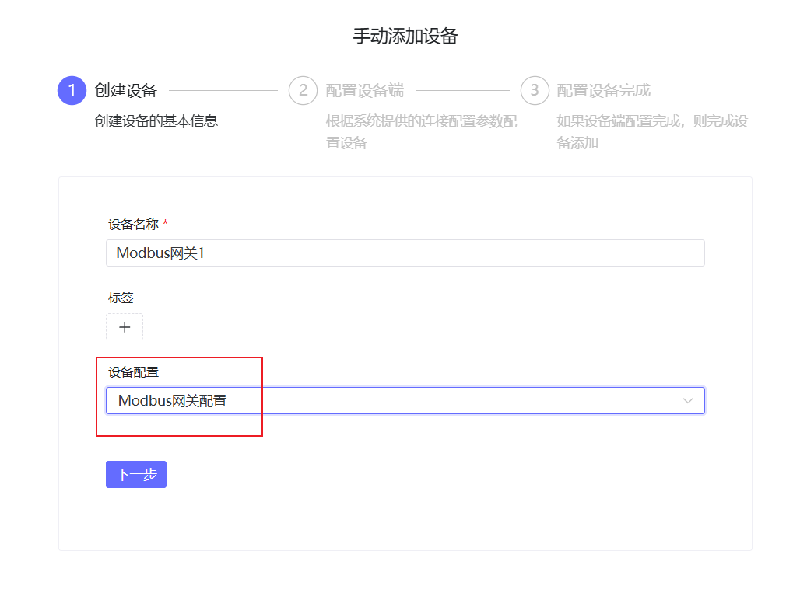
   2. 填入注册包信息（注意和网关或DTU配置中使用的注册包一致并且需要关闭设备的心跳包） 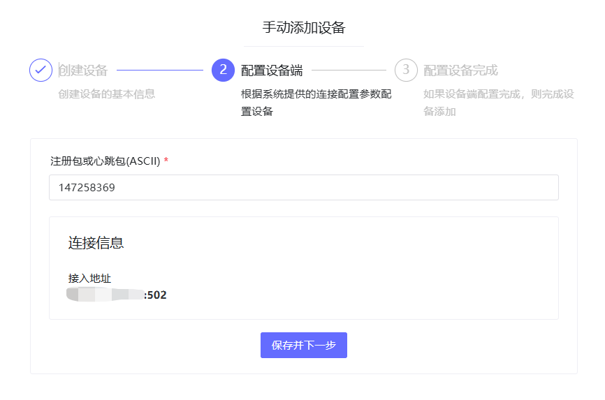
   3. 此时对设备上电，就可看到设备在线

### 在平台创建Modbus网关设备的子设备

1. 创建子设备配置模板
   1. 创建配置模板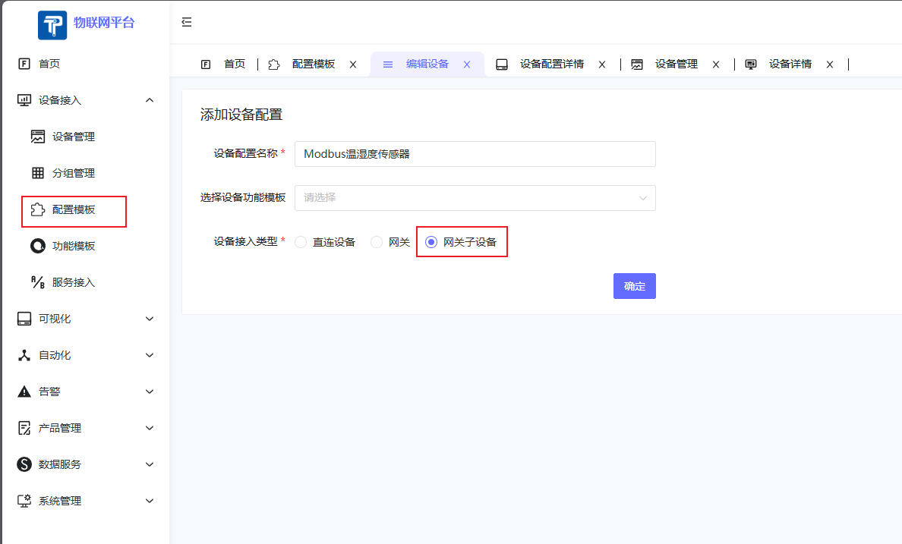
   2. 在协议配置中，需要选择使用Modbus_RTU或者Modbus_TCP，会出现配置表单，根据提示，填写对应的配置信息  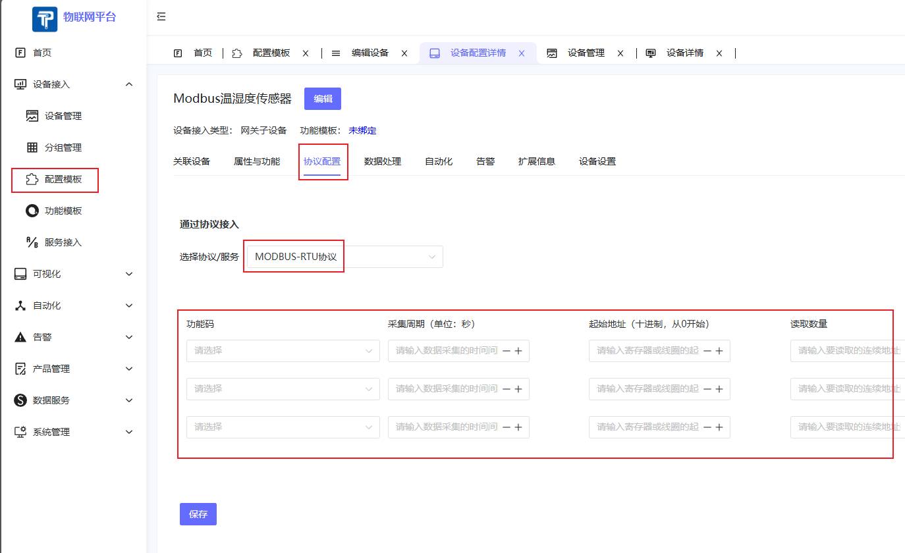
2. 创建设备，绑定刚创建的子设备类型的配置模板
   1. 进入`设备接入`->`设备管理`，点`添加设备`按钮创建子设备  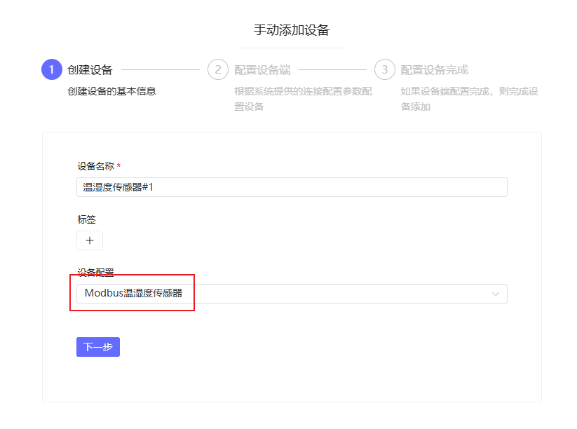
   2. 设置心跳时间 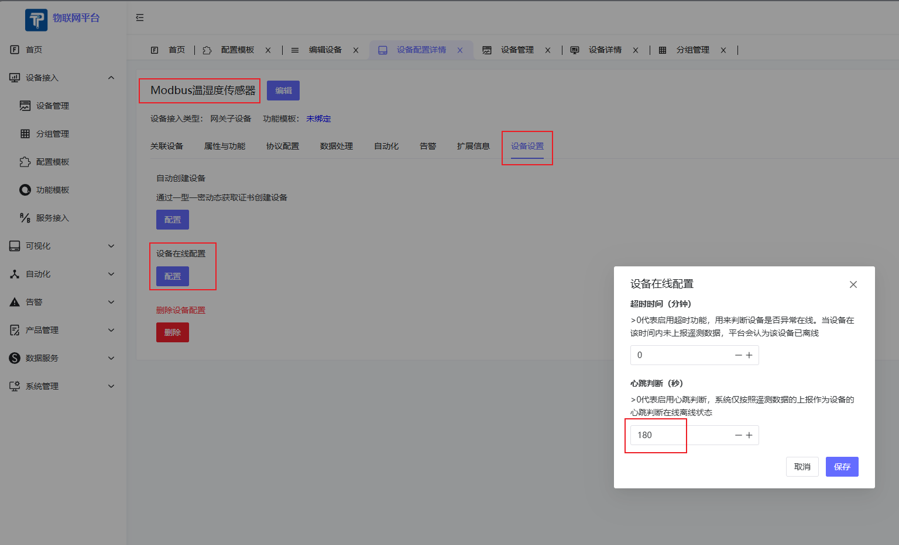
3. 绑定子设备到网关
   1. 进入`设备接入`->`设备管理`，选择子设备对应的网关设备，选择子设备页签，点击添加子设备按钮，选择要添加的子设备  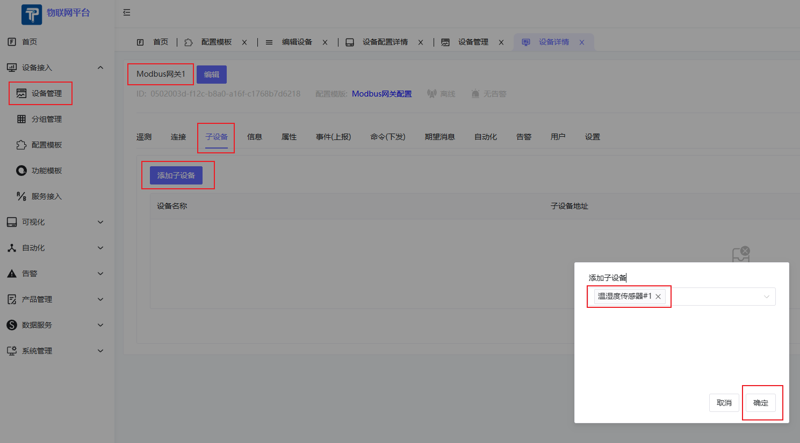
   2. 修改子设备地址（从机地址）  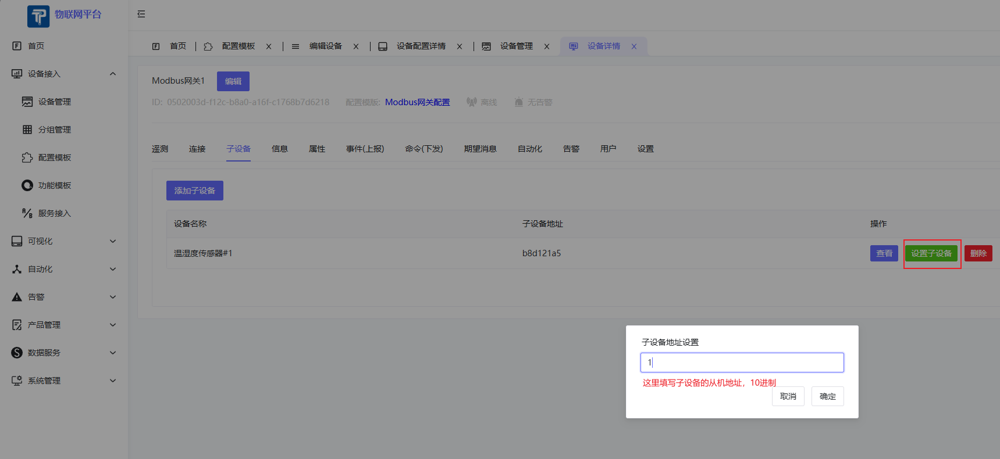
   3. 查看子设备详情，如果配置表单填写正确，此时子设备就可以正常上报数据了

## 操作流程图

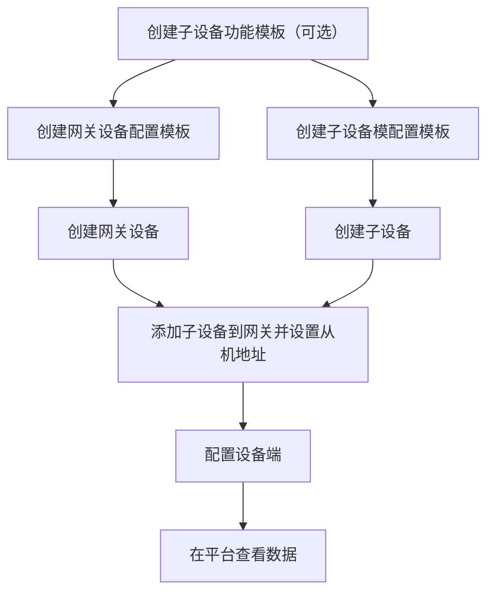

## 接入结果

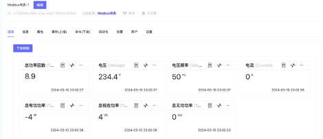

## 参考实例

[有人口红网关USR-DR154接智能电表接入ThingsPanel](http://thingspanel.cn/posts/54)
