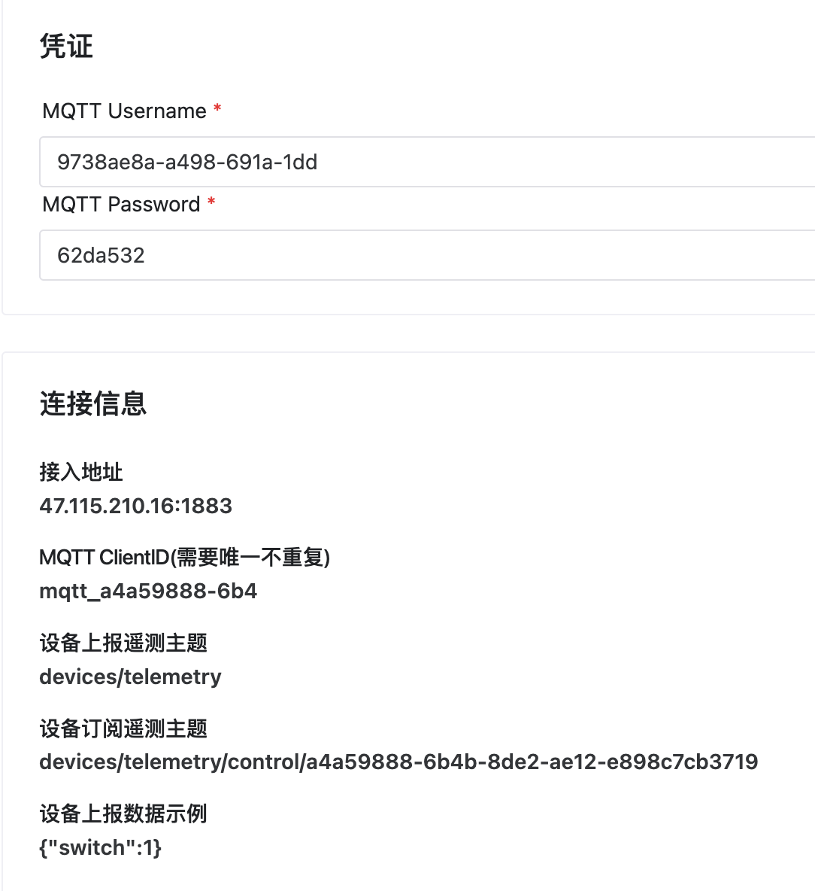
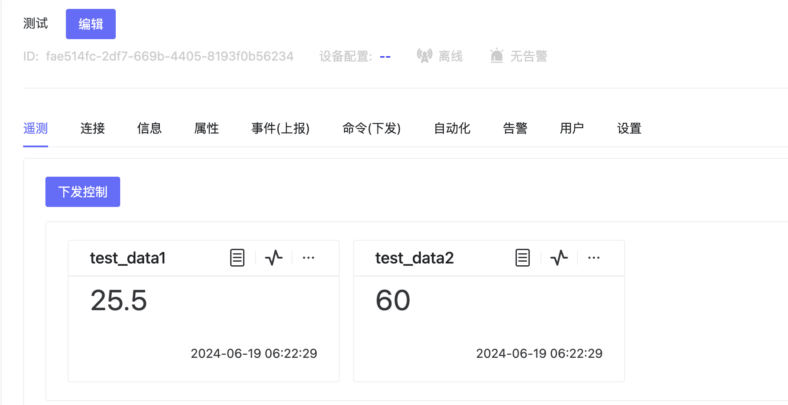

# MQTT直连设备接入

## 接入步骤
1. 创建设备
2. 选择配置模板（可不选择）
3. 获得设备端配置参数
4. 配置设备端
5. 完成接入


## 快速接入视频

<video controls src="/videos/15s_add_device.mp4" title="15秒添加设备并推送数据" width="1000"></video>


## 详细过程

### 创建设备

在【设备接入】菜单中，点击【添加设备】，手动添加即可添加设备，添加时有2个选项。

* 不选择【设备配置模板】：默认使用MQTT协议，采用MQTT Basic认证连接
* 选择【设备配置模板】：使用设备配置模板，则采用设备配置模板中绑定的协议

### 配置设备端


### 模拟报送
```
mosquitto_pub -h 47.115.210.16 -p 1883 -t "devices/telemetry" -m "{\"test_data1\":25.5,\"test_data2\":60}" -u "5547c615-593e-6fb1-41f" -P "ced8bfd" -i "mqtt_28e7fdfd-514"

```
这个命令使用 mosquitto_pub 工具向一个 MQTT 服务器发布消息。下面是对该命令各个部分的详细解释：

mosquitto_pub：这是 Mosquitto 提供的一个命令行工具，用于向 MQTT 服务器发布消息。
```
-h 47.115.210.16：指定 MQTT 服务器的主机地址（IP 地址为 47.115.210.16）。

-p 1883：指定 MQTT 服务器的端口号，这里是 1883，这是 MQTT 的默认端口。

-t "devices/telemetry"：指定消息发布的主题（topic），这里是 devices/telemetry。

-m "{\"test_data1\":25.5,\"test_data2\":60}"：指定消息的内容（payload），这里是一个 JSON 格式的字符串，包含两个数据字段 test_data1 和 test_data2，它们的值分别是 25.5 和 60。

-u "5547c615-593e-6fb1-41f"：指定用于连接 MQTT 服务器的用户名。

-P "ced8bfd"：指定用于连接 MQTT 服务器的密码。

-i "mqtt_28e7fdfd-514"：指定客户端 ID，这里是 mqtt_28e7fdfd-514。

总结起来，这个命令通过 MQTT 协议向指定的服务器发布一条消息，主题是 devices/telemetry，消息内容是 {"test_data1":25.5,"test_data2":60}，使用了特定的用户名和密码进行身份验证，并指定了客户端 ID。
```

### 采用Mosquitto MQTT客户端报送

需要安装Mosquitto MQTT客户端到本地操作系统，命令同模拟发送命令。

### 推送后结果



## MQTT接入规范
[ThingsPanel_MQTT_设备接入规范](https://docs.qq.com/doc/DZWtRdUpIVlVhQm5U)

## 常见问题

1. 注意MQTT Broker和平台可能不是一个地址。
2. MQTT ClientID需要唯一不重复。
3. 如果设备在线但是没消息，可能是主题错误。
4. 模拟推送正常意味着平台的组件工作正常，问题可能在设备端。
