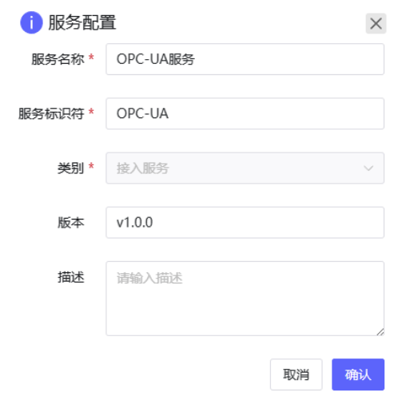
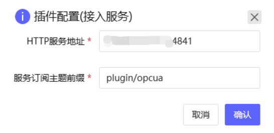
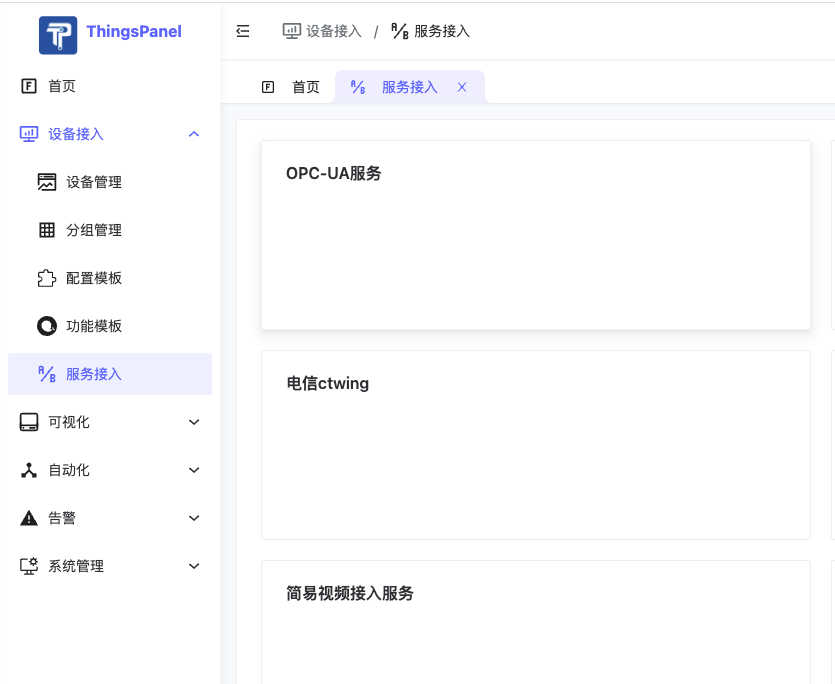
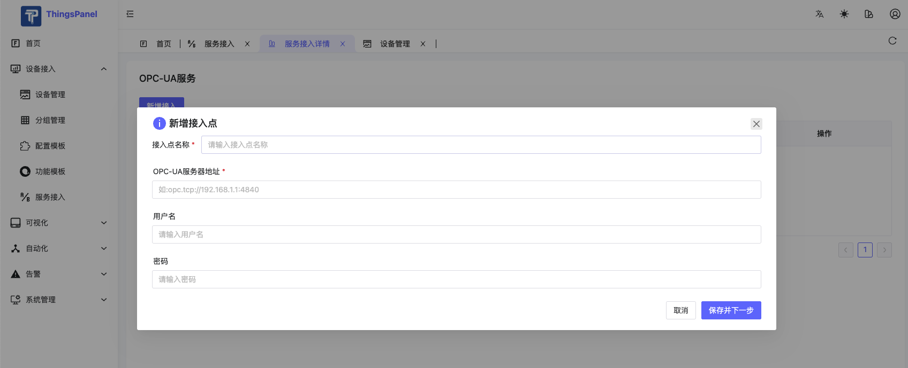
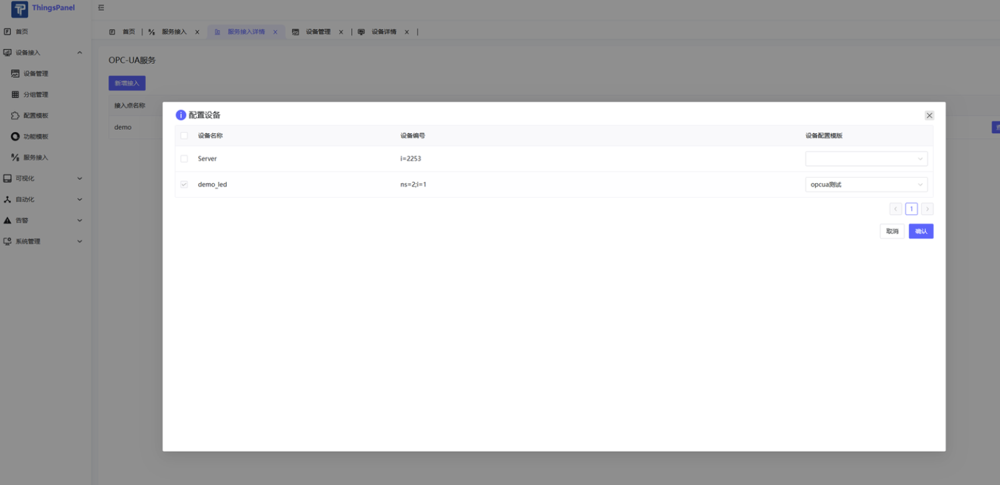
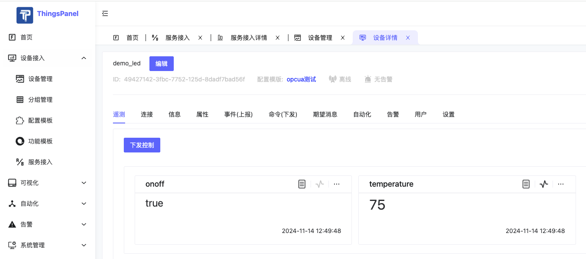

# OPC-UA接入

## 什么是OPC UA

OPC-UA（OPC Unified Architecture）作为工业自动化领域的新一代通信标准协议，正在逐步取代传统的OPC协议。它提供了一个安全、可靠、平台无关的工业通信解决方案。ThingsPanel平台通过集成OPC-UA协议插件，实现了与工业设备的无缝对接，为工业物联网应用提供了强大的支持。

OPC-UA是一个面向工业自动化的机器对机器通信协议，具有以下特点：

1. 平台独立性：

   - 支持跨平台部署

   - 不依赖特定操作系统

   - 支持多种编程语言实现

2. 安全性：

   - 内置加密机制

   - 支持证书认证

   - 数据传输安全保障

3. 可扩展性：

   - 支持自定义数据模型

   - 灵活的信息建模能力

   - 支持复杂数据结构

## OPC-UA协议插件

此插件为企业版功能，如有需求，请联系我们。

### 功能特性

- **设备发现**
  - 自动扫描 OPC-UA 服务器中的设备和节点
  - 支持递归遍历和过滤设备节点
  - 实时更新设备状态和在线情况

- **数据采集**
  - 支持多设备并发数据采集
  - 自动订阅设备数据变更
  - 支持数据缓存和批量上报
  - 内置数据采集重试机制

- **平台集成**
  - 与 ThingsPanel 平台无缝集成
  - 支持设备配置管理
  - MQTT 消息实时传输
  - HTTP API 接口支持

- **运行监控**
  - 完整的日志记录系统
  - 服务状态监控
  - 异常自动恢复机制
  - 性能指标收集

### 系统要求

- Go 1.22 或以上版本
- 支持 Windows/Linux/MacOS 系统
- OPC-UA 服务器需支持标准 OPC-UA 协议
### 操作步骤

#### 注册插件
1. super用户登录-应用管理-插件管理-添加新插件

2. 插件配置
   

#### 使用插件

1. 选择注册的服务插件

2. 新增接入点，填入OPC-UA服务的地址等信息

3. 选择要添加的设备（需要提前创建一个配置模板，协议配置里选择这个服务插件）

4. 添加后可查看设备

5. 数据变化上报

## 其它方法：通过规则引擎的方式

ThingsPanel对接opc-ua设备【通过规则引擎】  
https://www.bilibili.com/video/BV1G14y1a7iN/?spm_id_from=333.999.0.0