# 移动OneNET对接

本文主要介绍OneNet平台的设备快速接入ThingsPanel平台。

## 服务插件介绍

OneNET平台提供了多种接入方式

- service_plugin_onenet服务插件
  - 该服务插件是通过OneNet平台的http推送服务进行数据接入

## 对接流程

### 前提条件

1. 注册OneNET账号
2. 注册或者部署ThingsPanel平台，并部署OneNet服务插件
3. OneNet服务插件已经注册到平台
   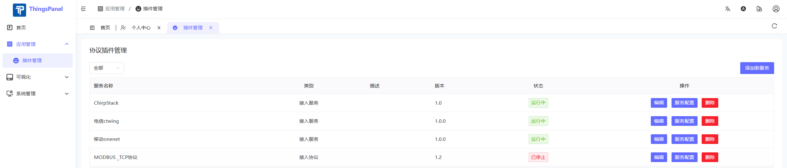

### 操作步骤

- OneNet平台配置
  - 登录OneNET平台，进入开发者中心
    - 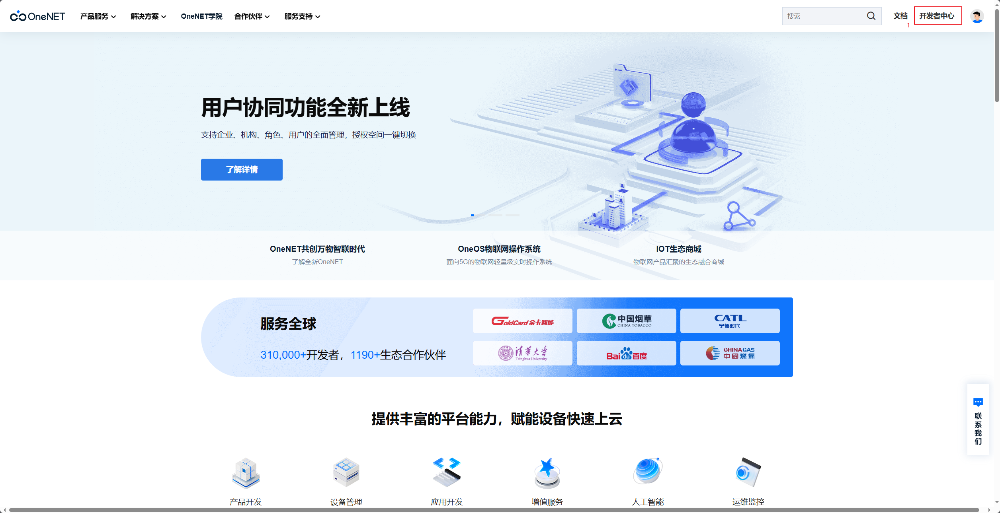
  - 创建产品
    - 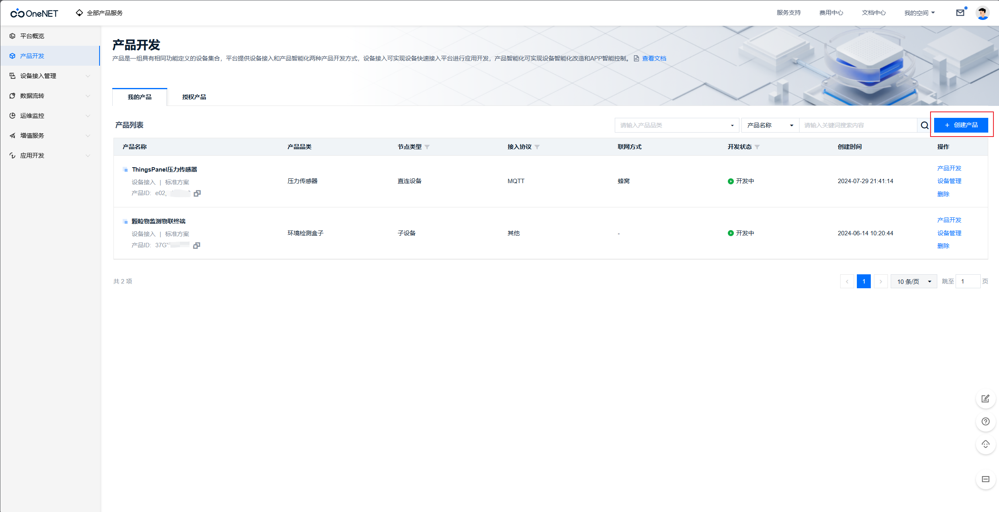
  - 添加设备
    - 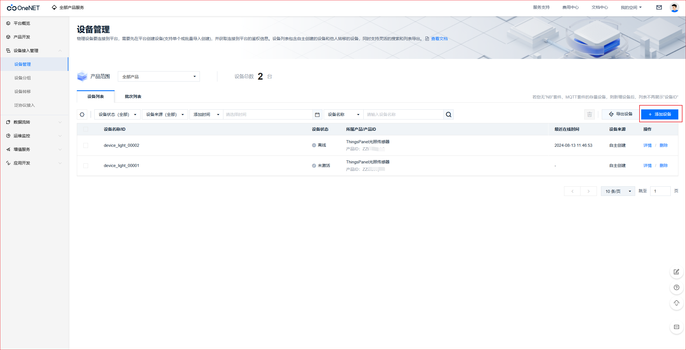
  - 设置流转
    - 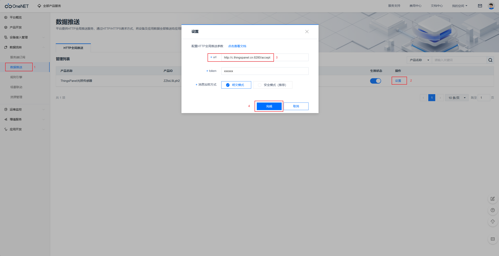
    - c.thingspanel.cn:8280是服务插件的地址和服务端口
  - 模拟设备推送数据
    - 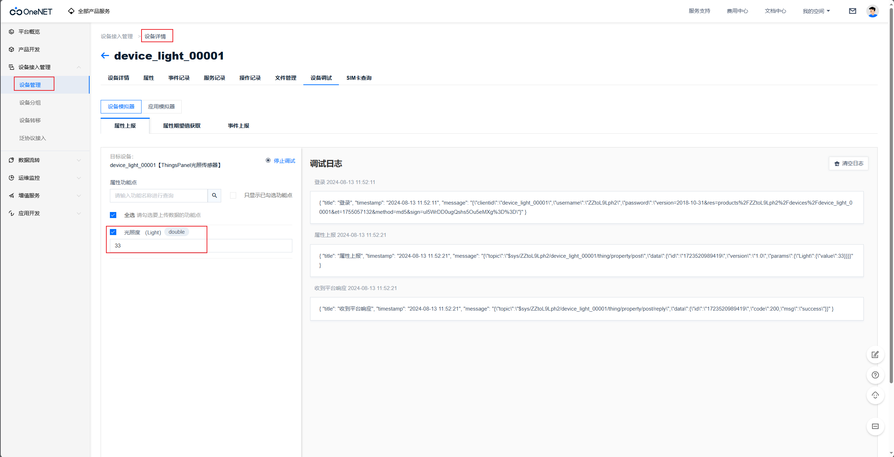
  - 获取产品ID和ACCESS_KEY
    - 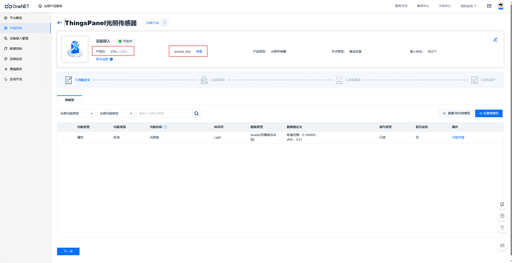
- ThingsPanel平台配置
  - 如果没有该服务的配置模板，需要创建
    - 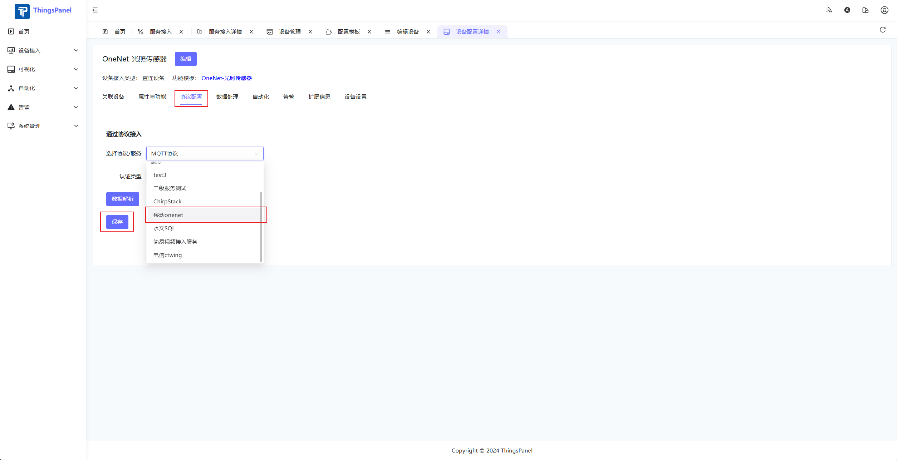
  - 进入服务接入页面
    - 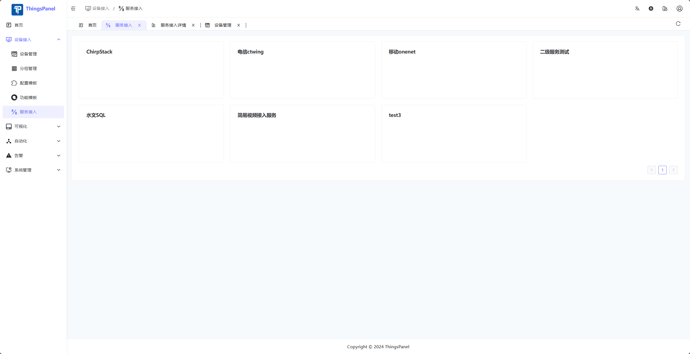
  - 新增服务接入点
    - 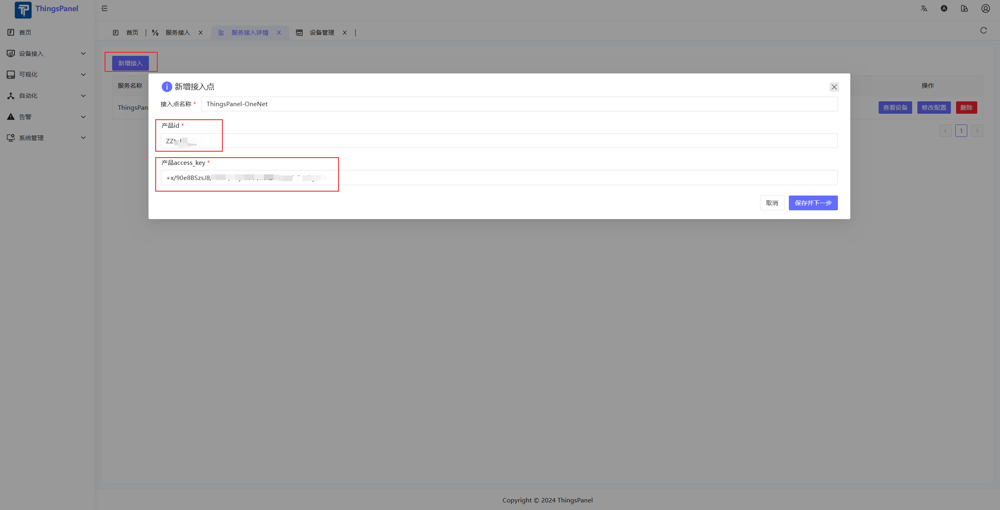
  - 选择要接入的设备
    - 注意：该设备列表只会显示有推送过数据的设备
    - 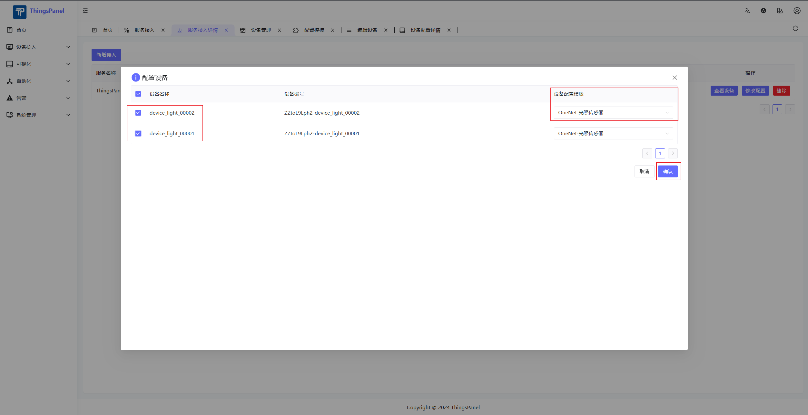
  - 推送数据后，在设备详情页查看数据
    - 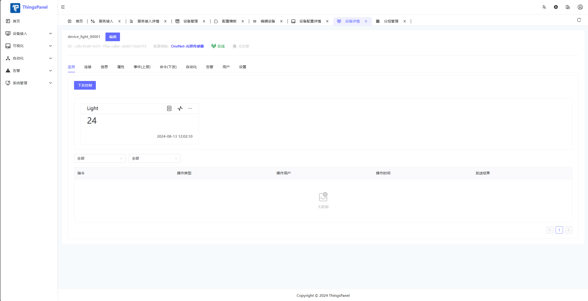

## 其他

ThingsPanel提供服务插件开发模板，其余接入方式可参考服务插件开发流程自行开发接入。
