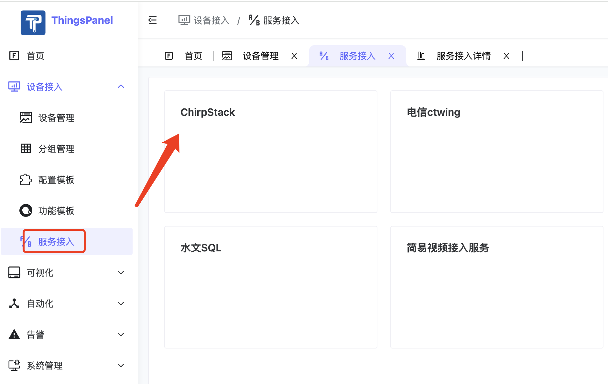
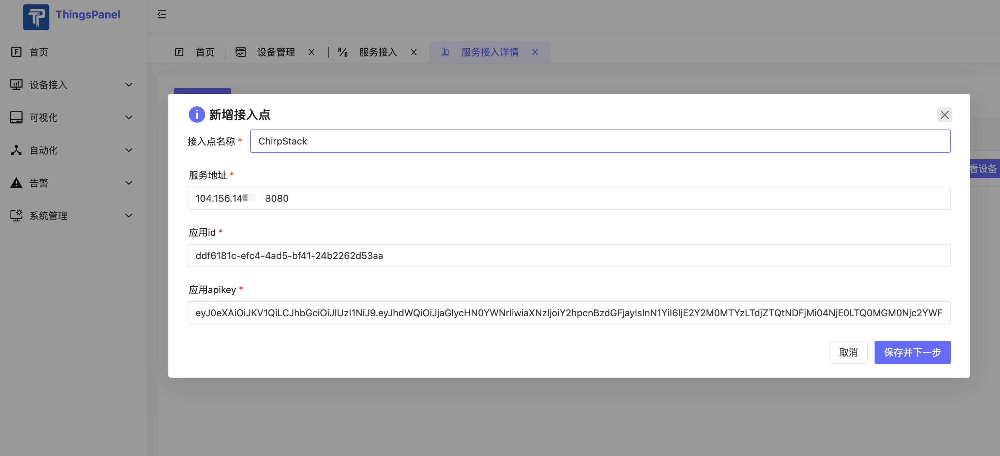
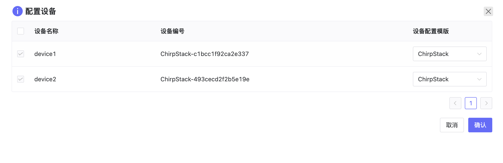
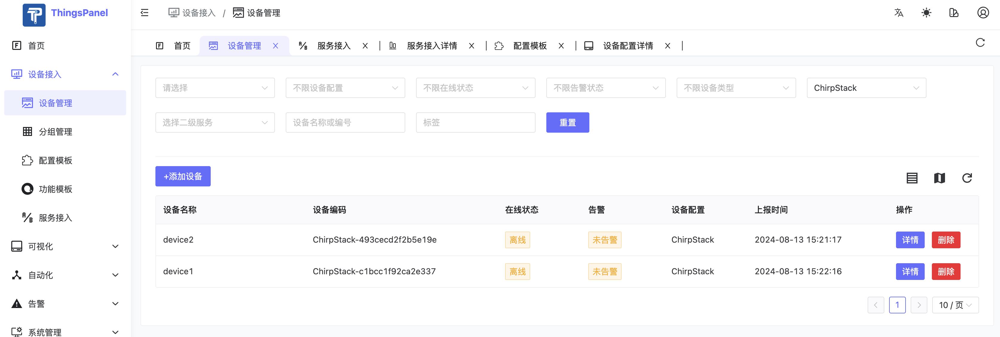
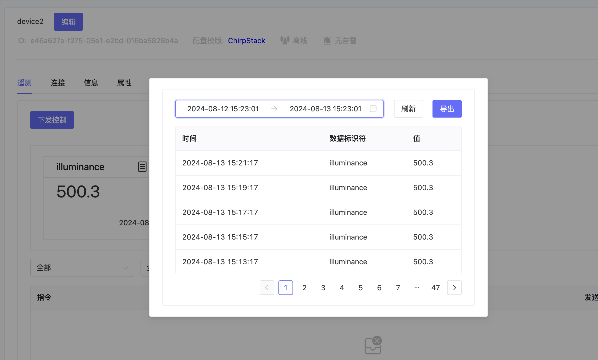

# LoRaWAN网关ChirpStack接入

ChirpStack是一个开源的LoRaWAN（R）网络服务器，可用于设置LoRaWAN网络。ChirpStack提供了一个用于管理网关、设备和租户的网络接口，以及与主要云提供商、数据库和通常用于处理设备数据的服务建立数据集成。ChirpStack提供了一个基于gRPC的API，可用于集成或扩展ChirpStack。

ThingsPanel已经实现了和ChirpStack的对接。
## 服务插件介绍

ChirpStack接入插件，通过APIkey、IP地址、应用ID来实现设备的获取，并将设备数据接入到ThingsPanel中。

## 对接流程

### 前提条件

1. 部署好ChirpStack并接入了LoRaWAN网关，如果没有设备，可以参考 从0搭建LoRaWAN服务器ChirpStack并模拟接入设备 http://thingspanel.cn/posts/89
2. 部署ThingsPanel平台，并在ThingsPanel中注册ChirpStack服务接入插件

### 注册插件步骤

参考插件代码库README.md https://github.com/ThingsPanel/service_plugin_chirpstack

### 设备接入步骤

1. 服务接入中选择ChirpStack服务接入插件
   
2. 添加新增接入点
   填写ChirpStack的APIkey、IP地址、应用ID   
   
3. 配置设备列表，筛选需要接入的设备
   
4. 完成接入，查看接入的设备
   
   
## 代码地址

ChirpStack插件代码地址：https://github.com/ThingsPanel/service_plugin_chirpstack