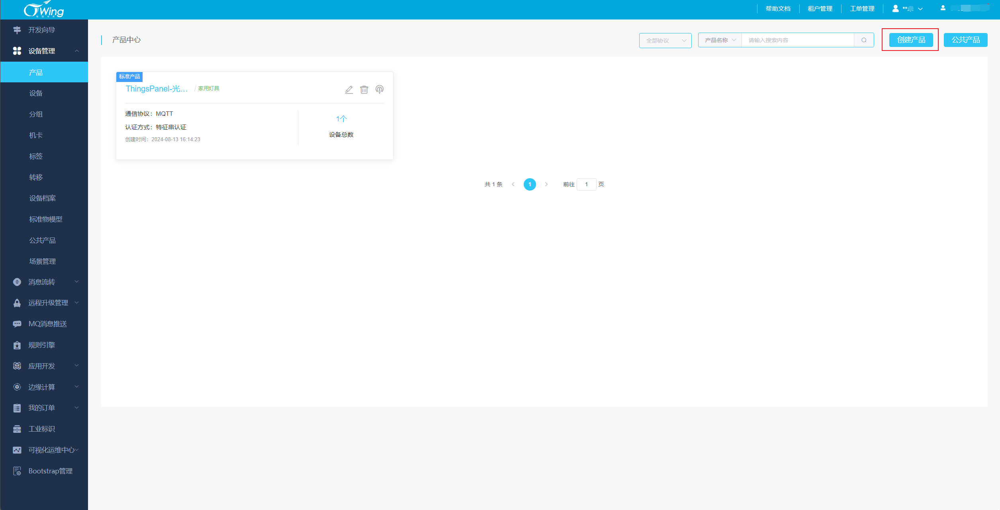
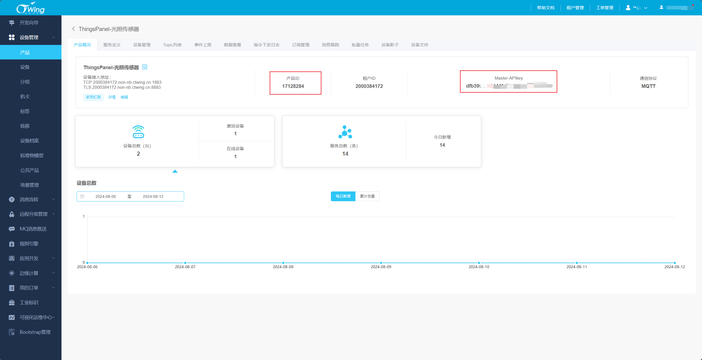
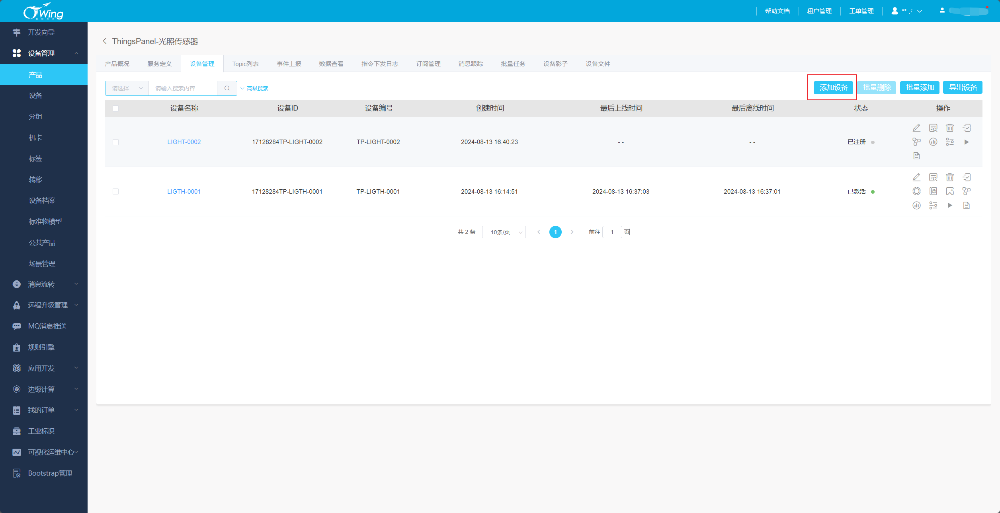
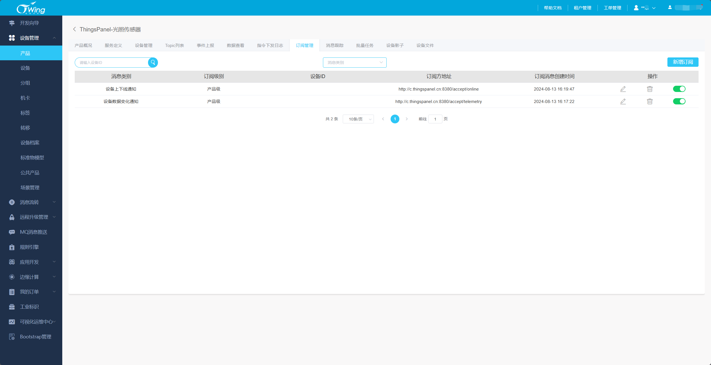
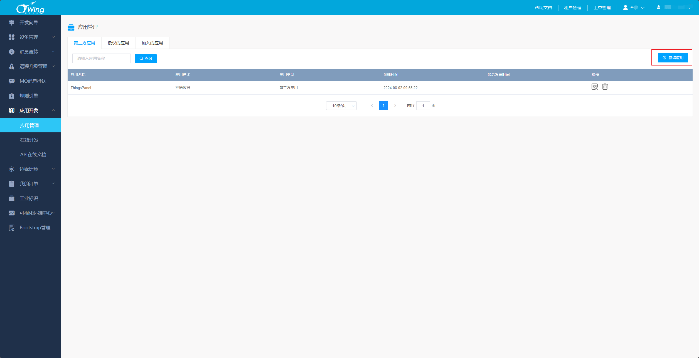
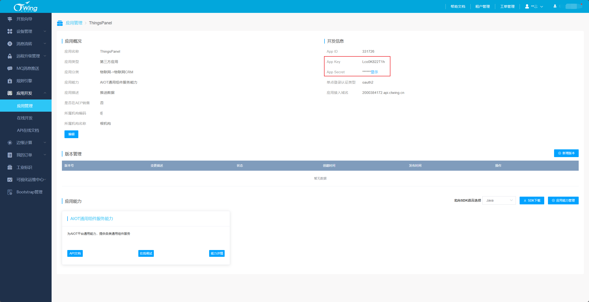
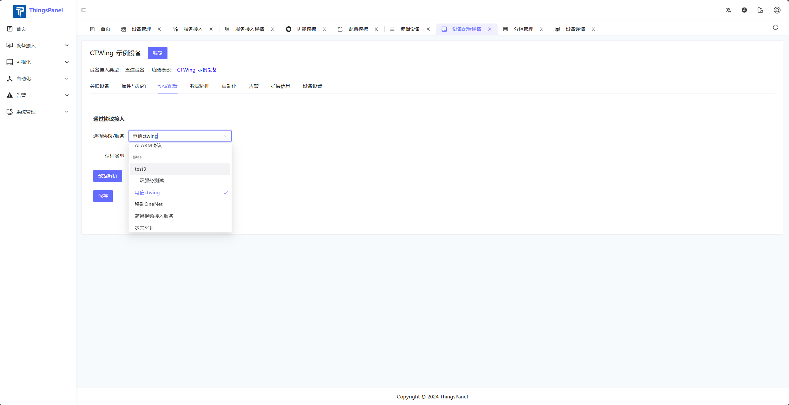
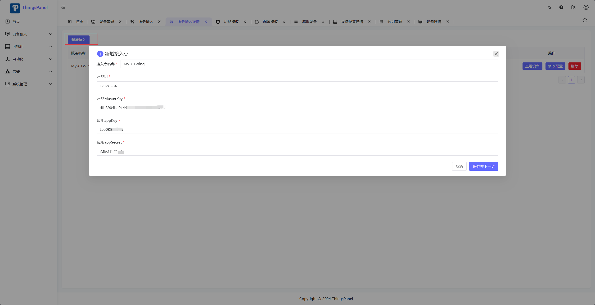
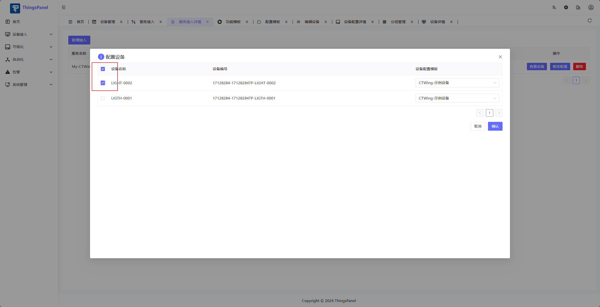
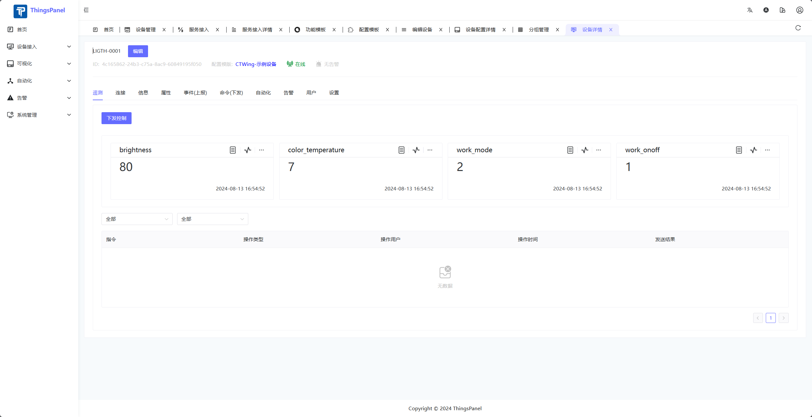

# 电信CTWing对接

本文主要介绍CTWing平台的设备快速接入ThingsPanel平台。

## 服务插件介绍

CTWing平台提供了多种接入方式

- service_plugin_ctwing服务插件
  - 该服务插件是通过CTWing平台的http推送服务进行数据接入

## 对接流程

### 前提条件

1. 注册CTWing账号
2. 注册或者部署ThingsPanel平台，并部署CTWing服务插件
3. CTWing服务插件已经注册到平台
   

### 操作步骤

- CTWing平台配置
  - 登录CTWing平台
  - 创建产品和设备，获取产品ID、Master-APIkey
    - 
    - 
    - 
  - 新增订阅
    - c.thingspanel.cn:8380为服务插件的地址和服务端口
    - 
  - 新增应用，获取App Key、App Secret
    - 
    - 
- ThingsPanel平台配置
  - 如果没有该服务的配置模板，需要创建
    - 
  - 进入服务接入页面
    - 
  - 新增服务接入点
    - 
  - 选择要接入的设备
    - 注意：该设备列表只会显示有推送过数据的设备
    - 
  - 推送数据后，在设备详情页查看数据
    - 
