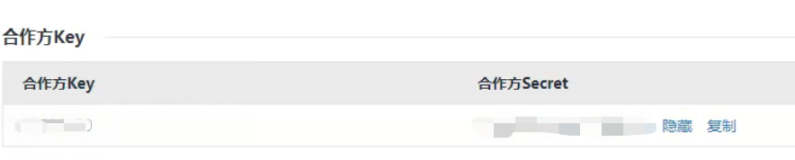
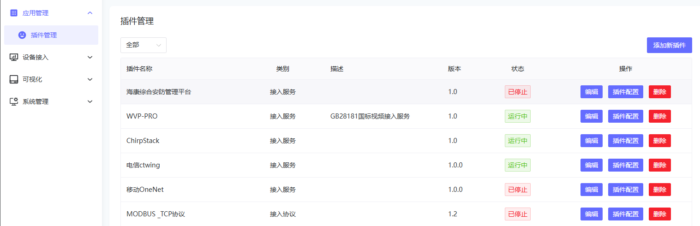
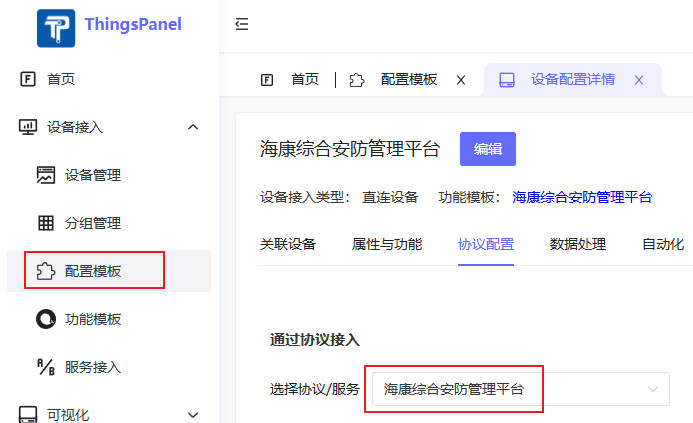
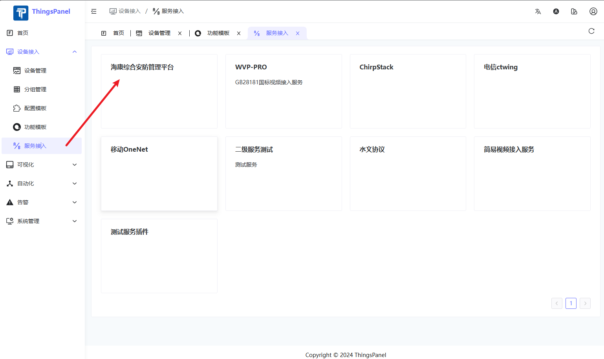
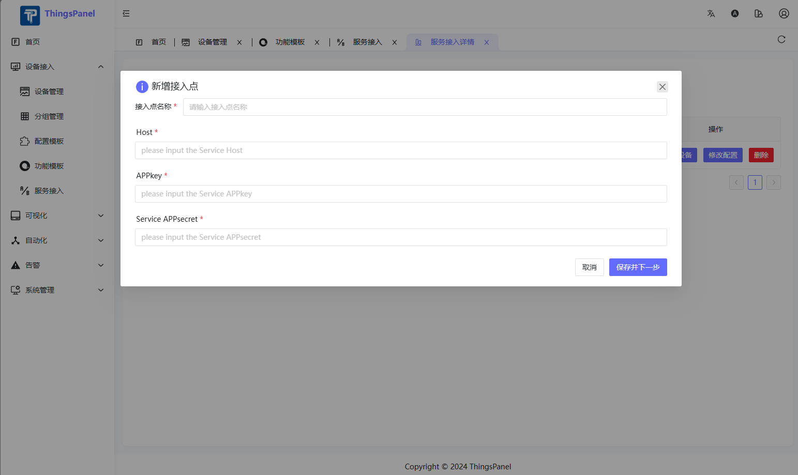
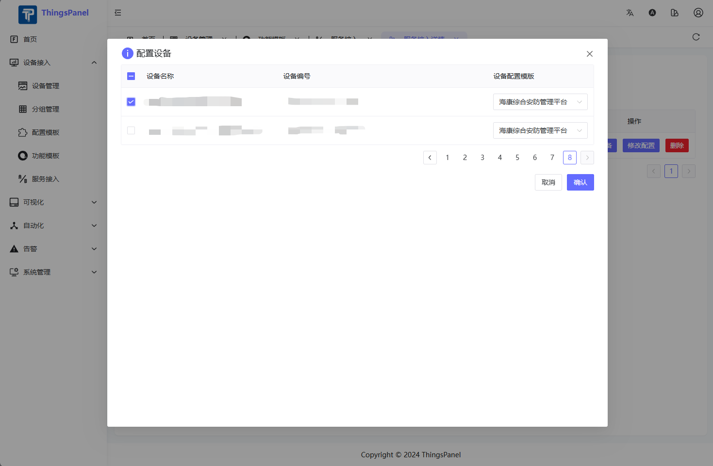
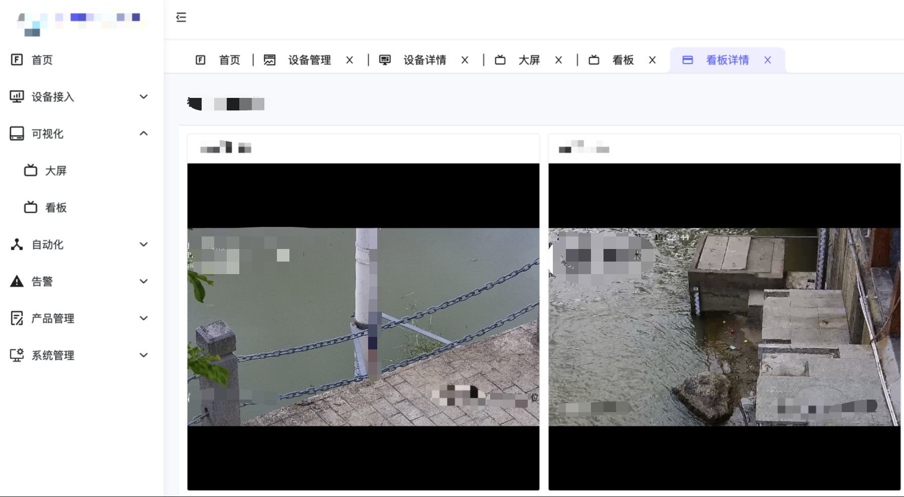

# 海康综合安防管理平台（iSecure Center）对接

本文主要介绍海康综合安防管理平台（iSecure Center）的设备资源快速接入ThingsPanel平台。

## 对接流程

### 前提条件

1. 从海康综合安防管理平台（iSecure Center）运管中心获取合作方Key和合作方Secret，也就是APPkey和APPsecret。
2. 部署ThingsPanel平台，并在ThingsPanel中注册iSecureCenter服务接入插件

### 操作步骤

1. 首先需要创建一个设备配置模板，选择注册的iSecureCenter服务接入插件。
2. 在服务接入中选择注册的该服务。
3. 新增一个接入点。
4. 选择添加该接入点的设备。
5. 在看板中添加播放视频的卡片，配置设备，即可查看视频。

## 代码地址

未开源
