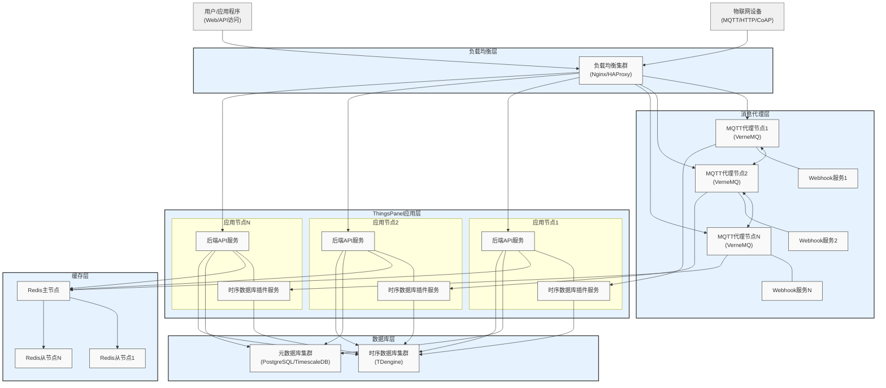

# 集群部署

## 集群部署架构图

## 1. 整体架构

ThingsPanel采用分层架构设计，从上到下分为负载均衡层、消息代理层、应用层、缓存层和数据库层。这种分层架构具有高可用性、可扩展性和可维护性的特点。

## 2. 各层详细说明

### 2.1 接入层

- **设备接入**
  - 支持多种协议：MQTT、HTTP、CoAP
  - 支持海量设备并发接入
  - 支持设备认证和安全机制

- **用户访问**
  - 支持Web界面访问
  - 提供标准REST API接口
  - 支持多种客户端应用接入

### 2.2 负载均衡层

- **组件**：Nginx/HAProxy集群
- **功能**：
  - 实现设备连接的负载均衡
  - 提供高可用性保证
  - 支持横向扩展
  - 流量控制和安全防护

### 2.3 消息代理层

- **MQTT代理节点（VerneMQ）**
  - 支持集群部署
  - 节点间数据同步
  - 设备消息的实时转发
  - 支持QoS服务质量保证

- **Webhook服务**
  - 与MQTT代理紧密集成
  - 提供消息预处理能力
  - 支持自定义消息处理逻辑

### 2.4 ThingsPanel应用层

- **后端API服务**
  - 设备管理
  - 用户权限管理
  - 业务规则引擎
  - 告警管理
  - 数据可视化

- **时序数据库插件服务**
  - 设备数据高效存储
  - 数据清洗和转换
  - 数据分析处理
  - 历史数据管理

### 2.5 缓存层

- **Redis集群**
  - 采用主从架构
  - 提供高速数据缓存
  - 支持会话管理
  - 提升系统响应速度

### 2.6 数据库层

- **时序数据库（TDengine）**
  - 针对物联网数据特点优化
  - 高性能数据存储和查询
  - 支持数据压缩
  - 提供数据保留策略

- **元数据库（PostgreSQL/TimescaleDB）**
  - 存储业务元数据
  - 设备配置信息
  - 用户及权限数据
  - 支持复杂业务查询

## 3. 系统特点

### 3.1 高可用性

- 各层组件支持集群部署
- 无单点故障设计
- 服务自动容错和恢复
- 数据多副本存储

### 3.2 可扩展性

- 支持水平扩展
- 各层可独立扩容
- 灵活的节点添加/删除
- 动态负载均衡

### 3.3 安全性

- 设备接入安全认证
- 数据传输加密
- 用户访问权限控制
- 多层安全防护

### 3.4 可维护性

- 组件解耦设计
- 便于问题定位
- 支持在线升级
- 完善的监控告警

## 4. 部署建议

### 4.1 小型部署（设备数量<1万）

- 最小化组件部署
- 单节点部署即可满足需求
- 建议配置：
  - 2核4G以上服务器
  - 100GB以上存储空间

### 4.2 中型部署（设备数量1万-10万）

- 建议双节点集群部署
- 关键组件冗余备份
- 建议配置：
  - 4核8G以上服务器
  - 500GB以上存储空间

### 4.3 大型部署（设备数量>10万）

- 全组件集群部署
- 跨机房容灾备份
- 建议配置：
  - 8核16G以上服务器
  - 1TB以上存储空间
  - 根据实际需求扩展节点

## 5. 扩展性建议

- 预留50%以上的性能余量
- 分阶段扩容规划
- 关注数据存储容量
- 定期进行性能评估
