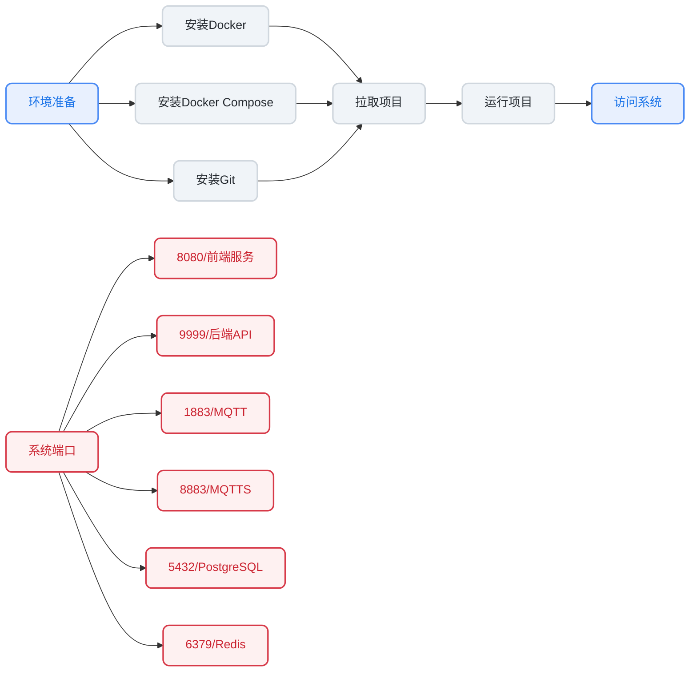

# Docker部署ThingsPanel

## 部署流程



## 环境准备

:::tip

windows环境下请安装 `Docker Desktop`和 `git`。

:::

### 安装Docker

- **安装docker（centos）**

  ```bash
  dnf config-manager --add-repo https://download.docker.com/linux/centos/docker-ce.repo
  dnf install docker-ce docker-ce-cli containerd.io
  systemctl start docker.service
  systemctl enable docker.service
  ```

- **安装docker-compose**

:::tip
  如docker-compose的v2.9.0运行出错，可下载v2.10.0使用。
  如要使用docker-compose较新版本，请自行修改项目里的docker-compose.yml文件
:::

  ```bash
  curl -L "https://github.com/docker/compose/releases/download/v2.9.0/docker-compose-$(uname -s)-$(uname -m)" -o /usr/local/bin/docker-compose
  chmod +x /usr/local/bin/docker-compose
  ```

  如果下载太慢可替换

  ```bash
  curl -L "https://get.daocloud.io/docker/compose/releases/download/v2.9.0/docker-compose-$(uname -s)-$(uname -m)" -o /usr/local/bin/docker-compose
  chmod +x /usr/local/bin/docker-compose
  ```

- **如没有安装git**

  ```bash
  dnf install git -y
  ```

### 镜像加速方式安装

[Debian系统安装 Docker 操作手册](https://docs.qq.com/doc/DZVZtdXBPdFJxV05C)  
[CentOS系统安装 Docker 操作手册](https://docs.qq.com/doc/DZUlaZG50dG1RdHB0)  
[Ubuntu系统安装 Docker 操作手册](https://docs.qq.com/doc/DZW13a1FzeGxiQk5J)  
[AlmaLinux系统安装 Docker 操作手册](https://docs.qq.com/doc/DZWNWZU9LZUxwTWVs)  

## 开始安装

- **拉取项目**

  ```bash
  # 拉取docker配置
  git clone https://github.com/ThingsPanel/thingspanel-docker.git
  cd thingspanel-docker
  ```

- **运行项目**

  > 在 `thingspanel-docker`目录下(win需要打开 `cmd` 窗口)
  >

  ```bash
  # 以日志显示前台方式启动项目(默认端口8080)
  docker-compose -f docker-compose.yml up
  # 或者以隐藏日志显示的方式启动项目
  docker-compose -f docker-compose.yml up -d
  # 停止服务
  docker-compose -f docker-compose.yml down
  ```

- **登录**

  - 打开浏览器，输入**服务器ip:8080**
  - 系统管理员 super@super.cn / 123456
  - 租户管理员 tenant@tenant.cn / 123456

## 挂载说明

- **配置文件、日志以及其他差分文件**

  ```bash
  ./data
  ```

- **docker数据卷名**

  ```bash
  go
  gmqtt
  nginx
  ```

## 查看容器运行日志

```bash
docker logs -f containerID
```

## 端口说明

```bash
8080（前端服务端口）
9999（后端API端口）
1883（mqtt端口）
8883（mqtts端口）
5432（postgresql端口）
6379（redis端口）
```

:::tip 设备对接

设备接入请参考
[`mqtt对接`](../device-connect/mqtt)

:::
