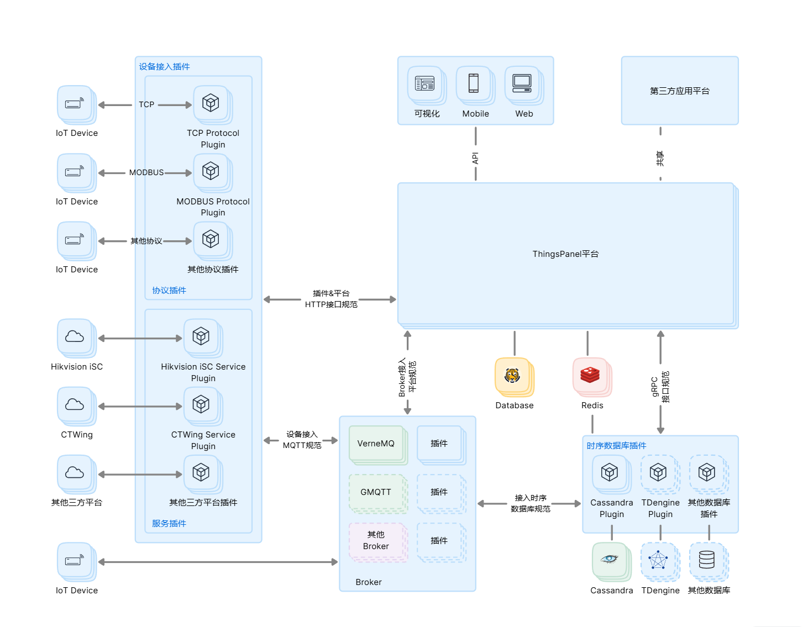

# 系统架构

**ThingsPanel设计优势**：

- **高性能分布式架构**：使用领先的开源技术构建，支持水平扩展，单节点支持万级设备接入，集群可处理百万级设备。
- **灵活的插件化设计**：通过插件方式可方便地增加新的功能和适配新的设备，支持协议、数据库、服务的灵活扩展。
- **高可用性保障**：集群中的每个节点都是对等的，无单点故障，支持服务自动容错和恢复。
- **开放的集成能力**：提供标准化的 API 接口，支持第三方系统快速集成。

参见如下架构图及关键组件。

说明：

- **协议插件**：ThingsPanel 支持多种通信协议，包括 Modbus、HTTP、TCP、OPC-UA 等，通过对应的协议插件与 IoT 设备进行连接和通信。这种设计可以帮助用户轻松扩展到新的设备和协议，确保与众多 IoT 设备的兼容性。

- **MQTT Broker集群**：VerneMQ、GMQTT 等各种知名的 MQTT Broker，为 IoT 设备提供高性能、高可靠性的消息传递服务。可以根据需求选择合适的 Broker。

- **数据库**：支持多种数据库如 Cassandra 和 TDengine 等分布式存储数据库，这提供了数据的高可用性、扩展性和灵活性，为 IoT 提供了高效、可靠的数据存储解决方案。可以根据实际需求选择合适的数据库。

- **部署**：ThingsPanel 的架构设计考虑到了高可用性和扩展性，确保没有单点故障，每个组件都可以进行水平扩展。

- **服务插件**：通过插件化的设计，ThingsPanel 可以轻松地扩展新的功能和服务，满足不断变化的业务需求。

- **插件化**：协议、数据库和 Broker 都是通过插件的形式实现的，这种模块化的设计可以方便地增加新的功能和适配新的设备，同时也使得维护更为简单。

- **跨平台接入**：ThingsPanel 支持多种终端接入，包括移动端、Web 端等。这意味着用户可以在任何设备上访问和管理他们的物联网设备。

- **API接口体系**：
  - REST API：提供标准的 HTTP 接口，支持设备管理、数据查询等操作
  - WebSocket：支持实时数据推送和设备状态监控
  - 认证机制：支持 Token、签名等多种认证方式
  - 数据服务：支持实时数据订阅、历史数据查询、批量数据处理等功能

- **集中管理**：ThingsPanel 作为核心的管理平台，可以集中处理多种设备、协议和存储的数据，这简化了管理工作并提高了效率。
