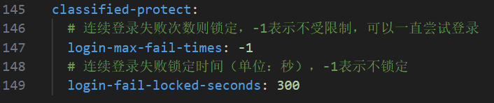
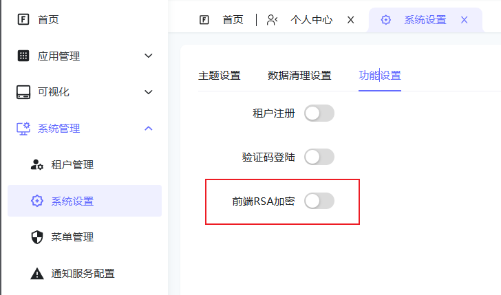
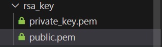

# 三级等保实施方案

## 背景与意义

根据《中华人民共和国网络安全法》要求，信息系统安全等级保护（简称等保）是国家网络安全保障的基本制度。作为物联网管理平台，ThingsPanel 满足三级等保要求，确保平台的安全性、可靠性和合规性。

## 实施思路

依据《信息安全技术-网络安全等级保护基本要求》（GB/T 22239-2019）中第三级安全要求，重点实现：

a) 用户身份标识和鉴别：确保身份标识唯一性，实施复杂度要求，定期更换鉴别信息；

b) 登录安全控制：配置登录失败处理、会话管理、非法登录限制等安全措施；

c) 远程管理安全：采取必要的加密措施防止鉴别信息在网络传输过程中被窃听。

## 具体安全要求

1. 连续登录失败 5 次锁定账户 30 分钟，登录超时时长为 300-1800 秒

2. 采用国家认可的密码技术保护重要业务数据和个人信息

3. 平台密码复杂度至少包含三种字符，进行特殊字符过滤，最小 8 位且禁止使用常用密码

4. 密码不可明文传输，不可明文存储

5. 实施 SQL 注入防护措施

6. 严格禁止共享账户使用

7. 用户登出时必须清除用户鉴别信息

8. 对具有上传功能的模块实施文件类型限制

## 开发措施

### 实现强密码策略

- 最小长度：8位
- 复杂度要求：至少包含三种字符类型（大小写字母、数字、特殊字符）

### 登录失败锁定

- 记录登录失败次数
- 设置阈值
  - 
- 超过阈值后，自动锁定账户 30 分钟

### RSA前端密码加密

- 实施全链路加密保护
  - 
- 前端密钥位置
  - rsa_key目录
- 后端密钥位置
  - 
- 密钥管理建议：
  - 定期轮换密钥对
  - 加强私钥保护

### 防范安全漏洞

- CodeQL 定期代码安全扫描
- DeepSource 提交时自动检测
- 重点关注的漏洞类型：
  - SQL注入
  - 跨站脚本（XSS）
  - 跨站请求伪造（CSRF）
  - 不安全的反序列化
  - 敏感数据泄露

### 日志和监控

- 记录关键安全事件：
  - 用户认证操作
  - 敏感数据访问
  - 系统异常信息

### 持续改进

- 定期安全评估和渗透测试
- 及时更新系统组件
- 持续优化安全策略
- 跟踪最新安全威胁

通过以上措施，确保平台满足三级等保要求，为用户提供安全可靠的服务。我们将持续关注安全技术发展，不断提升平台的安全防护能力。
