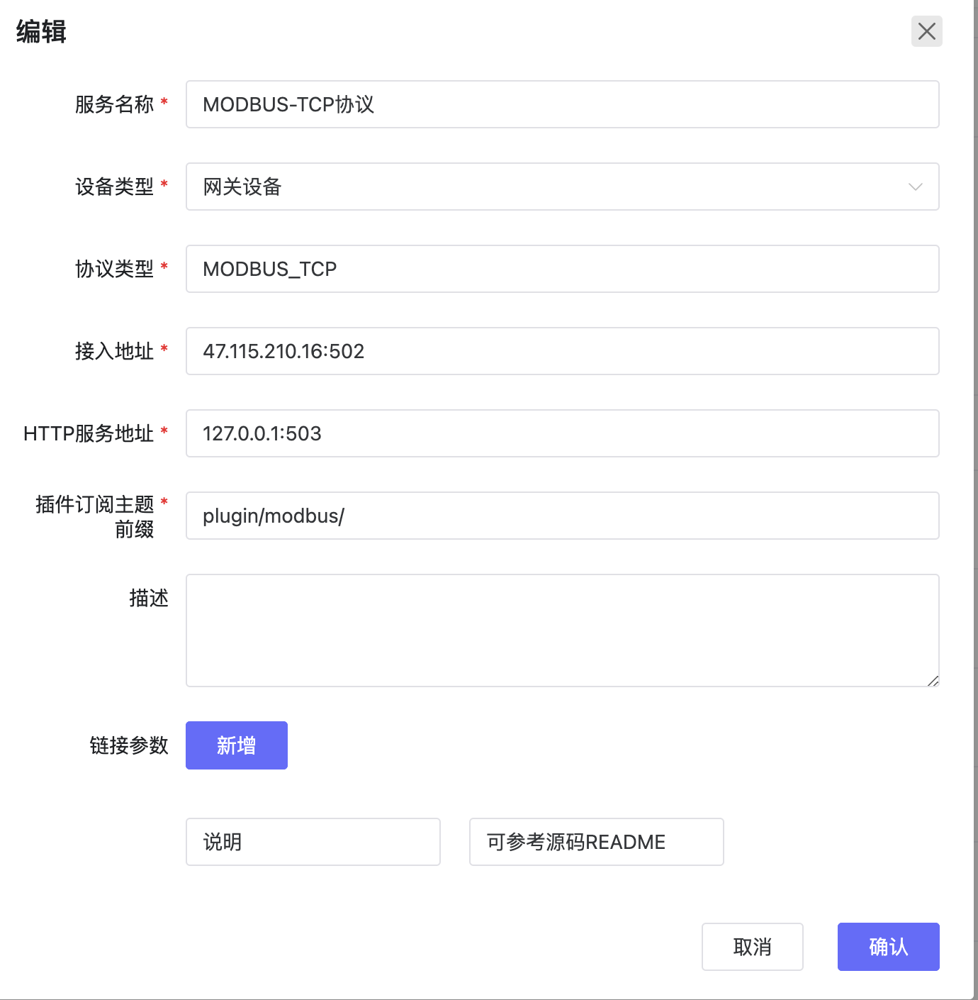

# 协议插件
- 点击应用管理-协议插件管理，可以进入协议管理页面。
- 协议插件需要系统管理员才可以添加，需要以系统管理员身份登录
- 目前支持新建、编辑、删除一个协议。
{width="5.791666666666667in" height="5.91757217847769in"}
- 请参考代码库中各协议插的README来配置和理解协议插件
[`代码库地址`](../../system-introduction/code_repository)

