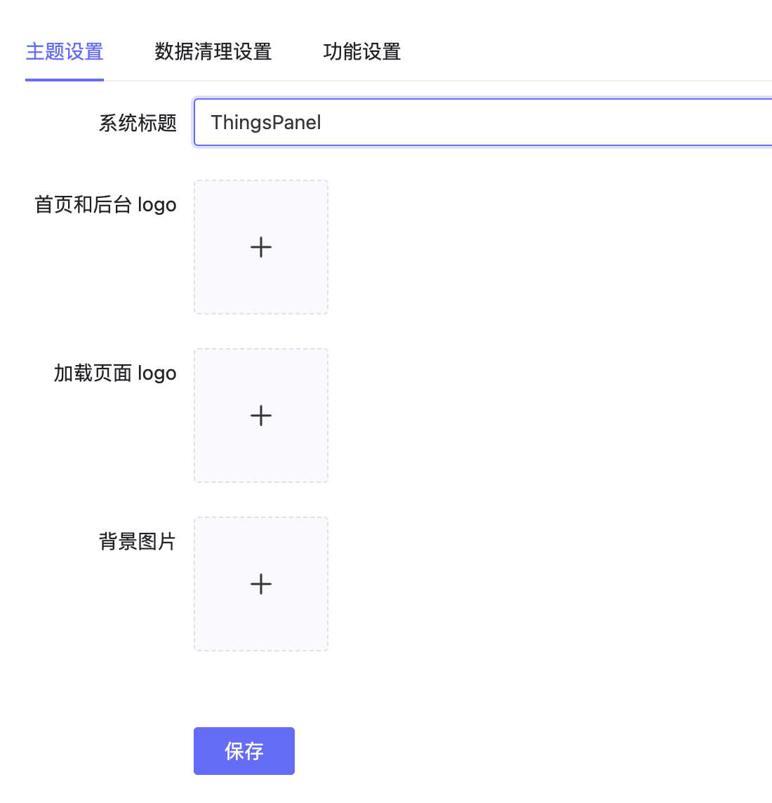
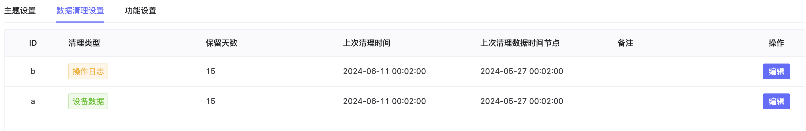
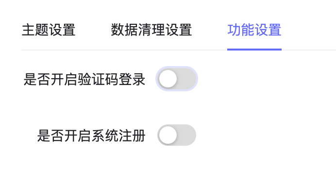

# 系统设置

## 1、说明
系统配置包包含了主题设置，清理数据设置和功能设置三部分。

## 2、操作
### 2.1、主题设置
可以设置系统标题，首页和后台log，加载页面log和背景图片，点击后即可生效。

### 2.2、清理数据设置

主要是操作日志和设备数据是否保存，以及保留时间的设置，默认启用并保留15天。

### 2.3、功能设置

设置是否开启验证码登陆和系统注册功能，默认不开启。

