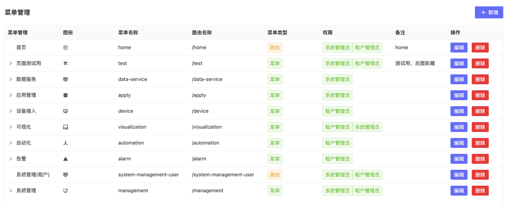

# 系统设置
## 说明
- 系统配置包包含了主题设置，清理数据设置和功能设置三部分。

## 操作：
#### 主题设置

可以设置系统标题，首页和后台log，加载页面log和背景图片，点击后即可生效。

{width="3.8585739282589677in" height="4.0129166666666665in"}

#### 清理数据设置

主要是操作日志和设备数据是否保存，以及保留时间的设置，默认启用并保留15天。

{width="6.530555555555556in" height="1.0699781277340332in"}

#### 功能设置

设置是否开启验证码登陆和系统注册功能，默认不开启。

{width="3.7901279527559053in" height="1.9279265091863518in"}

### 菜单管理

配置系统左侧菜单树，可配置父子菜单结构，以及每个菜单的名称、图标、路由、菜单类型和权限等功能。可新增、编辑、搜索、删除，隐藏。

{width="6.325417760279965in" height="2.560915354330709in"}

### 通知服务配置

设置接受通知的邮箱和短信配置。

{width="3.625in" height="4.185304024496938in"}

