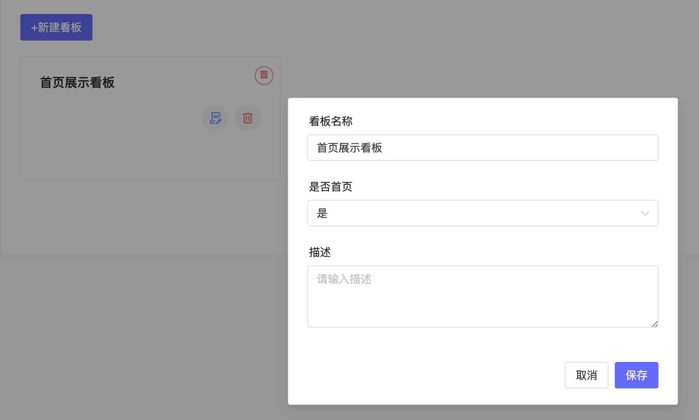
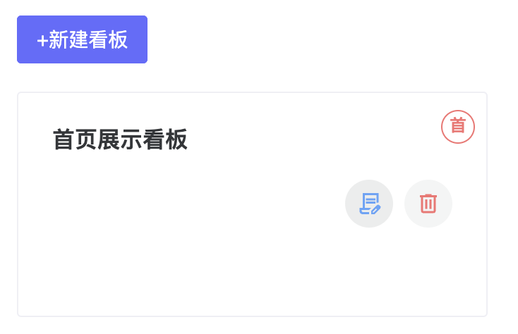
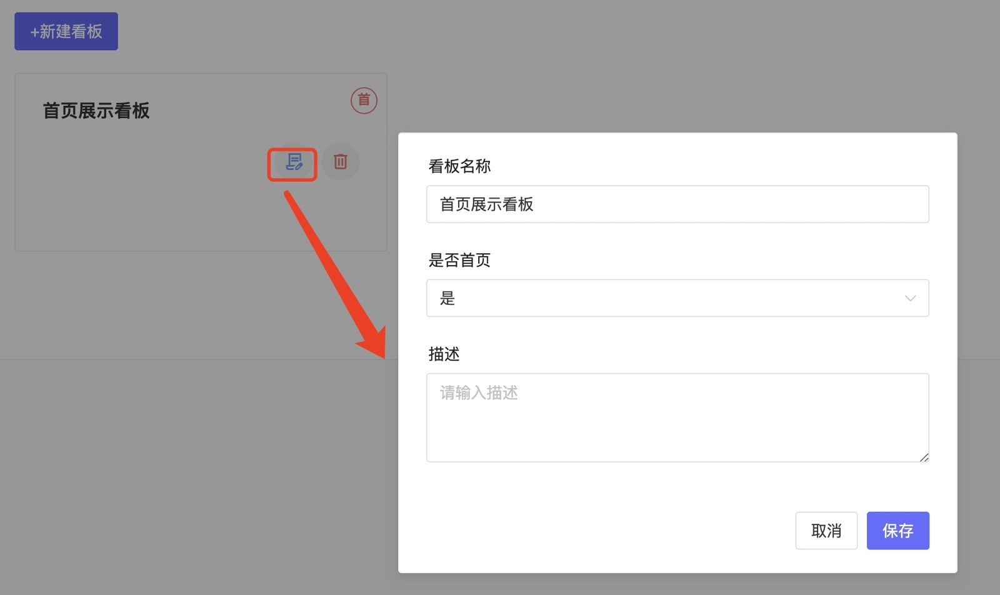
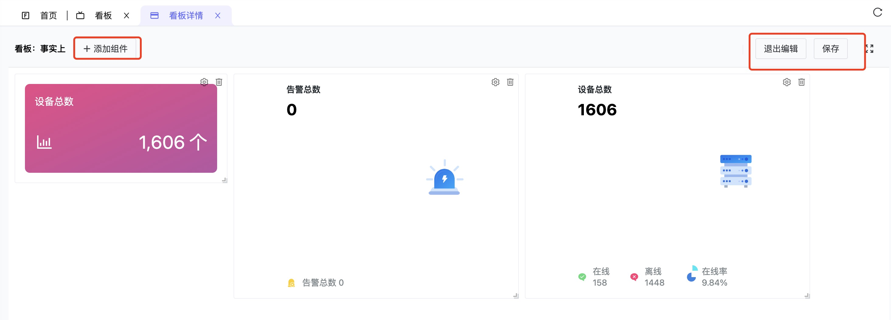

# 看板

## 1. 说明
- 点击可视化-看板进入看板管理页面。看板管理主要是配置展现的看板，具有新建看板、编辑看板、删除看板，并可选择是否该看板展示在首页等功能。

## 2. 操作

### 新建看板

- 点击"新建看板"打开新建看板弹出框，输入看板名称，是否展示在首页，描述等信息可以建立一个看板，目前只有一个看板可以展示在首页。

- 设置看板展示在首页后，在看板上面带"首"字标识，如下图所示。

### 编辑看板名称

- 选择要编辑的看板，点击编辑按钮，弹出编辑看板弹出框。

### 删除看板

- 选择要删除的看板，点击删除即可。

### 编辑看板图

- 点击要编辑展示图的站看，进入后，点击编辑，即可编辑需要的展示图组件。

