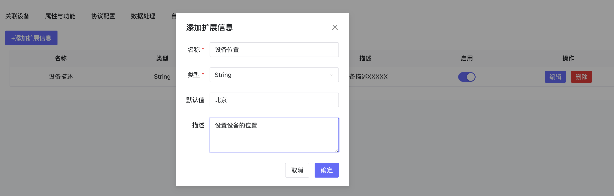

# 配置模版
## 1、说明
- 点击设备接入-配置模版进入配置模版管理页面，配置模版功能包括新建配置模版、编辑配置模版、以及配置模版。

## 2、操作

### 2.1、创建设备配置模板

- 点击创建设备配置，即可创建配置，创建配置时，可选择：

（1）输入设备配置名称：例如SGP30传感器

（2）绑定的设备配置模板

（3）设备接入类型，在编辑时，不可更改设备接入类型，创建时可选择

### 2.2、设备配置详情

#### 2.3、关联设备

- 添加配置模版关联的设备，配置后，关联模版的配置会同步到设备中。

#### 2.4、属性与功能

- 设置绑定的功能模版。

#### 2.5、协议配置

- 配置这个设备配置调用的协议

- 如果配置了Modbus电表，则如下图：

#### 2.6、数据处理

- 配置这个设备收到的数据后的预处理，通过自定义解析脚本，将接收到的非正规json的格式处理成平台能理解的json格式，并可在页面上进行调试。
- 用户上报的数据先通过脚本，再存入数据库。
- 例如：如果上报的数据是二进制，可以通过脚本来转换成JSON，存入数据库。
- 这个脚本在MQTT broker之后，入库之前做数据实时数据处理。

#### 2.7、自动化

- 自动化调用【场景联动】表单来创建自动化规则，自动化规则使用全局统一的编辑表单。

#### 2.8、告警

- 告警调用【场景联动】表单来创建告警规则，告警规则使用全局统一的编辑表单。

#### 2.9、扩展信息

- 设备有哪些额外字段，例如设备的位置，设备的维护手册等

#### 2.10、设备设置

配置设备自动激活、设备在线设置、删除设备配置

{width="6.530555555555556in"
height="2.741836176727909in"}