# 设备管理
## 说明
- 可以对使用的设备进行添加、编辑、删除、搜索等功能，并配置设置的分组，标签等属性，同时可以对设备进行遥测、下发属性、事件上报、命令下发、自动化、告警等管理。

## 操作

### 设备添加

- 点击添加可以选择手动添加和按照编号添加

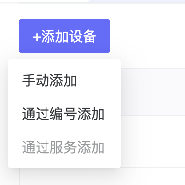

- 其中手动添加只需要输入设备名称配置等就可以添加完成。

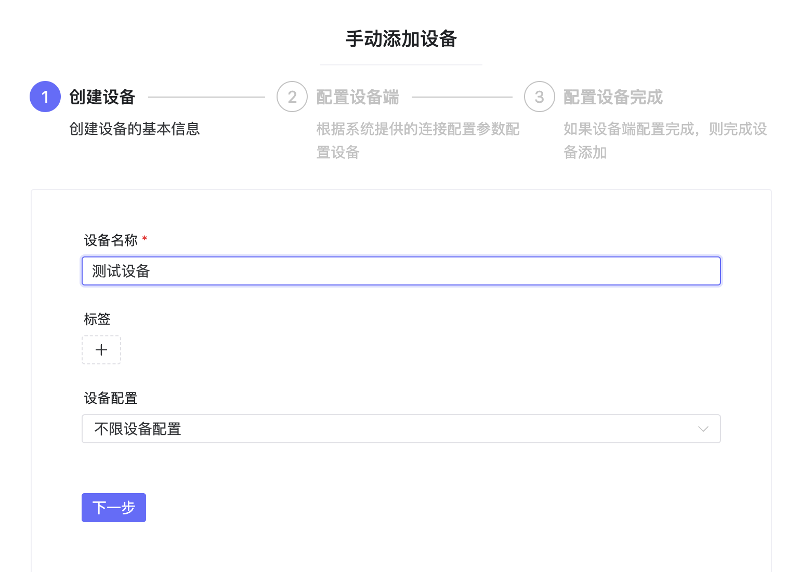

- 按照编号添加，可以通过输入设备编号添加设备，设备编号是在产品管理中生成的。

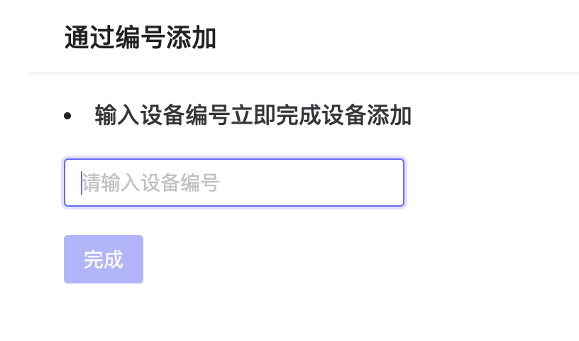

### 遥测

- 设备上报的遥测数据在这里展示，同时支持模拟数据上报和下发控制功能，主要是以key，value方式和设备进行交互。

- 遥测上报报文示例：{\"ip\":\"127.0.0.1\",\"mac\":\"xxxxxxxxxx\",\"port\":1883}

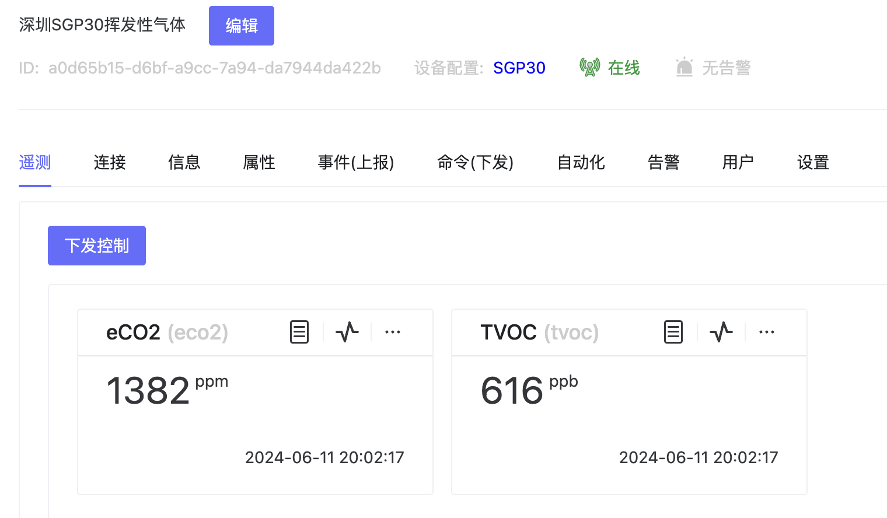

- 模拟数据上报功能支持上报自己定义的数据，进行功能检查使用。

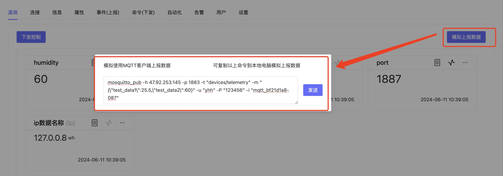

- 下发控制则可以下发不同的指令到设备，对设备数据进行控制，并可以查看下发指令的成功失败情况。

### 连接

- 可以查看设备连接的用户名、密码、clientId和数据上报的topic信息等。

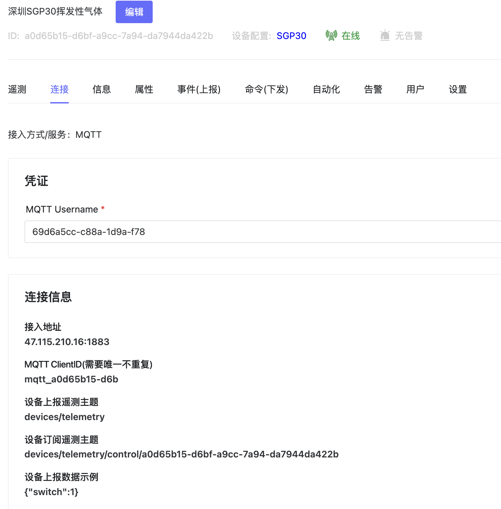

### 信息

可以设备设备的地址位置信息。

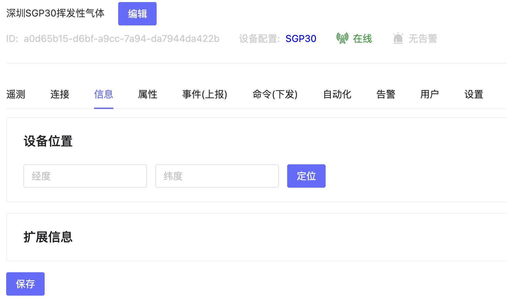

### 属性

- 设备上报时一些字段不想存储到平台，可以通过配置属性的方式呈现，这里可以定义每个字段的含义，同时可以下发属性控制到设备上。

- 属性上报的报文示例：{\"temperature\":28.5,\"version\":\"v0.1\",\"switch\":true}

### 事件（上报）

- 展示设备上报的事件，并可查看上报事件的状态和错误原因。

- 事件上报的报文示例：{\"method\":\"FindAnimal\",\"params\":{\"count\":2,\"animalType\":\"cat\"}}

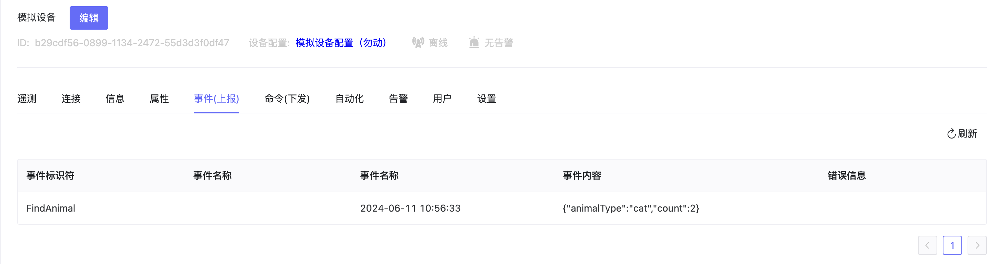

### 命令（下发）

- 以自定义的方式(http等）对设备发送命令进行控制，同时可以查看到下发命令的状态和错误原因。

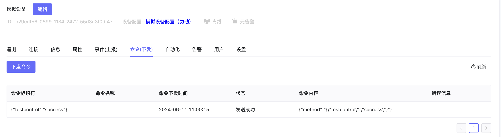

### 自动化

- 可以配置设备当触发某种情况时，可以进行告警，触发其他设备等操作，具体的场景联动配置见自动化-场景联动。

- 当设备关联的模版中已经建立了某些场景联动时，设备中会自动带入，设备仍可以建立属于本设备的场景联动配置。

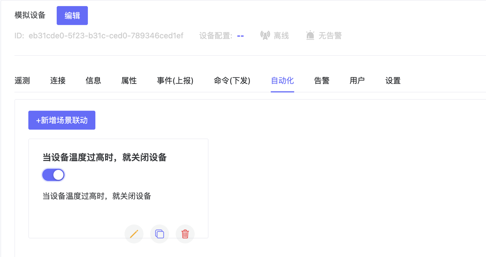

### 告警

- 通过添加告警规则，当设备触发某些条件时，发送告警。可以设备单设备和同类设备的告警。

- 当场景模版中配置时，会自动同步到设备中，设备也可以添加自由的告警配置。

### 设置

- 这里可以设置设备的配置模版、分组、上下线状态等信息。

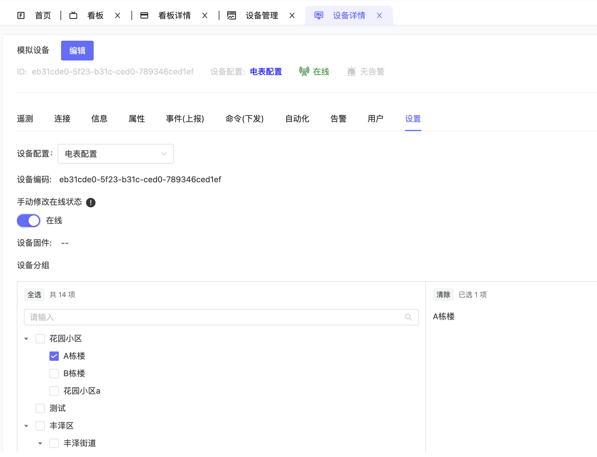

