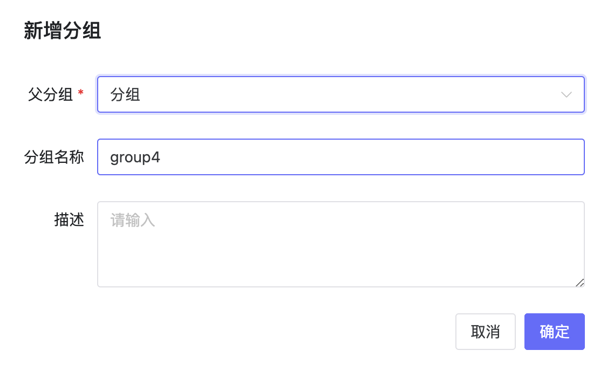
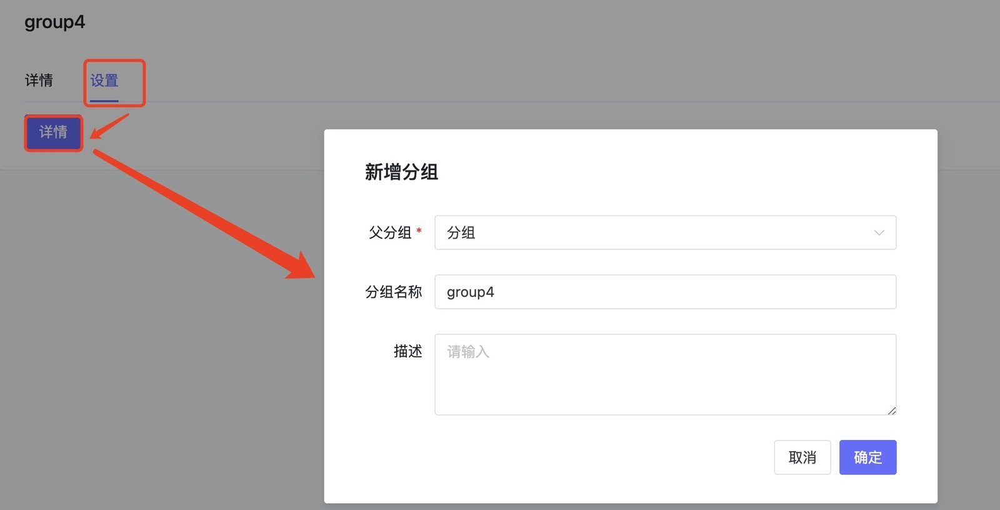
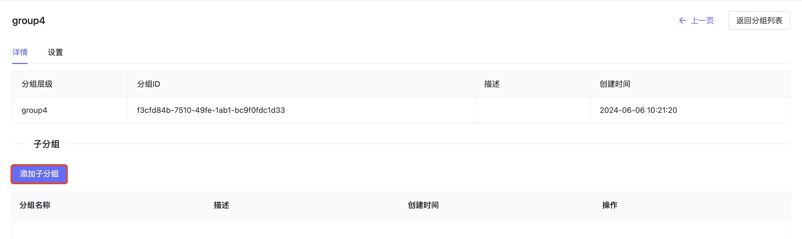
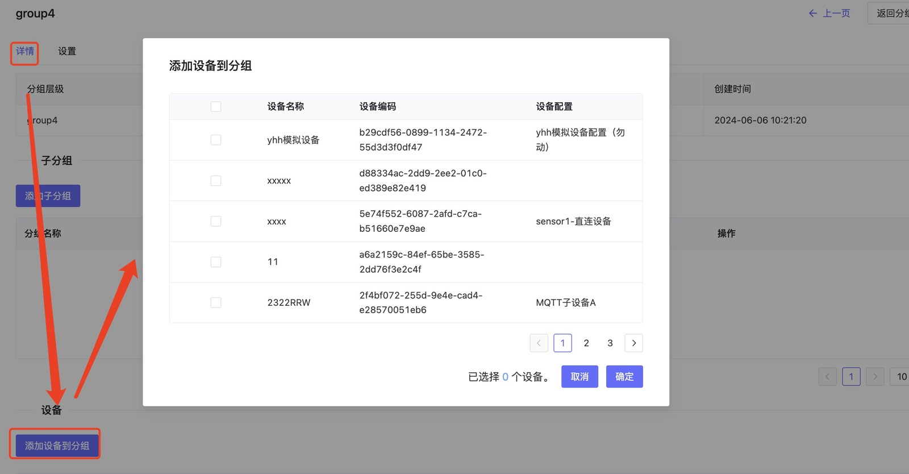

# 分组管理
## 1、说明
- 点击设备接入-分组管理进入分组管理页面，分组管理具有新建分组、编辑分组、搜索分组、删除分组、添加设备到分组等功能。

## 2、操作

### 2.1、新建分组

- 点击创建分组来新建一个分组，在弹出框中输入父分组和分组名称可以新建分组，默认分组，分组名称不能重复。

### 2.2、编辑分组

- 选择要编辑的分组，点击分组信息或者点击查看按钮进入分组详情页面，点击设置-详情，既展示编辑分组的弹出框，可以更改分组的名称，描述等信息。

### 2.3、添加子分组

- 选择要编辑的分组，点击分组信息或者点击查看按钮进入分组详情页面，点击"添加子分组"按钮来添加子分组。

### 2.4、添加设备到分组

- 选择要编辑的分组，点击分组信息或者点击查看按钮进入分组详情页面，点击"添加设备到分组"按钮，弹出设备选择框，可以选择设备来添加到分组中。

