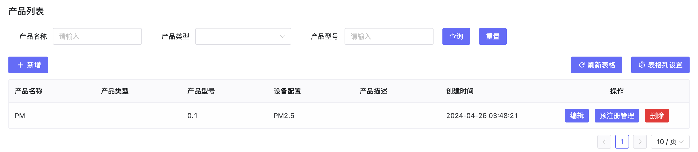

# 产品管理 

## 1. 功能说明

产品管理主要解决量产的数据准备和设备预注册的问题，具体的功能有：

- 创建产品：选择设备插件、绑定协议、选择认证方式，为设备预注册提供基础配置。
- 批量管理：可创建设备批次并导出数据，也可以导入数据，支持一机一密。
- 二维码数据：可导出二维码数据供生产和用户端APP扫码快速添加设备。
- 手动激活：可以手动激活设备
- 预注册管理：查看设备激活状态

## 2、操作步骤
1.  创建产品
2.  创建批次
3.  生成批次
4.  在预注册列表中添加设备
5.  给产品添加固件
6.  在创建任务前上线设备，订阅ota/device/infrom/AccessToken准备接收升级信息
7.  添加升级任务，选择设备
8.  接收到升级信息后查看升级任务列表
9.  模拟升级上报升级进度ota/device/progress例如：

``` {"step":"2","desc":"升级进度2%","module":"default"} ```

10. 在升级任务列表查看升级进度变化

11. 推送100%进度，升级完成

## 3、 操作
### 3.1、产品管理与固件升级操作流程


### 3.2、设备自动注册


### 3.3、产品列表


#### 3.4、新增产品
- 创建产品时，绑定设备配置


#### 3.5、预注册管理


#### 3.6、创建批次


