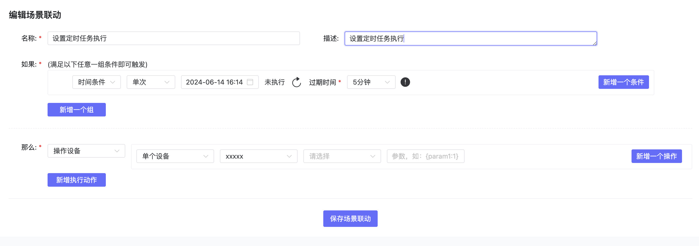
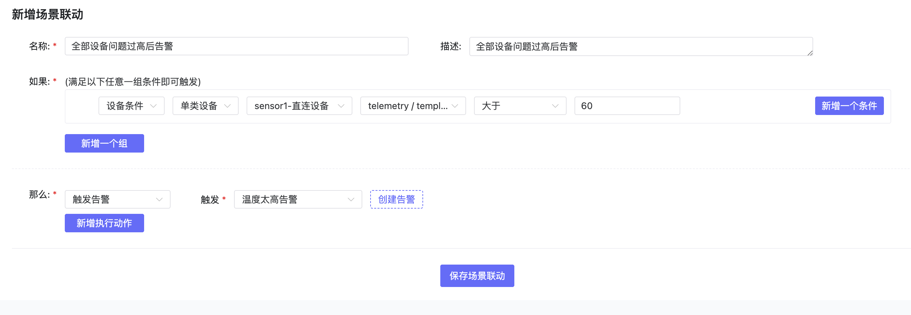
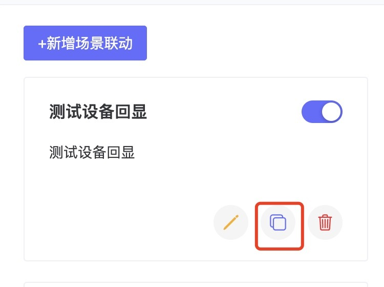
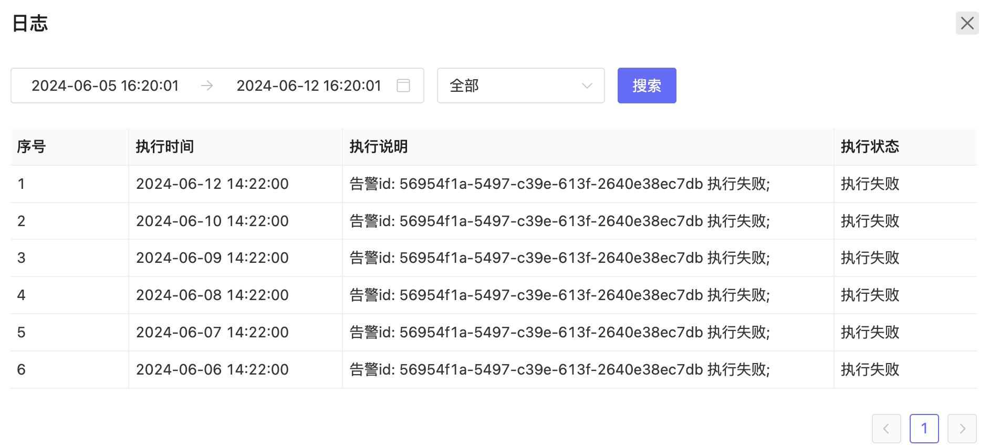

# 场景联动
## 1、说明
- 同设备和配置模版中自动化的配置，可以添加各种场景联动的配置或告警。
- 设备和配置模版自动化中添加的配置也会呈现在这里。 

## 2、场景联动操作步骤

**前置条件**：已经对接好设备并给设备绑定了插件。

### 2.1、新建场景联动

- 点击新建场景联动，可以新建一个场景联动。
- 目前支持时间条件的场景联动和设备条件的场景联动。
 - **时间条件**：  
        - 重复，包括：
            1. 每小时每小时的第几分钟执行；
            2. 每天每天的几点几分执行；
            3. 每周每周几的几点几分（需要选择星期）；
            4. 每月每月几号的几点几分；
            5. 自定义cron
        - 单次（执行后自动删除），时间格式为yyyy-MM-dd HH:mm:ss。
        - 时间范围：必须与设备条件是'且'关系
            |cron|描述|
            |-|-|
            |0/2 * * * *|每2分钟触发|
            |0 0/2 * * *|每两小时触发|
            |15 10 * * *|每天上午的10:15触发|
            |0/5 14 * * *|在每天下午2点到下午2:55期间的每5分钟触发|
            |0/5 14,18 * * *|在每天下午2点到2:55期间和下午6点到6:55期间的每5分钟触发|
            |15 10 ? * MON-FRI|周一至周五的上午10:15触发|
            |15 10 15 * *|每月15日上午10:15触发|
    

 - **设备条件**：  
        - 设备的属性、事件、上下线；
        - 单个设备：仅该设备触发条件后执行
        - 单类设备：使用某配置模版的设备触发条件后均执行
    
   

### 2.2、编辑场景联动
- 找到要编辑的场景联动，点击编辑即可更改其内容。

### 2.3、查看场景联动的日志
- 找到要查看日志的场景联动，点击日志按钮，可以查看触发后的日志。

### 2.4、场景联动删除
- 找到要删除的场景联动，点击删除即可删除该配置。

