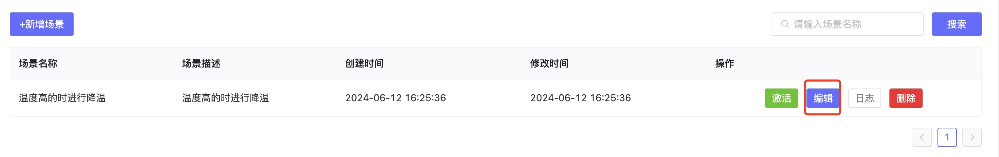
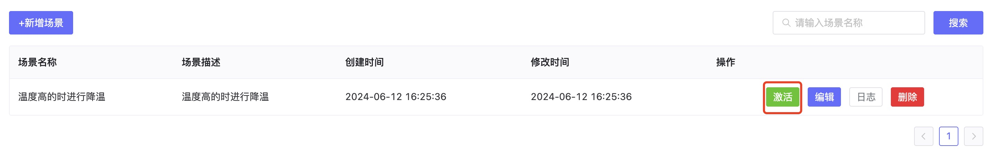

# 场景管理
## 1、说明
- 设置某个场景，可以和场景联动关联起来，当触发某条件时，触发该场景。 

## 2、操作

### 2.1、新增场景

- 点击新增场景，可以新建一个场景，设置对某个设备或某类设备的处理。

### 2.2、编辑场景
- 选择要编辑的场景，点击编辑，可以更改场景的内容

### 2.3、激活场景
- 点击激活可以触发一次场景的设置

### 2.4、#### 查看场景日志
- 点击日志，可以查看场景的的触发日志。

### 2.5、删除场景
- 点击删除，可以删除该场景。

