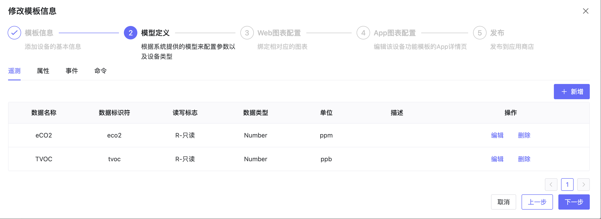

# 功能模版
## 1、说明
- 点击设备接入-功能模版进入配置模版管理页面。
- 设备功能模板对应了现实世界的产品名，例如XX品牌的温湿度传感器中的"温湿度传感器"
- 设备功能模板的目的是定义物模型定义图表D
- App端的图表等，设定预配置，方便高效的接入设备。
- 设备功能模板可以被设备配置模板调用。

## 2、操作

### 2.1、创建设备配置模板

- 点击"添加设备配置模版"就可以新建。

- 新建时需要设置模版名称，标签等信息。

### 2.2、配置物模型

- 可以在这里配置遥测、属性、事件、命令等对应的参数的数据名称-标识符的映射关系。

### 2.3、配置图表

- 并选择展示的图表和数据来源

### 2.4、配置App图表

- 查看APP图表的样式：

### 2.5、完成配置

- 查看模版的信息，并完成配置。

## 概念介绍

| 概念 | 描述 | 示例 |
|------|------|------|
| 遥测（Telemetry） | 遥测数据是设备自动收集和发送的数据，通常用于监控设备的运行状态或环境条件。这些数据通常是只读的，并且频繁地发送。 | 温度传感器定期发送当前温度数据。 |
| 属性（Property） | 属性代表设备的配置或状态，可以是只读的，也可以是可写的。用户或系统可以修改可写的属性，以改变设备的配置或行为。 | 空调的目标温度可以设置为22度，用户可以通过手机应用更改此设置。 |
| 命令（Command） | 命令是向设备发送的指令，用于执行特定操作。这通常是一个单向的交互，从服务器到设备。 | 向打印机发送打印命令以开始打印文档。 |
| 事件（Event） | 事件是设备在特定条件下产生的信号，通常用于通知系统某些特定的变化或异常。 | 烟雾报警器在检测到烟雾时发送警报事件。 |
