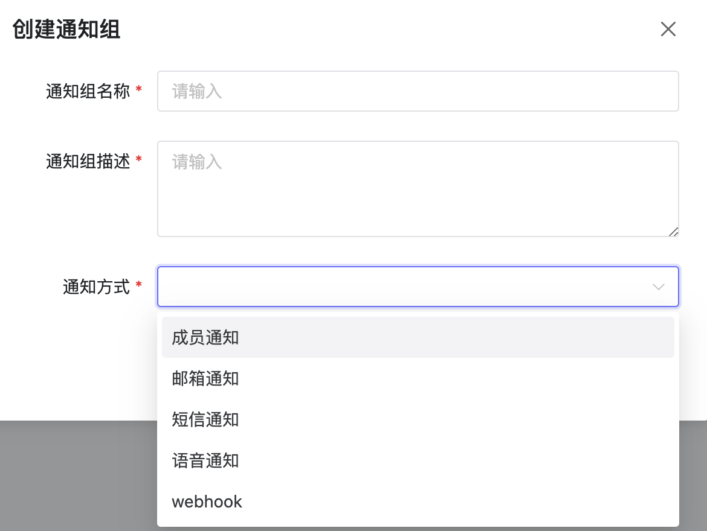
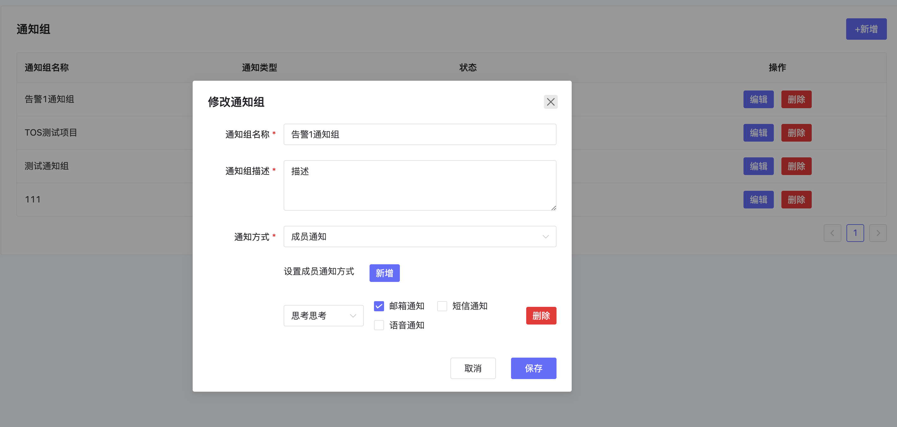

# 通知组

## 1、说明
- 可配置不同的通知组，目前支持成员通知、邮箱通知、短信通知、语音通知和webhook通知。
- 新建立的通知组时时效状态，点击状态启用后才能使用。

## 2、操作

### 2.1、创建通知组
- 点击新增按钮，可以创建一个通知组。

### 2.2、编辑通知组
- 选择一个通知组，点击编辑可以编辑通知组的内容

### 2.3、启用/暂停通知组
- 点击状态可以启用/暂停通知组

### 2.4、删除通知组
- 点击删除可以删除通知组。