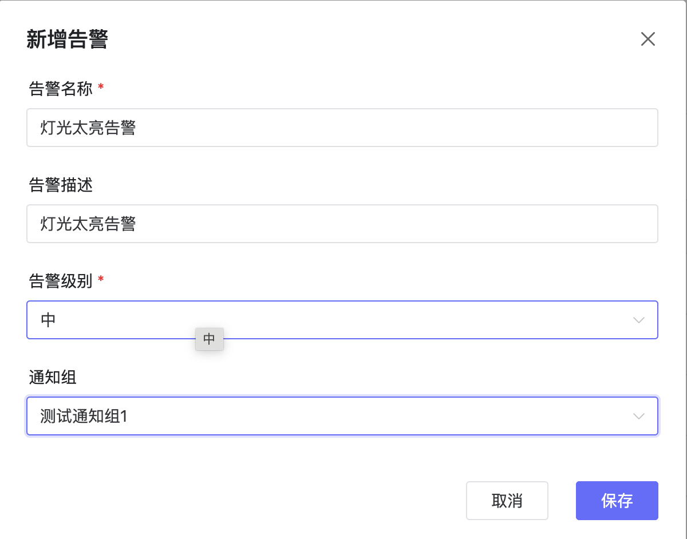
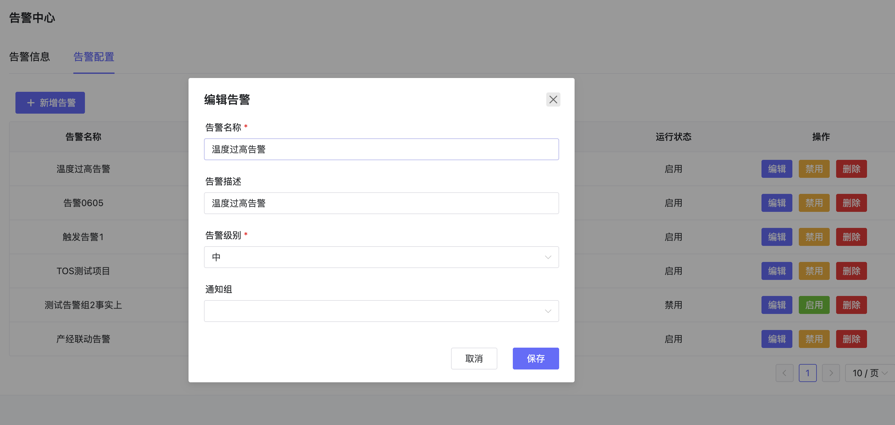

# 告警信息
## 1、说明
- 可以查看告警的日志，并新建通知规则。

## 2、操作

### 2.1、告警日志查看
- 点击告警日志的告警信息，可以查看到所有的告警日志，并可通过告警时间段和级别进行筛选。

### 2.2、新建告警规则
- 点击告警配置-新建告警，可以新建一个告警配置。

### 2.3、编辑告警
- 选择一个告警，点击编辑可以编辑告警的信息

### 2.4、启用/禁用告警
- 点击启用/禁用可以禁用一个告警，禁用告警后，告警将不再生效。

### 2.5、删除告警
-点击删除可以删除一个告警。
