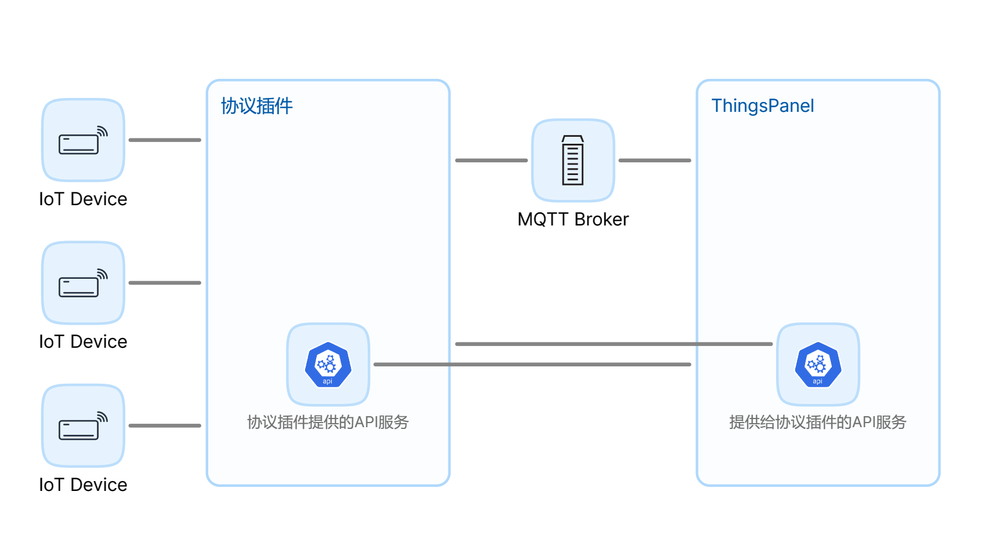

# 设备接入插件开发

## 背景
在物联网领域，通信协议极为多样且复杂。常见的协议包括MQTT、TCP、HTTP、SOAP、Modbus、OPC-UA、Bacnet、KNX、LwM2M和SNMP等，还有数不清的其他协议以及各种各样的网关服务或三方服务。这些协议和服务在通信模式和报文规范上各不相同，导致在系统集成时面临巨大的复杂性。这种复杂性不仅使系统变得臃肿、效率低下，而且还难以扩展和维护，进而导致维护成本居高不下。

## 描述
ThingsPanel插件是一个多功能中间件组件，设计用于实现以下两个主要目标：
1.**协议接入**：支持各种物联网协议（如MODBUS、MQTT等），使ThingsPanel平台能够直接与使用这些协议的设备通信。
2.**服务接入**：连接ThingsPanel平台与各种第三方物联网平台，实现数据互通和设备管理。

### 该插件的主要目的是：
- 提供统一的接口规范，简化设备和第三方平台的接入流程。
- 支持多种协议和服务，增强ThingsPanel平台的兼容性和扩展性。
- 实现灵活的配置和凭证管理，方便用户快速接入不同的协议和第三方平台。
- 插件的主要特点包括：
- 模块化设计，易于扩展支持新的协议和第三方平台
- 提供标准化的数据交换格式和接口
- 支持设备配置模板和凭证管理
- 实时数据同步和设备状态监控
- 支持多种通信协议，包括但不限于MQTT、MODBUS等

## 1、说明
- 参数说明
	- device_type:1-直连设备 2-网关设备 3-子设备
	- form_type:CFG-配置表单 VCR-凭证表单 SVCRT-服务凭证表单


## 2、交互结构图 




## 3、平台提供的接口 
### 获取设备配置（通过设备id或设备凭证）
- config分别是设备表单数据和子设备表单数据，是根据协议插件提供的表单，用户填写后保存的json数据。
- API：/api/v1/plugin/device/config GET
- 示例：
```
{
	"voucher": "{\"username\":\"aaaaaa\",\"password\":\"\"}",
	"device_id": "2611f2a8-fdab-9247-efc7-683e9de4f137"
}
```
- 响应示例：
```
{
	"code": 200,
	"message": "success",
	"data": {
		"id": "f073477f-6e11-9f0b-06ae",
		"voucher": "123456",
		"device_type": "2",
		"protocol_type": "MODBUS_TCP",
		"config": {},
		"sub_devices": [
			{
				"device_id": "0036d6bf-ffea-922e-f12e",
				"voucher": "202e0361-2cf8-f78b-0b8b",
				"sub_device_addr": "c7bb49f70",
				"config": {}
			}
		]
	}
}
```
### 上报心跳
- API：/api/v1/plugin/heartbeat POST
- 请求示例
```json
{
    "service_identifier": "MODBUS-RTU"
}
```


## 4、协议插件提供的接口
### 1.获取json表单
- /api/v1/form/config GET
- form_type：CFG-配置表单 VCR-凭证表单 SVCRT-服务凭证表单
	- 配置表单：平台配置模板详情-协议配置的数据解析表单，用户可以在此干预解析规则等
	- 凭证表单：平台设备管理-连接的凭证表单，用户在这里可以设置设备的凭证信息，对设备的接入做鉴权。
	- 服务凭证表单：平台服务接入点管理详情中接入点的修改配置表单，用于连接三方服务的信息。
- VCR 响应示例：
```
{
    "code": 200,
    "data": [
        {
            "dataKey": "reg_pkg",
            "label": "Registration Package",
            "placeholder": "please input the registration package",
            "type": "input",
            "validate": {
                "message": "The Registration Package cannot be empty",
                "required": true,
                "type": "string"
            }
        }
    ],
    "message": "success"
}
```
- CFG响应结构与VCR响应结构一致，参考表单规范文档ThingsPanel-JSON表单设计(https://docs.qq.com/doc/DZXBIZnpISmhxdmh2)

### 2.断开设备连接
- 断开设备连接，主要用在更新配置后断开设备让设备重连达到更新配置的目的
- /api/v1/device/disconnect POST
- 请求：device_id

### 3.通知
- 当平台设备或服务配置修改，用来通知到服务
- /api/v1/plugin/notification POST
- 请求：message_type,message

### 4.获取服务设备列表
- 如果是服务接入，这个接口用来获取对应服务的设备列表以添加设备到系统
- /api/v1/plugin/device/list GET
- 请求
```  
{
    "voucher":"",
    "service_identifier":""
}
```
## 5、交换数据相关
### 5.1插件推送数据到平台
- 协议插件发送遥测规范如下，属性类似（事件参考平台MQTT主题设计规范）：
#### 5.1.1、直连设备或子设备消息
- mqtt用户：root  （使用thingspanel-go配置文件中的用户名和密码）
- 发布主题：device/telemetry
- 报文规范：```{"device_id":device_id,"values":{key:value...}}```
或自定义报文：```{"token":device_id,"values":自定义报文}```
- 自定义报文可以根据设备配置里的脚本进一步解析，考虑到性能，推荐在协议插件内解析

#### 5.1.2、网关设备消息
- mqtt用户：root  （使用thingspanel-go配置文件中的用户名和密码）
- 发布主题：gateway/telemetry
- 报文规范：```{"device_id":device_id,"values":{sub_device_addr1:{key:value...},sub_device_add2r:{key:value...}}}```
- 或自定义报文：```{"device_id":device_id,"values":自定义报文}```

#### 5.1.3、在线离线通知
- mqtt用户：root  （使用thingspanel-go配置文件中的用户名和密码）
- 发布主题：device/status
- 报文规范：```{"device_id":device_id,"values":1}```
- 0-离线 1-上线

### 5.2、平台推送数据给插件
- 协议插件订阅主题如下：
#### 5.2.1、 直连设备消息
```
    mqtt用户：root (使用thingspanel-go配置文件中的用户名和密码)
    订阅主题：plugin/modbus/# （说明：plugin/modbus/为注册插件时填写的订阅主题前缀,主题#部分是MQTT主题规范（凡是device_number的要改为device_id），实际上就是协议插件比平台下行规范多了主题前缀）
    报文规范：{key:value...}（示例是telemetry或attributes，commands请参考平台主题规范）
```


#### 5.2.2、网关设备消息
```
    mqtt用户：root  （使用thingspanel-go配置文件中的用户名和密码）
    订阅主题：plugin/modbus/# (说明：plugin/modbus/为注册插件时填写的订阅主题前缀,主题#部分是MQTT主题规范（凡是device_number的要改为device_id），实际上就是协议插件比平台下行规范多了主题前缀)
    报文规范：{sub_device_addr:{key:value...},sub_device_addr:{key:value...}}
（示例是telemetry或attributes，commands请参考平台主题规范）

```
## 6、插件注册

- 服务名称：创建配置模板时，会显示在选择协议下拉框中  
- 服务标识符：系统中唯一标识这个插件，由字母和数字组成
- 类别：选择接入协议
- HTTP服务地址：填写平台后端能够直接访问插件API的地址，格式如127.0.0.1:8151
- 服务订阅主题前缀 ：格式如（name一般为服务标识符）：
  ```
  service/name/
  ```
- 设备接入地址：这里填写的内容会显示在设备凭证管理的下发，以提示用户应该将设备连接到哪里

### 方式一：使用SQL注册(参考SQL)：
```
INSERT INTO public.service_plugins (id, "name", service_identifier, service_type, last_active_time, "version", create_at, update_at, description, service_config, remark) VALUES('41d04726-8490-119f-7689-7f8d0193ad45', 'ALARM协议', 'ALARM', 1, NULL, 'v0.0.1', '2024-06-23 16:44:26.607', '2024-06-30 14:05:25.790', '', '{"http_address":"127.0.0.1:8151","device_type":1,"sub_topic_prefix":"service/alarm/","access_address":":8150"}'::json, '');
```
### 方式二：平台注册
- 超管账号登录
- 应用管理-插件管理，点击添加新服务按钮

## 7、开发步骤
- 协议插件开发流程
【腾讯文档】ThingsPanel-服务插件-协议开发流程
https://docs.qq.com/doc/DZXZCSk5McVBPSlRL
- 服务插件开发流程


