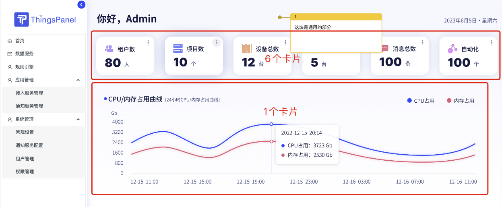
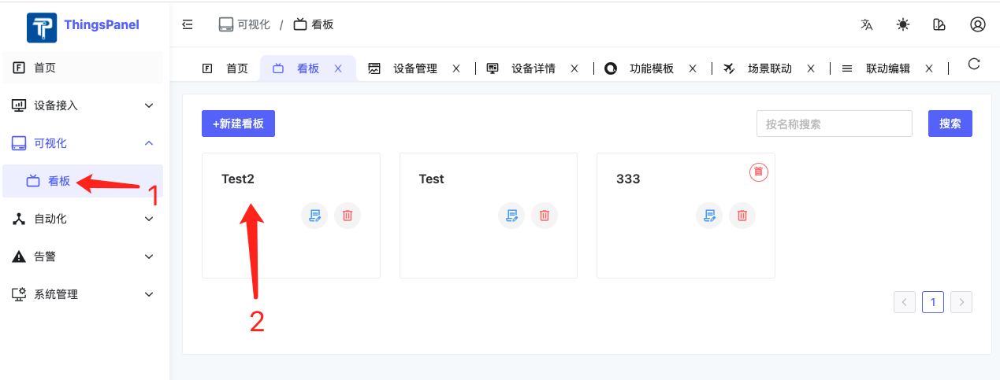
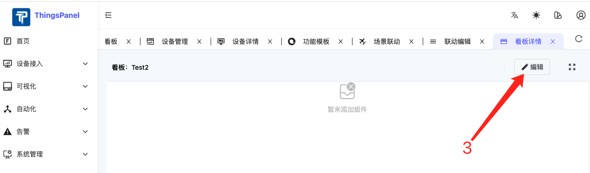
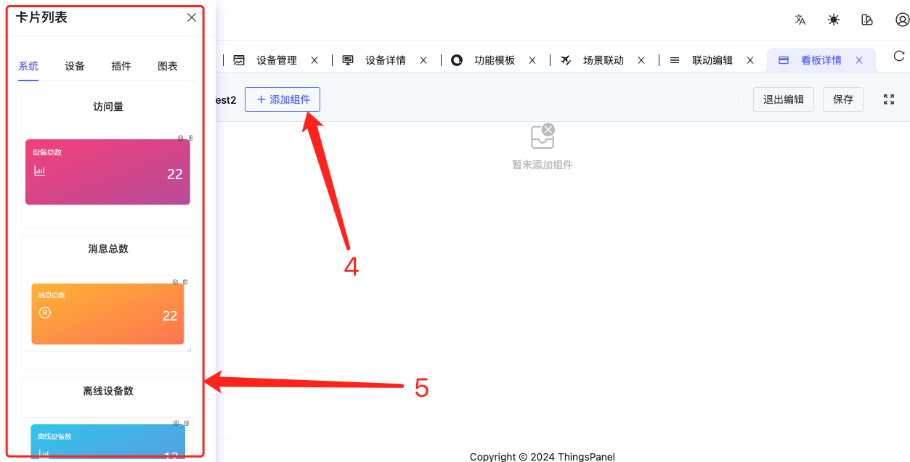
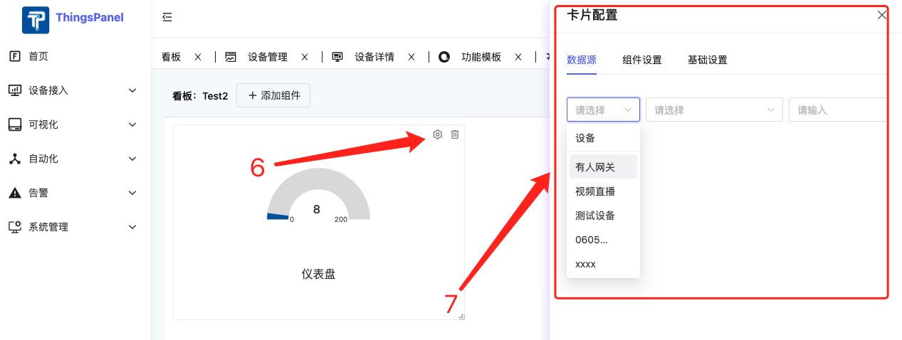
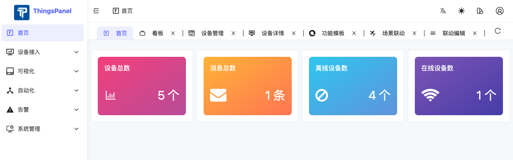
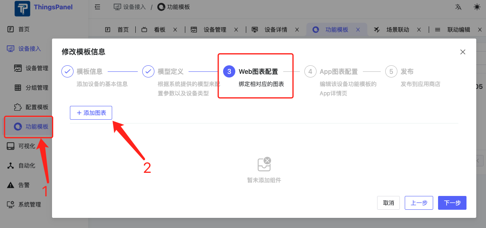
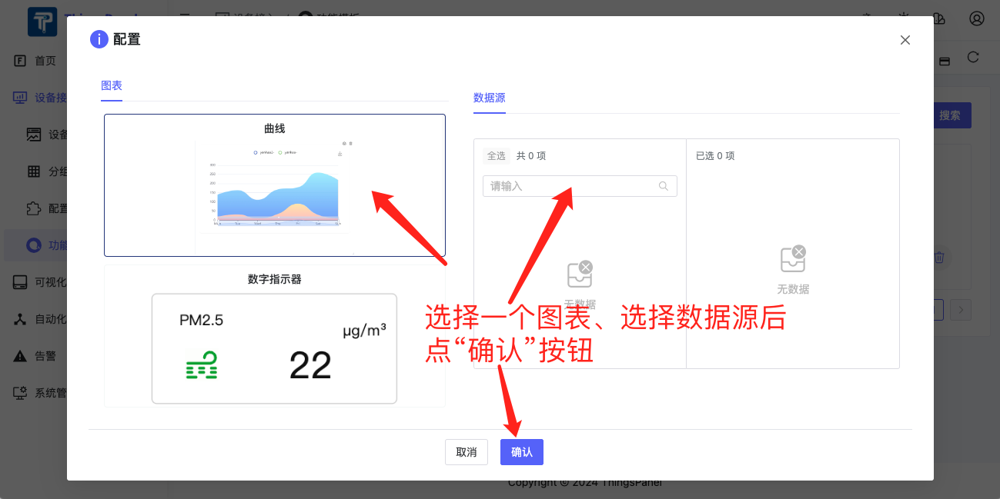
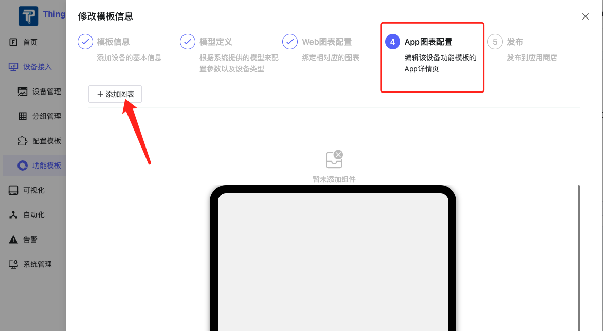
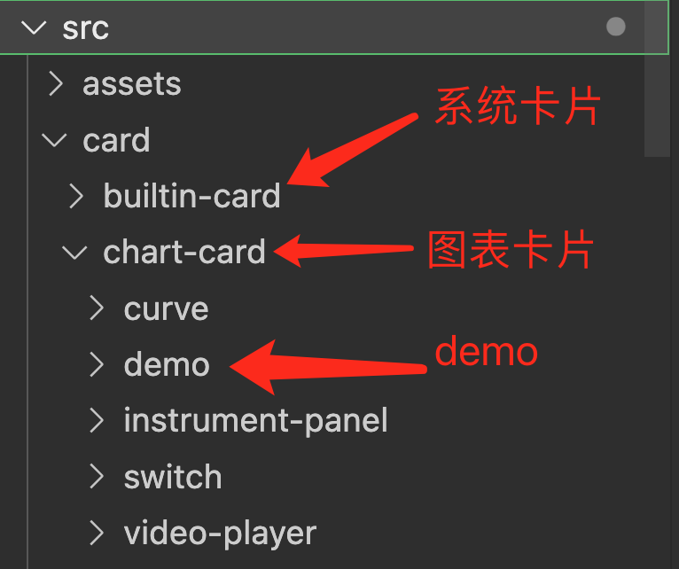

# 看板卡片开发
看板卡片快速开发指南。
## 一、首先介绍下看板卡片
### 1、什么是看板卡片？
看板卡片是用来搭建ThingsPanel的页面的组件，可以是一个数字指示器，一个曲线，或者一个表格。


### 2、怎么使用看板卡片？
#### 1）看板卡片创建、编辑




#### 2）看板卡片使用
我们可以在3个地方使用看板卡片：
1. 首页
   
2. 设备功能模板的Web图表配置（仅图表类型）
   
   
3. 设备功能模板的App图表配置（仅图表卡片）
   
   

## 二、如何开发看板卡片
### 1. 明确将要开发的卡片类型
看板卡片目前分为2个类型：**系统卡片** 和 **图表卡片**。其中只有图表卡片可以在设备功能模板的Web图表配置和App图表配置中使用。

### 2. 在相应目录下创建文件夹和文件进行开发
一般包括4个文件（参考demo：/src/card/chart-card/demo）：
```
demo
  - index.ts // 导出目录：定义卡片的名称，id，类型（builtin：系统卡片，chart: 图表卡片），预设的参数，图标等
  - component.vue // 卡片组件
  - card-config.vue // 卡片配置表单，无配置可不添加，主要用于收集卡片特有的一些属性和值的配置信息
  - poster.png // 卡片示意图，缩略图尺寸236*148
```
*注：卡片全部自动加载，无需做额外引入。*
### 3. 数据获取和保存
#### 1）卡片配置表单（card-config.vue）中的数据如何保存
卡片配置表单用于收集用户对于卡片的配置信息，上层会通过传入一个ctx对象来收集数据：
`const ctx = inject<IConfigCtx>('config-ctx')!;`
表单中需要保存的信息都保存在**ctx.config**这个对象中即可。例如如果需要用户选一个颜色，可以把选定的颜色信息保存在ctx.config.color中：
`<NColorPicker v-model:value="ctx.config.color" :show-alpha="false" />`。
#### 2）如何在卡片组件（component.vue）中获取配置信息
在卡片组件中，可以通过组件的props属性获取配置信息：`props.card.config`。
比如上面例子里保存的颜色信息，可以通过以下方式获取到：
`<NIcon class="iconclass" :color="props?.card?.config?.color || 'black'">`。
#### 3）设备数据的获取
在开发**图表卡片**的时候需要获取设备数据。有2种获取设备数据的方式：
1. http方式：通过http请求接口 `/telemetry/datas/current/keys` 来获取设备的历史数据；
2. WebSocket方式：通过WebSocket的API来获取设备的实时数据：
    ```typescript
    const { otherBaseURL } = createServiceConfig(import.meta.env);
    let wsUrl = otherBaseURL.demo.replace('http', 'ws').replace('http', 'ws');
    wsUrl += `/telemetry/datas/current/keys/ws`;
    const params = {
        device_id: dataSource.deviceSource[0]?.deviceId ?? '',
        keys: arr.deviceSource[0].metricsId
      };
    request.get<any>('/telemetry/datas/current/keys', { params });
    ```
### 4. 注意事项
#### 1）响应式
卡片的大小是用户可以编辑的，卡片UI设计时**必须要遵循Responsive UI的设计原则**，UI必须能适应不同卡片大小。
如果卡片过小时不能正常显示，请设置**minW**和**minH**来保证卡片编辑时的最小行列高度和宽度。
具体的规范如下：
1. 避免使用绝对单位：避免使用像素（px）等绝对单位定义宽度、高度或间距。转而使用相对单位，如百分比（%）、视窗单位（vw, vh, vmin, vmax）或em/rem，这些单位能够根据父元素或视口大小动态调整。
2. 采用流式布局：流体布局（Fluid Layout）允许内容根据容器的宽度自动调整大小，使用百分比宽度代替固定宽度，确保内容能够顺畅地重新排列。
3. 使用Flexbox或Grid布局：Flexbox（弹性盒子模型）和CSS Grid布局是响应式设计中的两大利器。Flexbox适合单维度布局，如一行或一列的对齐和分配空间；而Grid布局适用于二维布局，能够轻松创建复杂的网格结构。两者都能自动适应容器大小，使元素在不同屏幕尺寸下都能保持良好的布局。
4. 媒体查询：利用CSS媒体查询来为不同的屏幕尺寸或设备特性定义不同的样式规则。这允许你基于视口宽度、设备类型或分辨率等条件，调整布局、字体大小、图片大小等。
5. 响应式图片：使用max-width: 100%; height: auto; 确保图片不会超过其容器的宽度，并自动调整高度以保持比例。还可以利用\<picture\>标签和srcset属性来提供不同分辨率的图片资源，以优化加载时间和视觉质量。
6. 字体大小的灵活性：使用相对单位（如em, rem）设置字体大小，允许字体随着用户设置或父元素大小变化而缩放，提高可访问性。
#### 2）卡片示意图（poster.png）
开发完成后，截图保到当前卡片目录下。