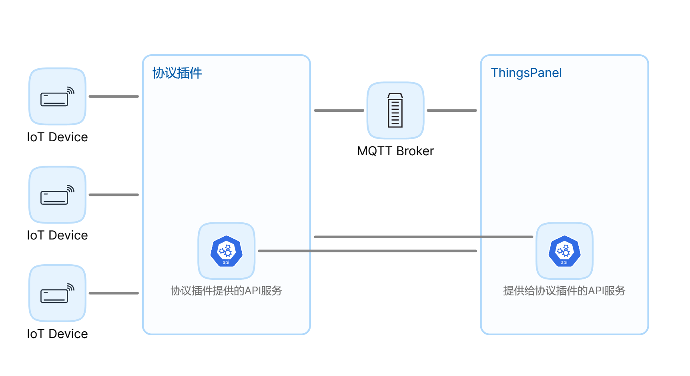

# 协议插件开发

## 1、说明
-  **代码仓库**
-  **参数说明**
    -  device_type:1-直连设备 2-网关设备 3-子设备

## 2、交互结构图 




## 3、平台提供的接口 
### 获取设备配置（通过设备id或设备凭证）
- config分别是设备表单数据和子设备表单数据，是根据协议插件提供的表单，用户填写后保存的json数据。
- API：/api/v1/plugin/device/config GET
- 示例：
```
{
	"voucher": "{\"username\":\"aaaaaa\",\"password\":\"\"}",
	"device_id": "2611f2a8-fdab-9247-efc7-683e9de4f137"
}
```
- 响应示例：
```
{
	"code": 200,
	"message": "success",
	"data": {
		"id": "f073477f-6e11-9f0b-06ae",
		"voucher": "123456",
		"device_type": "2",
		"protocol_type": "MODBUS_TCP",
		"config": {},
		"sub_devices": [
			{
				"device_id": "0036d6bf-ffea-922e-f12e",
				"voucher": "202e0361-2cf8-f78b-0b8b",
				"sub_device_addr": "c7bb49f70",
				"config": {}
			}
		]
	}
}
```


## 4、协议插件提供的接口
### 1.获取json表单
- /api/v1/form/config GET
- form_type：CFG-配置表单 VCR-凭证表单 VCRT-凭证类型下拉菜单
- VCRT响应示例
```
{
    "code": 200,
    "data": {
        "Registration Package": "REG_PKG"
    },
    "message": "success"
}
```

- VCR 响应示例：
```
{
    "code": 200,
    "data": [
        {
            "dataKey": "reg_pkg",
            "label": "Registration Package",
            "placeholder": "please input the registration package",
            "type": "input",
            "validate": {
                "message": "The Registration Package cannot be empty",
                "required": true,
                "type": "string"
            }
        }
    ],
    "message": "success"
}
```
- CFG响应结构与VCR响应结构一致，参考表单规范文档ThingsPanel-JSON表单设计(https://docs.qq.com/doc/DZXBIZnpISmhxdmh2)


## 5、交换数据相关
### 5.1插件推送数据到平台
- 协议插件发送遥测规范如下，属性类似（事件参考平台MQTT主题设计规范）：
#### 5.1.1、直连设备或子设备消息
- mqtt用户：root  （使用thingspanel-go配置文件中的用户名和密码）
- 发布主题：device/telemetry
- 报文规范：```{"device_id":device_id,"values":{key:value...}}```
或自定义报文：```{"token":device_id,"values":自定义报文}```
- 自定义报文可以根据设备配置里的脚本进一步解析，考虑到性能，推荐在协议插件内解析

#### 5.1.2、网关设备消息
- mqtt用户：root  （使用thingspanel-go配置文件中的用户名和密码）
- 发布主题：gateway/telemetry
- 报文规范：```{"device_id":device_id,"values":{sub_device_addr1:{key:value...},sub_device_add2r:{key:value...}}}```
- 或自定义报文：```{"device_id":device_id,"values":自定义报文}```

#### 5.1.3、在线离线通知
- mqtt用户：root  （使用thingspanel-go配置文件中的用户名和密码）
- 发布主题：device/status
- 报文规范：```{"device_id":device_id,"values":1}```
- 0-离线 1-上线


