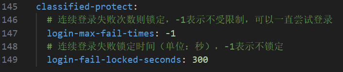
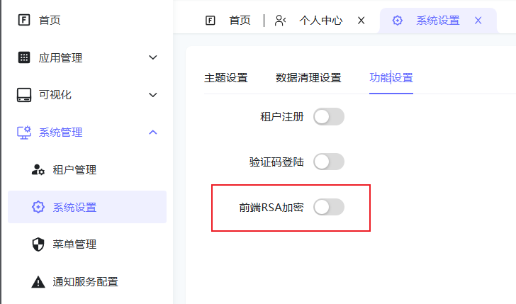
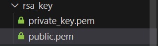

# 国家三级等保

## 背景与意义

软件三级等保（三级等级保护）是中国信息安全领域的重要制度，旨在保护关键信息系统和数据安全。

### 背景

- **信息化快速发展**: 随着信息技术的广泛应用,信息安全问题日益突出。
- **国家安全需求**: 保护关键信息基础设施和重要数据成为国家安全的重要组成部分。
- **法律法规要求**: 《网络安全法》等法律法规明确要求实施等级保护制度。

### 意义

- **保护信息安全**: 通过分级分类保护,有效防范网络攻击和数据泄露。
- **规范行业标准**: 为软件开发和使用提供统一的安全标准和规范。
- **提升安全意识**: 促使各组织重视信息安全,加强安全管理和技术措施。
- **促进产业发展**: 推动信息安全产业发展,提升整体信息安全水平。
- **履行法律义务**: 帮助组织遵守相关法律法规,避免法律风险。

## 开发措施

### 实现强密码策略

- 最小长度：8位
- 复杂度要求：至少包含三种字符类型（大小写字母、数字、特殊字符）

### 登录失败锁定

- 记录登录失败次数
- 设置阈值
  - 
- 超过阈值后，锁定账户一定时间

### RSA前端密码加密

- 保护用户密码在传输和存储过程中的安全性，防止中间人攻击和密码泄露
  - 
- 前端密钥位置
  - rsa_key目录
- 后端密钥位置
  - 
- 建议：
  - 定期轮换密钥对
  - 确保私钥的安全存储和访问控制

### 防范常见漏洞（如SQL注入、XSS等）

- 使用CodeQL定期扫描处理漏洞
  - CodeQL是一个强大的静态代码分析工具，主要用于发现和预防软件安全漏洞。
- 重点关注的漏洞类型：
  - SQL注入
  - 跨站脚本（XSS）
  - 跨站请求伪造（CSRF）
  - 不安全的反序列化
  - 敏感数据泄露

### 日志和监控

- 记录关键安全事件：
  - 用户认证
  - 敏感操作
  - 系统异常

### 持续改进

- 我们会持续对平台安全进行优化和改进
  - 定期进行安全评估和渗透测试
  - 及时更新和补丁系统组件
  - 跟踪最新的安全威胁和防护技术
  - 优化安全策略和流程
  - 加强员工安全意识培训

通过这些措施，我们致力于确保平台在各种条件下都能保持高效性、稳定性和安全性，满足国家三级等保要求，并为用户提供可靠的服务。
