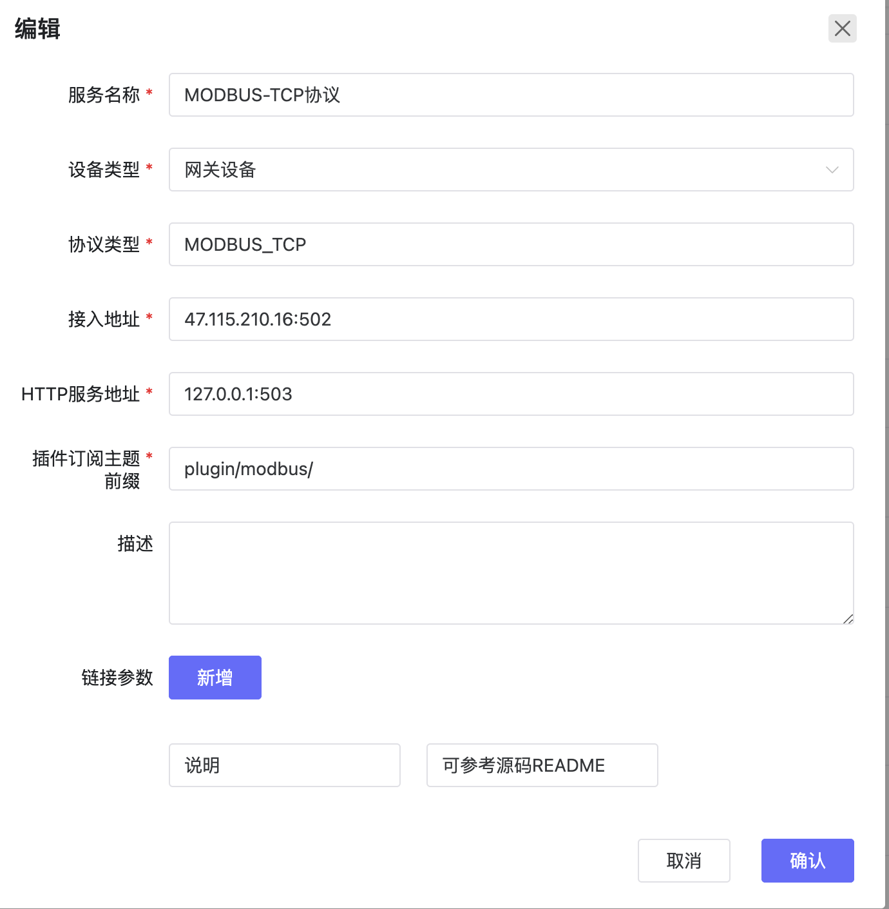

# 协议插件
## 协议插件介绍
协议插件是设计用来扩展和适应各种通信协议的模块或软件组件。

## 协议插件的作用
协议插件的主要作用包括：

**兼容性和互操作性**：通过支持多种通信协议，协议插件确保了不同设备之间的兼容性和互操作性，这是物联网生态系统成功的关键。

**扩展性**：随着新技术和标准的出现，物联网系统可能需要支持新的通信协议。协议插件允许系统通过简单地添加新的插件来轻松扩展其功能，而无需重新设计整个系统。

**模块化**：协议插件提供了一种模块化的方法来处理通信任务，这使得系统维护和升级更加容易。

**定制化**：不同的应用可能需要不同的通信行为或优化。协议插件允许开发者定制或优化特定的通信协议以满足特定的应用需求。
## 操作步骤
- 点击应用管理-协议插件管理，可以进入协议管理页面。
- 协议插件需要系统管理员才可以添加，需要以系统管理员身份登录
- 目前支持新建、编辑、删除一个协议。

## 配置参考
- 请参考代码库中各协议插的README来配置和理解协议插件
[`代码库地址`](../../../introduction/code_repository)

