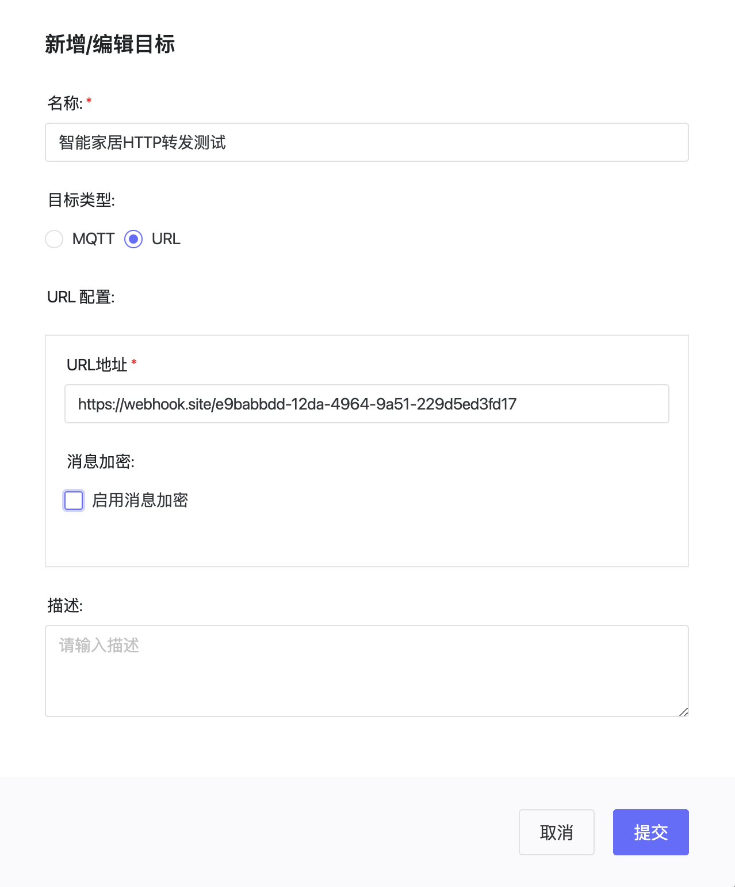
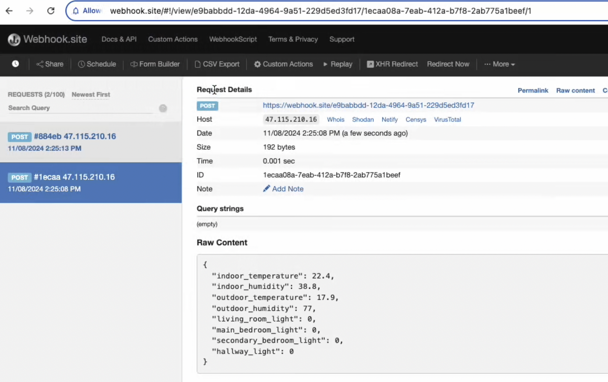

# HTTP数据转发

HTTP数据转发功能允许您将设备数据实时转发到指定的HTTP服务器，适用于与第三方系统集成、数据备份等场景。

## 功能特点

- 支持按照设备、分组、产品多种类型
- 支持脚本
- 支持多个转发目标
- 实时数据转发
- 支持加密传输

## 配置步骤

### 1. 添加转发地址

在ThingsPanel平台中添加HTTP转发配置：

1. 进入"系统管理 > 数据转发 > HTTP转发"
2. 点击"添加转发"按钮
3. 填写转发配置信息：
   - 名称：为该转发配置指定一个识别名称
   - URL：目标服务器地址



### 2. 数据格式说明

ThingsPanel转发的数据格式示例：

```json
{
    "deviceId": "device123",
    "timestamp": 1678956123000,
    "values": {
        "temperature": 25.6,
        "humidity": 60
    },
    "metadata": {
        "type": "sensor",
        "location": "room1"
    }
}
```

## 查看收到的数据结果

