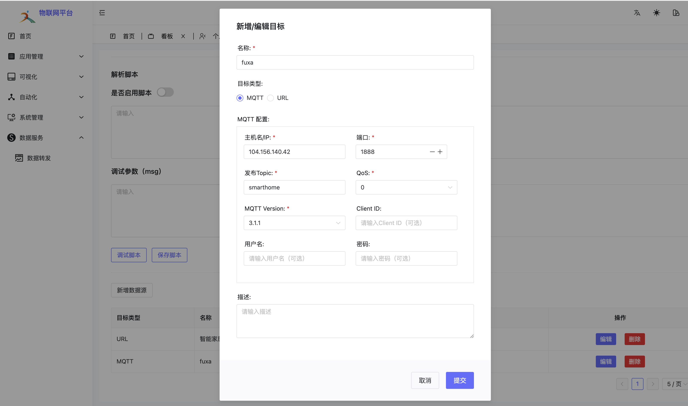

# MQTT数据转发

MQTT数据转发功能允许您将设备数据实时转发到指定的MQTT服务器，适用于与第三方系统集成、数据备份等场景。

## 功能特点

- 支持按照设备、分组、产品多种类型
- 支持脚本
- 支持多个转发目标
- 实时数据转发
- 支持加密传输

## 配置步骤

### 1. 基础配置
1. 在平台中进入数据转发页面
2. 点击"新增数据源"按钮
3. 选择目标类型为"MQTT"

### 2. MQTT配置参数
#### 必填参数
- **名称**：设置转发规则的名称标识
- **主机名/IP**：填写目标MQTT服务器地址(示例: 104.156.140.42)
- **端口**：填写MQTT服务器端口(示例: 1888)
- **发布Topic**：设置消息发布主题(示例: smarthome)
- **QoS**：消息质量等级(示例: 0)
- **MQTT Version**：选择MQTT协议版本(示例: 3.1.1)


#### 可选参数
- **Client ID**：MQTT客户端标识符
- **用户名**：MQTT服务器认证用户名
- **密码**：MQTT服务器认证密码
- **描述**：规则描述信息

### 3. 操作说明
1. 填写完必要参数后,点击"提交"按钮保存配置
2. 可以通过列表中的"编辑"按钮修改配置
3. 通过"删除"按钮可以移除不需要的转发规则

## 配置示例
```
名称: fuxa
主机名/IP: 104.156.140.42
端口: 1888
发布Topic: smarthome
QoS: 0
MQTT版本: 3.1.1
```

## 注意事项
1. 确保目标MQTT服务器地址可访问
2. 检查端口是否正确开放
3. 如果服务器需要认证,请正确填写用户名和密码
4. Topic名称要符合MQTT规范
5. 建议在正式使用前进行测试转发

## 测试验证
1. 配置完成后,可以使用MQTT客户端工具订阅配置的Topic
2. 通过平台发送测试数据
3. 确认目标Topic能正常收到转发的消息

