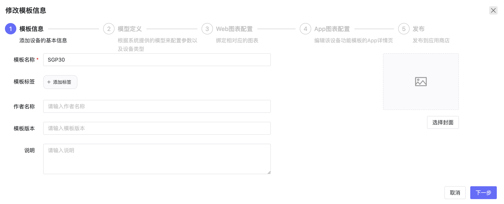
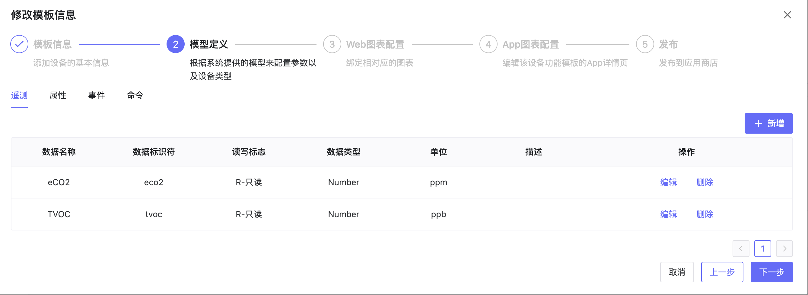
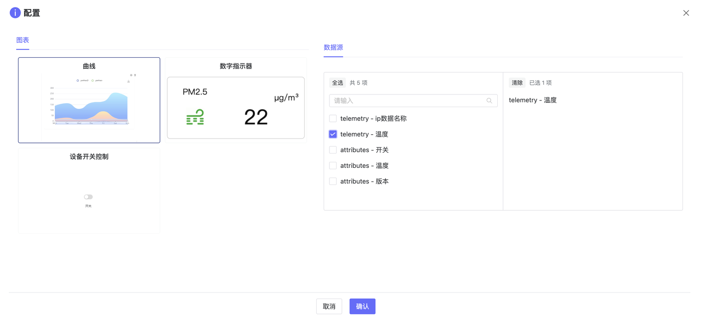
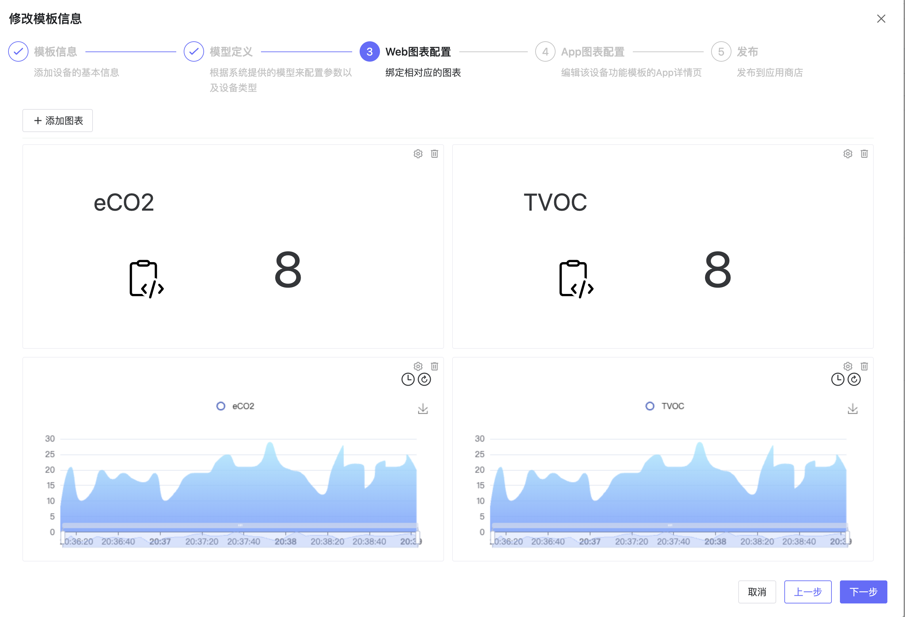
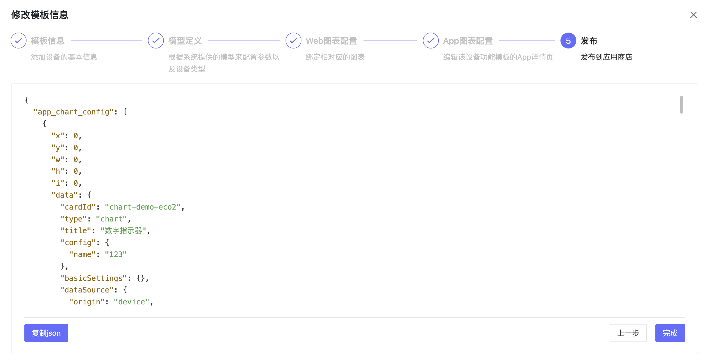

# 功能模版

功能模板的目的是复用物模型和图表。如下说明功能模板功能如何使用。

## 1、说明
- 点击设备接入-功能模版进入模版管理页面。
- 设备功能模板对应了现实世界的产品名，例如XX品牌的温湿度传感器中的"温湿度传感器"
- 设备功能模板的目的是定义物模型定义图表D
- App端的图表等，设定预配置，方便高效的接入设备。
- 设备功能模板可以被配置模板调用。

## 2、操作

### 2.1、创建设备配置模板

- 点击"添加设备模版"就可以新建。

- 新建时需要设置模版名称，标签等信息。

### 2.2、配置物模型

- 可以在这里配置遥测、属性、事件、命令等对应的参数的数据名称-标识符的映射关系。

### 2.3、配置图表

- 并选择展示的图表和数据来源

### 2.4、配置App图表

- 查看APP图表的样式：

### 2.5、完成配置

- 查看模版的信息，并完成配置。

