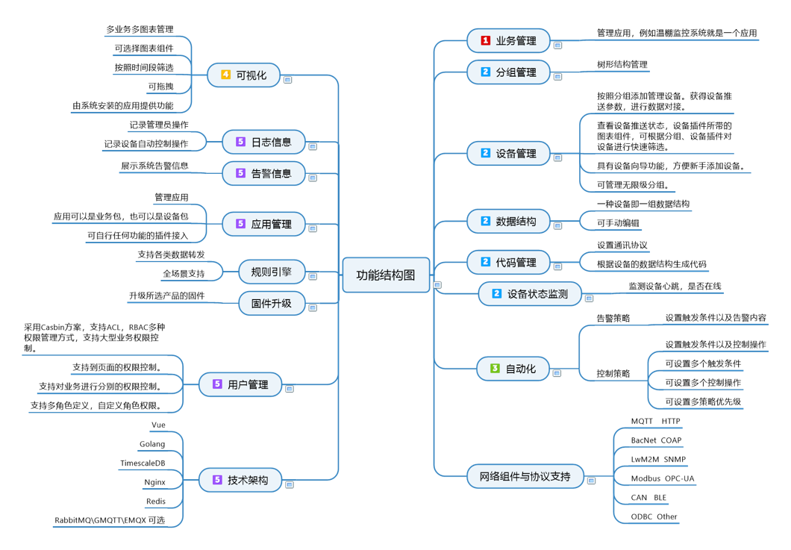

# Why ThingsPanel

ThingsPanel is a general-purpose, open source IoT application platform designed to simplify and accelerate IoT development delivery by reducing development efforts through reusable components.

**The standard device plug-in** is the biggest feature of ThingsPanel, which makes the IoT much less complex through standard devices.reduce costs and improve efficiency.Also reduce the difficulty and cost of operation and maintenance.

## FEATURES

- Device and Enterprise IoT+.
- Open Source, AGPLv3.
- Simplicity and ease of use.
- Modular architecture for faster project delivery.
## For users
- Quick Delivery Projects
- Quickly develop your program
- Device IoT+
## Issue
- The development of a slow and highly complex issue for the Internet of Things project.
## Function Structure

## Stack
* Golang：Excellent parallel performance and hardware cost savings.
* Vue.js：frontend build, experience it
* PostgreSQL：higher load capacity, lower ownership cost.
* TimescaleDB ：time series database, PostgreSQL plugin.
* Nginx：High Performance Web server.
* GMQTT：high performance message queue processing.
* Redis：NoSQL cache database
