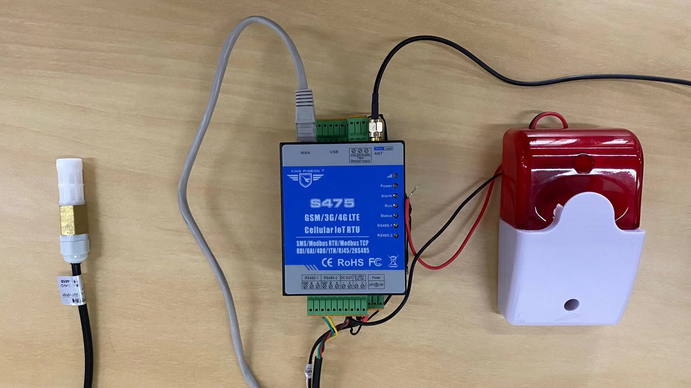
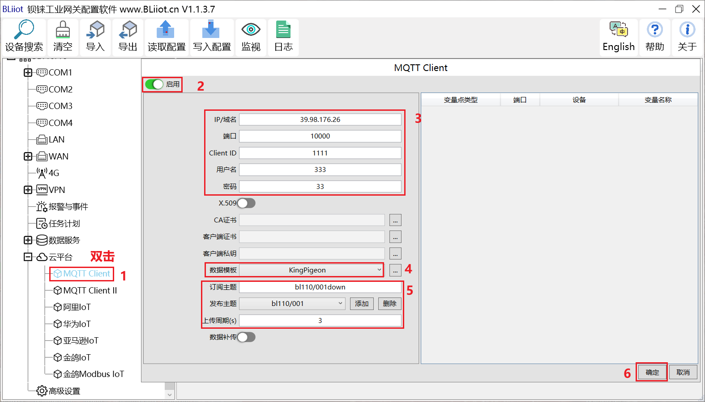

# Push Data

## Connect device

Connect the purchased device and this takes about 10 minutes (contact gateways provider).

## Configuration at the device end
 Important items to configure are：**IP addresses, ports, themes**如果有验证的话，不要填错**用户名密码**。 In the above example, the gateway has a separate push theme configured.The gateway (Golden Pigeons) is resolved separately by the server.

## View gateway device push data via MQTTBox
It can be seen that the data has been received.Temperature 282° below (raw data coming directly from the device) 